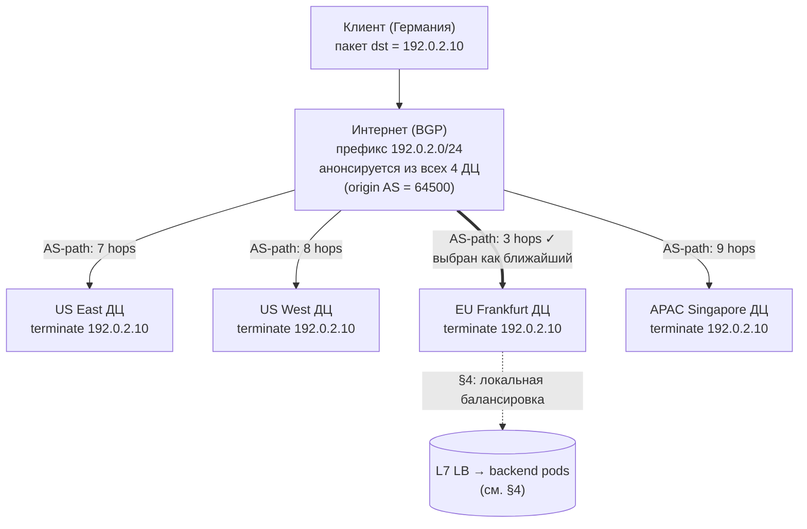
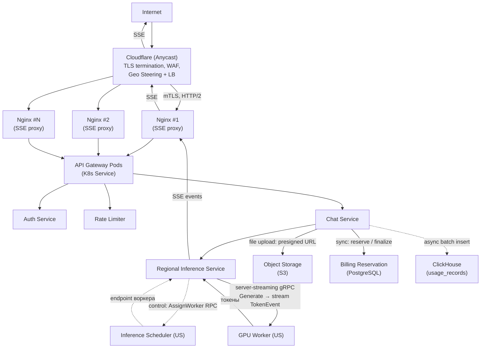
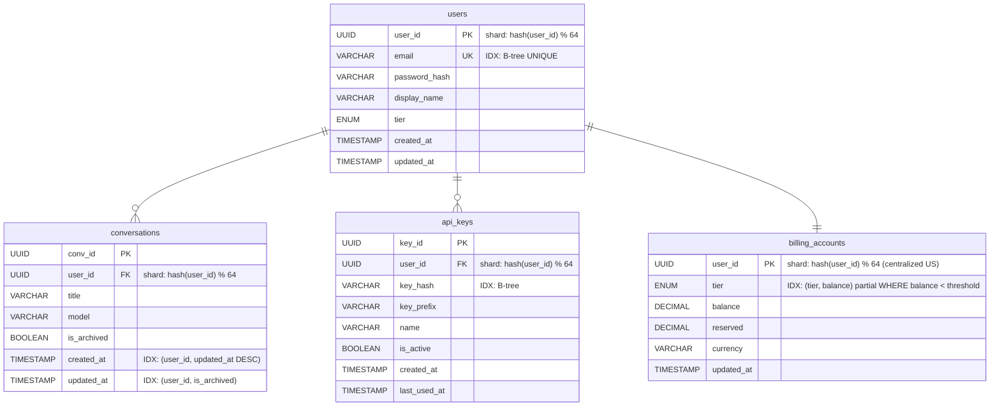
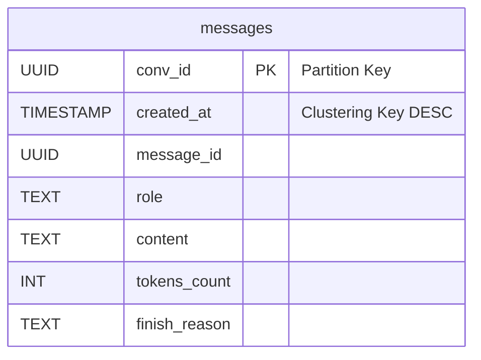
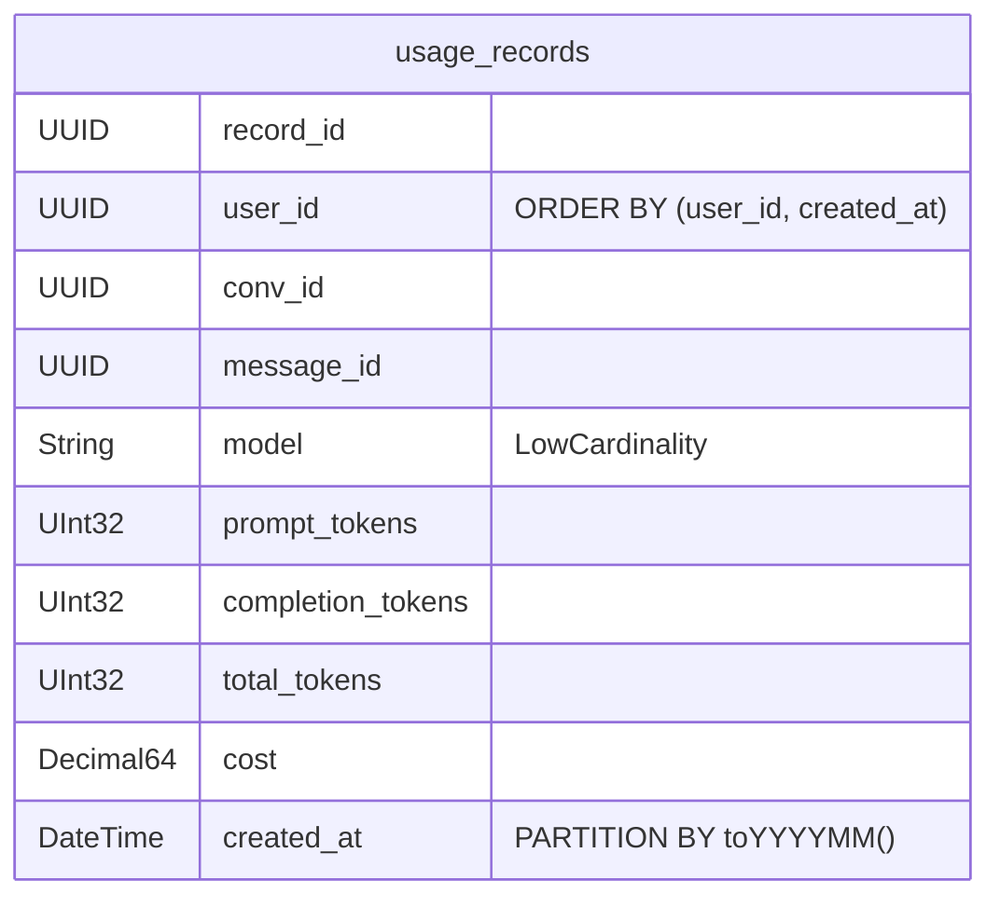
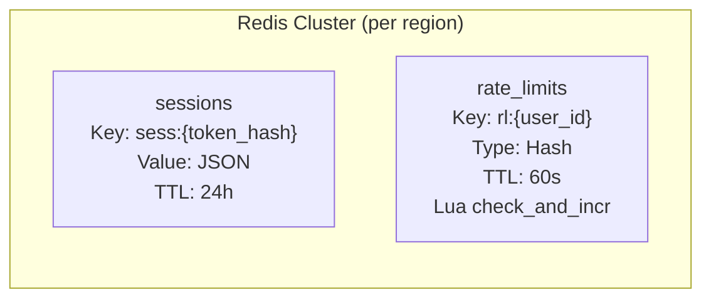
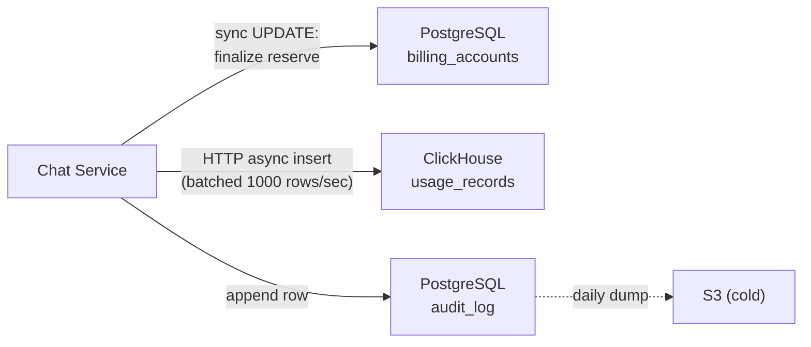
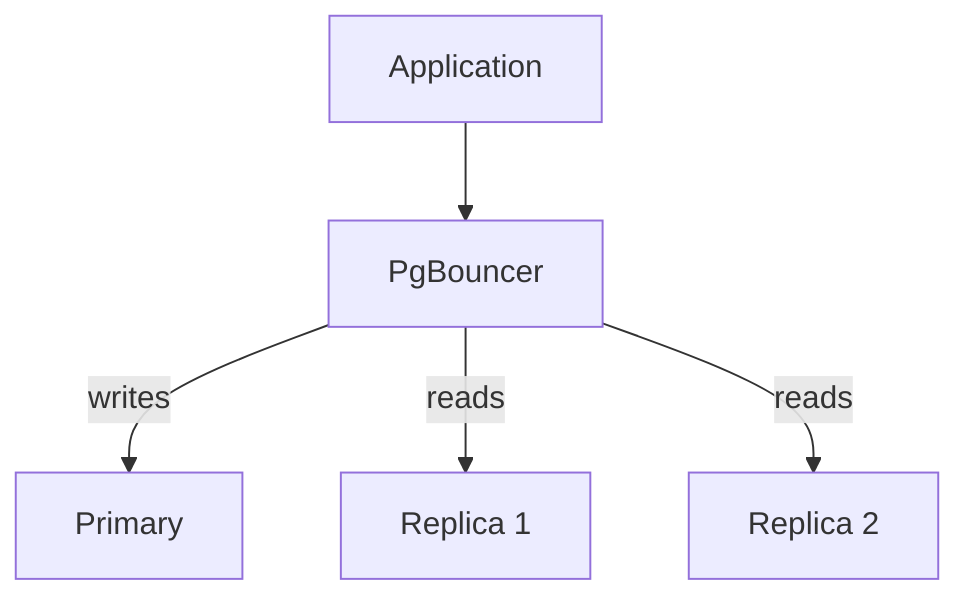

# 1. Тема и целевая аудитория

## Описание

Проектируемая система — публичная AI-платформа, предоставляющая доступ к большой языковой модели (LLM) через два канала:

- **HTTP API** — stateless-интерфейс для разработчиков. Клиент сам передаёт историю диалога в каждом запросе. Сервер не хранит сообщения.
- **Веб-чат** — интерфейс для конечных пользователей. История диалогов хранится на сервере, доступна с любого устройства.

В обоих случаях ядро системы одно: пользователь отправляет запрос → модель генерирует ответ на GPU → токены передаются клиенту в реальном времени через SSE.

Состав запроса:
- текст
- вложения (только фото и документы)

То есть ключевая продуктовая фича: мультимодальная LLM, которая на вход может принимать изображения и документы, а на выход выдавать текст.

## Ключевой пользовательский сценарий

Пользователь отправляет сообщение
- бэкенд собирает контекст (из запроса или из БД)
- контекст уходит на GPU-кластер
- модель генерирует ответ токен за токеном
- токены передаются клиенту через SSE
- пользователь видит ответ по мере генерации

## Дополнительный функционал, обеспечивающий работу бизнеса

- Аутентификация:
  - Для веб-чата: кука, которая прикладывается к каждому запросу. Бэкенд ходит с кукой в Auth Service, который идет в БД за сессиями и сверяет подлинность и время жизни куки (1 месяц).
  - Для API: с каждым запросом прикладываем API токен. Бэкенд ходит с токеном в Auth Service, который идет в БД и сверяет подлинность токена и его время жизни (условимся, что токен можно выдать максимум на 1 месяц).
- Лимитирование:
  - Для веб-чата: лимитирование по тирам подписки: Free, Plus, Pro, Max. Для каждого тира назначается лимит лимит токенов на input и output для каждой модели.
  - Для API: usage-based лимитирование. Назначаем цену за N токенов на input и M токенов на output. По API токену определяется биллинг аккаунт и, перед запросом к inference-кластеру, идет резервирование цены запроса (прогоняем input через tokenizer, а для output считаем по max_output_tokens, которые заранее предопределены для каждой модели). После выполнения запроса возвращаем разницу между предварительной оценкой цены запроса и тем, сколько на самом деле потратилось.

## Реальные аналоги

* ChatGPT (OpenAI), Claude (Anthropic), Gemini (Google) — устойчивый глобальный рынок AI-ассистентов с аудиторией ~1 млрд WAU.

## Характеристики нагрузки

* длительное время генерации ответа (до 1 минуты)
* высокая вычислительная нагрузка на GPU
* большое количество долгоживущих SSE-соединений
* потоковая передача ответа токен за токеном

## Целевая аудитория

Ориентир — аудитория OpenAI. Ключевые публичные метрики:

| Метрика | Значение | Источник |
|---------|----------|----------|
| WAU (всего) | 900 млн | OpenAI [^1] |
| Web-чат | 2.5 млрд сообщений/день | OpenAI [^2] |
| API | 15 млрд токенов/мин ≈ 21.6 трлн токенов/день | OpenAI [^1] |

Web и API — два разных профиля нагрузки: web — короткие промпты от живых пользователей, API — длинный контекст в каждом запросе от сервисов/ботов. Каналы считаем раздельно (см. §2.1).

География [^3][^4][^5]:

| Регион              | Доля трафика | Ключевые страны                        |
| ------------------- | ------------ | -------------------------------------- |
| North America       | ~19–21%      | США (14–17%), Канада (2–4%)          |
| Europe              | ~14–28%      | Великобритания, Германия (~3–6% каждая)|
| Asia-Pacific        | ~28–36%      | Индия (~8–16%), Япония, Сингапур       |
| Latin America       | ~5–6%        | Бразилия (~5–6%)                       |
| Middle East & Africa| ~7%          | ОАЭ, Израиль                           |

## Ключевые продуктовые решения

* **Stateless API** — контекст диалога передаётся в каждом запросе для API
* **Stateful Web** — для веб-чата весь контекст хранится на серверах
* **Streaming через SSE** — ответы передаются токен за токеном поверх HTTP
* **Разделение API и Inference** — API-слой отделён от GPU-кластера
* **Горизонтальное масштабирование** — независимое масштабирование компонентов
* **Глобальная балансировка** — распределение нагрузки между регионами
* **Режим работы 24/7** — высокие требования к доступности
* **Auth** — пользователю выдается идентификатор (кука Session_id для web, API токен для API), который живет 1 месяц. На каждый запрос от пользователя, бэкенду нужно сходить в Auth Service.
* **Лимитирование запросов** — отдельный сервис Rate Limiting Service, который лимитирует запросы для конкретного пользователя
* **Client-side image compression** — web/mobile-клиент ресайзит фото до ~1280×1280 и пережимает в JPEG q=80 перед upload-ом (как WhatsApp/iMessage). Финальный resize до 1024×1024 для vision-encoder делает GPU worker. Документы (PDF/DOCX/PPTX) идут «как есть».
* **Хранение вложений только в исходном виде** — в S3 лежит оригинал блоба, эмбеддинги картинок не кэшируются

# 2. Расчёт нагрузки

## 2.1 Исходные данные

### Размеры сообщений (датасеты)

| Источник | Период | User (токены) | Assistant (токены) | Профиль |
|----------|--------|---------------|--------------------|---------|
| LMSYS-Chat-1M [^7] | 2023 | ~70 | ~215 | Web |
| WildChat [^8] | 2023–2024 | ~296 | — | Web |
| ShareChat [^9] | 2023–2025 | — | ~1 115 | Web |
| OpenRouter [^10] | 2025 | 6 000 (полный контекст) | ~400 | API |
| Замер DevTools | 2025 | ~250 (1 КБ) | ~500 (8 КБ SSE) | Web |

### Параметры расчёта

| Параметр | Значение | Источник / расчёт |
|----------|----------|-------------------|
| Web messages/day | 2.5 млрд | OpenAI [^2] |
| API tokens/min | 15 млрд → 21.6 трлн/день | OpenAI [^1] |
| **API requests/day** | ~3.375 млрд | 21.6 трлн / 6 400 токенов на запрос |
| Среднее Web-сообщение | ~800 токенов (~300 user + ~500 assistant) | DevTools + WildChat/ShareChat |
| Средний API-запрос | ~6 400 токенов (~6 000 input + ~400 output) | OpenRouter [^10]: полный контекст в каждом запросе |
| Доля Web-сообщений с вложением | **7%** | OpenAI [^6] |
| Средний размер вложения | **~2 МБ** | оценка с учётом client-side compression* |
| Пиковый множитель | ×2 | глобальная аудитория, распределённая по часовым поясам |
| Хранение | Web — бессрочное; API — не требуется (stateless) | продуктовое решение |

\* **Лимиты** OpenAI [^11]: картинки до 20 МБ/файл, документы до 512 МБ, CSV до 50 МБ, per-user cap 25 ГБ. **Реальный микс в чате** (нет публичной статистики OpenAI, оценка автора):

| Тип | Доля | Средний размер | Источник числа |
|-----|------|----------------|----------------|
| Фото (vision) | ~70% | ~1 МБ после client-side compression | бенчмарки мессенджеров: WhatsApp HD 2–5 МБ, iMessage 1–5 МБ; ChatGPT всё равно ресайзит до 1024×1024 → ~1 МБ JPEG q=80 |
| Документы (PDF/DOCX/PPTX) | ~30% | ~5 МБ | PDF Candy industry avg 5 МБ (2022) [^12] |

Взвешенное среднее: 0.7 × 1 + 0.3 × 5 ≈ **2 МБ/вложение**. Документы доминируют по объёму трафика несмотря на меньшую долю по штукам. Для API подавляющий объём ввода — текст, вложения игнорируем.

**Web и API считаем раздельно.** Объединять через DAU нельзя: API-клиенты часто сервисы/боты с тысячами запросов в день. Inference-нагрузку выводим напрямую: для Web — из «2.5 млрд сообщений/день», для API — из «15 млрд токенов/мин» через средний размер запроса.

Все расчёты — для модели класса Claude Sonnet.

## 2.2 Продуктовые метрики

### Аудитория

| Метрика | Значение | Расчёт |
|---------|----------|--------|
| WAU | 900 млн | OpenAI [^1] |
| MAU | ~1 млрд | ~1.1 × WAU |
| Web DAU | ~360 млн | ~0.4 × WAU |
| API customers | ~5–10 млн | оценка (разработчики + B2B); не сводится к DAU |

### Нагрузка по каналам

| Канал | Запросов/день | Avg RPS | Peak RPS (×2) | Tokens/req |
|-------|---------------|---------|---------------|------------|
| **Web** | 2.5 млрд | 28 935 | **57 870** | ~800 |
| **API** | 3.375 млрд | 39 063 | **78 125** | ~6 400 |
| **Итого** | 5.875 млрд | 67 998 | **135 996** | — |

API даёт **больше inference-RPS, чем Web** — длинный контекст в каждом запросе перевешивает меньшее число клиентов.

### Среднее количество действий пользователя (Web)

Для API per-user метрика не определена — клиенты варьируются от 10 до миллионов запросов/день, считаем суммарно по объёму (3.375 млрд req/day, см. таблицу выше).

| Действие | Кол-во/день | Обоснование |
|----------|-------------|-------------|
| Отправка промпта | 7 | 2.5 млрд / 360 млн DAU |
| Получение SSE-ответа | 7 | 1 ответ на запрос |
| Загрузка списка чатов | 1 | старт сессии |
| Открытие диалога | 3 | переключение чатов |
| Auth check | каждый HTTP-запрос | проверка куки (то же для API-токена) |
| Login / создание токена | 1/мес | TTL куки/токена 1 месяц |

### Размер сетевого payload

DevTools-замер: фиксированный JSON-overhead HTTP-запроса 0.9 КБ; SSE-стрим **17.8 байт/токен** (`data: {...}\n\n`). Для хранения — ~4 байта/токен + 100 байт метаданных.

| Параметр | Токены | Сетевой payload | Для хранения |
|----------|--------|-----------------|--------------|
| Web input (user msg) | ~300 | 2 КБ | 1.2 КБ |
| Web output (assistant, SSE) | ~500 | 9 КБ | 2 КБ |
| API input (полный контекст) | ~6 000 | 25 КБ | — (stateless) |
| API output (SSE) | ~400 | 7 КБ | — (stateless) |
| Вложение (Web) | — | 2 МБ | 2 МБ |
| Метаданные сообщения | — | — | ~100 байт |

### Средний размер хранилища пользователя (Web)

Среднее сообщений на пользователя в месяц (Web MAU ≈ 1 млрд):

```
2.5 млрд × 30 / 1 млрд = 75 сообщений/мес
```

| Тип данных | Расчёт | Объём/мес |
|-----------|--------|-----------|
| Текст (user) | 75 × 1.2 КБ | 90 КБ |
| Текст (assistant) | 75 × 2 КБ | 150 КБ |
| Метаданные | 75 × 2 × 0.1 КБ | 15 КБ |
| Вложения | 75 × 0.07 × 2 МБ | 10.5 МБ |
| **Итого** | | **~10.8 МБ/мес** |

Вложения — **~97%** объёма пользователя.

---

## 2.3 Технические метрики

### Размер хранения за 1 год

API stateless, хранилища не требует. Web MAU ≈ 1 млрд.

| Тип данных | Расчёт | Объём/год |
|-----------|--------|-----------|
| Текст (user) | 1 млрд × 12 × 90 КБ | ~1.08 ПБ |
| Текст (assistant) | 1 млрд × 12 × 150 КБ | ~1.80 ПБ |
| Метаданные сообщений | 1 млрд × 12 × 15 КБ | ~0.18 ПБ |
| Вложения | 1 млрд × 12 × 10.5 МБ | **~126 ПБ** |
| **Итого** | | **~129 ПБ/год** |

---

### Concurrent SSE-соединения

Скорость генерации Sonnet ~50 токенов/сек.

| Тип | Output (токены) | Длительность | Avg concurrent | Peak (×2) |
|-----|----------------|--------------|----------------|-----------|
| Web | 500 | 10 сек | 289 350 | **578 700** |
| API | 400 | 8 сек | 312 500 | **625 000** |
| **Итого** | | | 601 850 | **~1.2 млн** |

API даёт чуть больше concurrent SSE, чем Web — больше RPS перевешивает короткий output.

---

### Сетевой трафик (peak ×2)

#### Входящий (user → сервер)

| Тип | Расчёт | Peak Gbit/s |
|-----|--------|-------------|
| Web текст | 57 870 × 2 КБ | 0.93 |
| Web вложения | 57 870 × 0.07 × 2 МБ | **64.81** |
| API текст | 78 125 × 25 КБ | 15.63 |
| **Итого входящий** | | **~81.4 Гбит/с** |

#### Исходящий (сервер → user, SSE)

| Тип | Расчёт | Peak Gbit/s |
|-----|--------|-------------|
| Web SSE | 57 870 × 9 КБ | 4.17 |
| API SSE | 78 125 × 7 КБ | 4.37 |
| **Итого исходящий** | | **~8.54 Гбит/с** |

#### Суточный трафик

| Тип | Расчёт (avg) | Объём/сутки |
|-----|-------------|-------------|
| Входящий текст (Web ~5 ТБ + API ~84 ТБ) | (28 935×2 КБ + 39 063×25 КБ) × 86 400 | ~89 ТБ |
| Входящий вложения | 28 935 × 0.07 × 2 МБ × 86 400 | **~350 ТБ** |
| Исходящий SSE (Web ~22 ТБ + API ~24 ТБ) | (28 935×9 КБ + 39 063×7 КБ) × 86 400 | ~46 ТБ |
| **Итого** | | **~485 ТБ/сутки** |

Вложения дают **~72%** суточного трафика. API — основной источник текстового трафика (84 ТБ против 5 ТБ у Web): полный контекст в каждом запросе.

---

### Сводная таблица RPS

| Тип запроса | Avg RPS | Peak RPS |
|-------------|---------|----------|
| Web inference | 28 935 | 57 870 |
| API inference | 39 063 | 78 125 |
| Открытие диалога | 12 500 | 25 000 |
| Список чатов | 4 170 | 8 340 |
| Auth check | 84 500 | 169 000 |
| Login / создание токена | 386 | 772 |

# 3. Глобальная балансировка нагрузки

## 3.1 Функциональное разбиение по доменам

| Домен              | Назначение                                            | Размещение                  |
| ------------------ | ----------------------------------------------------- | --------------------------- |
| `chat.llm.com`     | Web-чат: HTTP + SSE                                   | Все 4 ДЦ (Anycast IP)       |
| `api.llm.com`      | HTTP API для разработчиков: HTTP + SSE                | Все 4 ДЦ (Anycast IP)       |
| `attach.llm.com`   | API выдачи presigned URL для S3 (загрузка/скачивание) | Все 4 ДЦ (Anycast IP)       |
| `cdn.llm.com`      | Статика (JS/CSS, assets)                              | Внешний CDN-провайдер (CNAME) |

Три первых домена резолвятся в **один общий Anycast IP** — гео-разделение по ДЦ происходит на сетевом уровне через BGP (см. §3.4–§3.5), а не в DNS. Сами бинарники вложений лежат в S3 и качаются по presigned URL напрямую с S3-эндпоинтов, через нашу инфраструктуру не проходят.

---

## 3.2 Расположение ДЦ и обоснование

| ДЦ      | Локация    | Роль                                  | Доля HTTP |
| ------- | ---------- | ------------------------------------- | --------- |
| US East | Virginia   | API + SSE + основной GPU-кластер      | 17.5%     |
| US West | Oregon     | API + SSE + резервный GPU-кластер     | 17.5%     |
| EU      | Frankfurt  | API + SSE termination                 | 35%       |
| APAC    | Singapore  | API + SSE termination                 | 30%       |

EU и APAC — только HTTP-слой (terminate TLS, держать SSE-соединения, проксировать inference в US). GPU-кластеров там нет.

**Почему 4 ДЦ:**

* **1 ДЦ** — RTT клиент→ДЦ у пользователя из EU/APAC 100–200 мс. Плюс ещё 80–150 мс на проксирование в US-GPU. Итого TTFT (time-to-first-token) 500–800 мс, ощутимая задержка перед началом ответа.
* **4 ДЦ** — RTT клиент→ближайший ДЦ < 30 мс для ~95% мировой аудитории; TTFT падает до 250–400 мс. Каждый дополнительный ДЦ сверх 4 даёт экономию RTT всего 5–15 мс — пренебрежимо на фоне самой генерации (5–60 сек). Вкладывать в 5-й и 6-й ДЦ не имеет смысла.
* **4 независимых ДЦ — достаточный запас для failover (N+1):** при отказе одного оставшиеся 3 держат пиковую нагрузку с разливом по таблице из §3.5.

**Почему GPU только в US — три причины (по убыванию веса):**

1. **Утилизация — главный фактор.** GPU-inference экономически выгоден только при высокой утилизации: continuous batching формирует крупный batch только когда очередь полная. Если разнести GPU на 4 региона, общая очередь делится на 4 → пиковая утилизация падает с ~80% до ~50% → для той же пропускной способности нужно **вдвое больше** H100. На масштабе тысяч GPU это перевешивает любую разницу в цене инстанса.
2. **Доступность H100/GB200.** Пулы свежих GPU у крупных облаков (AWS, Azure, Oracle) в EU и APAC заметно меньше: capacity и quotas в `us-east-1` / `us-west-2` выдаются быстрее и большими объёмами, чем в `eu-central-1` / `ap-southeast-1`. Плюс электричество в Virginia / Oregon на ~15% дешевле, чем во Frankfurt — это даёт ~10–15% к цене часа GPU-инстанса (вторичный, но реальный фактор).
3. **Operational overhead.** Каждая GPU-площадка требует отдельной инфры: Inference Scheduler, мониторинг GPU/VRAM, pipeline деплоя моделей, on-call. ×4 региона = ×4 overhead без выигрыша по продуктовым метрикам.

Latency на это **не влияет**: RTT EU/APAC↔US-GPU 80–150 мс — это <3% от 5–60 сек самой генерации, пользователь разницы не заметит.

**Влияние на продуктовые метрики:**

| Метрика          | Эффект 4-региональной схемы                                                 |
| ---------------- | --------------------------------------------------------------------------- |
| TTFT для EU/APAC | 250–400 мс вместо 500–800 мс при single-region                              |
| Доступность      | 4 независимых ДЦ; отказ одного → клиенты автоматически уходят в ближайший живой (§3.5) |
| Стоимость        | 90% inference в США держит GPU $/токен на минимуме; в EU/APAC — только дешёвый HTTP/SSE-слой без дорогих H100 |

---

## 3.3 Распределение запросов по ДЦ

Раскладываем суммарный HTTP-трафик из §2 (85 054 avg / 170 108 peak RPS, ~1.2 млн concurrent SSE) по регионам пропорционально доле аудитории. Это вход для §4 — сколько Nginx и SSE-серверов держать в каждом ДЦ.

Доли 17.5/17.5/35/30% — worst-case по верхней границе Europe (28% + рост) и Asia-Pacific (32%, середина диапазона) на основе аналитики глобального трафика ChatGPT [^7][^8]; OpenAI официальной региональной разбивки не публикует.

| ДЦ        | HTTP RPS avg | HTTP RPS peak | Concurrent SSE peak |
| --------- | ------------ | ------------- | ------------------- |
| US East   | 14 884       | 29 769        | 210 648             |
| US West   | 14 884       | 29 769        | 210 648             |
| EU        | 29 769       | 59 538        | 421 295             |
| APAC      | 25 516       | 51 032        | 361 110             |
| **Итого** | **85 054**   | **170 108**   | **1 203 700**       |

Все inference-запросы (67 998 avg / 135 996 peak RPS из §2) в итоге сходятся на GPU-кластерах в США независимо от того, в каком ДЦ они принимаются: EU/APAC — только HTTP-слой, проксирующий gRPC-стрим в US-GPU.

---

## 3.4 Anycast-балансировка

Полноценной DNS-балансировки нет: домены резолвятся в **один общий IP** для всех 4 ДЦ независимо от географии резолвера. Гео-распределение трафика делает BGP на сетевом уровне — это и есть Anycast.

**DNS-записи (одинаковые для всех клиентов мира):**

| Запись                | Тип    | Значение                          | Назначение                                      |
| --------------------- | ------ | --------------------------------- | ----------------------------------------------- |
| `chat.llm.com`    | A      | `192.0.2.10`                      | Anycast IP, общий для всех 4 ДЦ                 |
| `api.llm.com`     | A      | `192.0.2.10`                      | Anycast IP, общий для всех 4 ДЦ                 |
| `cdn.llm.com`     | CNAME  | `static.cdn-provider.net`         | Статика (JS/CSS) — внешний CDN                  |
| `attach.llm.com`  | A      | `192.0.2.10`                      | Anycast IP — выдача presigned URL → S3          |
| `llm.com`         | NS     | 4 anycast-адреса authoritative NS | Сами NS-сервера тоже на anycast (RFC 7094)      |

TTL A-записей — 60 сек (для миграции Anycast-провайдера / IP-блока), DNSSEC включён.

**Anycast** — сетевая техника, при которой один IP анонсируется в Интернет одновременно из нескольких ДЦ через протокол BGP. Каждый ДЦ держит свой edge-роутер, который через BGP-сессию с upstream-провайдерами анонсирует наш `/24`-префикс под нашим ASN. Маршрутизаторы Интернета выбирают **ближайший** анонс по числу AS-hop — без участия DNS и приложения.



> **Граница раздела.** Глобальная балансировка (§3) заканчивается там, где Anycast-пакет попал в нужный ДЦ. Что происходит дальше — TLS termination, SNI routing по `Host`, выбор Nginx-ноды, distribution по backend pods — это локальная балансировка, **§4**. ASN `64500` — пример из приватного диапазона RFC 6996; в проде у нас был бы зарегистрированный публичный ASN.

<!-- Контр-аргументы для устной защиты («зачем Anycast, а не GeoDNS», DDoS-распределение,
     проблема геолокации мобильных resolver-ов и т.п.) — в notes/defense-cheatsheet.md.
     В РПЗ оставляем минимально достаточный текст; всё остальное — на защиту устно. -->

---

## 3.5 Регулировка трафика между ДЦ

> Раздел про балансировку **между ДЦ**: какие условия выводят целый регион из ротации и куда уходит его трафик. Балансировка **внутри** одного ДЦ (между Nginx-нодами, между Pod-ами) — отдельная задача, см. §4.

Сам Anycast (§3.4) разбирается с failover автоматически: ДЦ снимает свой BGP-анонс — пакеты уходят к следующему ближайшему. Решение «снять анонс» принимается **внутри** ДЦ по результатам self-health-check всего региона.

**Условия, при которых регион снимает свой анонс / получает пониженный вес:**

| Метрика                 | Порог                  | Действие                              |
| ----------------------- | ---------------------- | ------------------------------------- |
| HTTP latency p95        | > 500 мс               | Снижение веса региона                 |
| Error rate (5xx)        | > 1% за 1 минуту       | Снижение веса региона                 |
| Origin pool недоступен  | 3 подряд failed health-check | Снять BGP-анонс, регион выходит из ротации |
| GPU queue depth (US-кластер) | > 1000 задач      | Возврат `503` на новые inference через Scheduler (HTTP-backpressure) |

**Реализация (open-source стек на edge-роутере каждого ДЦ):**

| Компонент          | Инструмент                          | Роль                                                                   |
| ------------------ | ----------------------------------- | ---------------------------------------------------------------------- |
| BGP-демон          | BIRD2 (или FRRouting)               | Держит BGP-сессию с upstream-провайдерами, анонсирует Anycast-префикс  |
| Метрики            | Prometheus + node_exporter          | Скользящие окна по latency / 5xx; GPU Scheduler публикует queue depth  |
| Health checker     | Свой сервис на Go                   | Раз в 1 сек тянет метрики и `/health` бэкендов; принимает решение      |
| Управляющий канал  | `birdc` (CLI BIRD) / ExaBGP REST    | Health checker дёргает BGP-демон: prepend или withdraw                 |

**Что физически делает «снижение веса» и «снять анонс»:**

* **Снижение веса** = **AS-path prepending**. Это BGP-механизм: мы анонсируем тот же `/24` IP, но искусственно повторяем свой ASN в AS-path 1–3 раза. Соседние BGP-роутеры в Интернете при выборе маршрута предпочитают короткий AS-path → часть мира перестаёт выбирать наш ДЦ. Чем больше prepend, тем дальше «отодвигается» регион.
* **Снять анонс** = **route withdraw**. BIRD шлёт BGP UPDATE с withdrawn route — BGP-таблицы в Интернете перестраиваются за 30–90 сек, пакеты уходят в следующий ближайший ДЦ. Это failover-механизм Anycast.
* **GPU queue overflow** требует другого ответа: AS-path prepending тут не поможет (HTTP-трафик из EU/APAC всё равно проксируется в US-GPU). Inference Scheduler в US начинает возвращать `503 Service Unavailable` / `Retry-After` на новые inference-запросы — это backpressure на уровне HTTP, а не BGP.

**Routing policy для HTTP-слоя (куда уходит трафик):**

| Регион клиента      | Primary           | Fallback при отказе primary |
| ------------------- | ----------------- | --------------------------- |
| Северная Америка    | US East / US West | EU                          |
| Европа / MEA        | EU                | US East                     |
| Азия / Океания      | APAC              | US West                     |
| Латинская Америка   | US East           | EU                          |

Эта таблица — про **HTTP-слой** (TLS, Auth, list chats, открытие диалога, UI). Inference — отдельная плоскость: любой ДЦ, принявший запрос, всё равно проксирует gRPC-стрим в US-GPU.

**Inference-failover (на уровне GPU-кластеров в US):**

* US East — primary, US West — резерв. Inference Scheduler держит оба пула в горячем состоянии и переключает запросы на US West, если US East перегружен или недоступен.
* При падении US East: HTTP-клиенты Северной Америки уходят в US West (по таблице выше), inference тоже идёт в US West.
* **При одновременном отказе US East И US West** новый inference недоступен глобально — GPU-площадки только в США. EU/APAC продолжат принимать HTTP-запросы (history, list, login, UI работают), но новые промпты возвращают `503 Service Unavailable` до восстановления хотя бы одного US-региона. Это осознанный компромисс: вторая GPU-площадка вне США удвоила бы инфраструктурные расходы и не оправдана при разнесении US East/West по разным AZ/регионам с независимыми сетевыми и питающими подсистемами.

**Пример частичного отказа** (один ДЦ, не GPU-кластер): при отказе EU 35% HTTP-трафика разливается US East ≈ 25% + US West ≈ 10%; inference как раньше идёт в US-GPU. Latency для пострадавших клиентов растёт на 80–150 мс, но сервис полностью доступен.

**Способы переключения:**

1. **Gradual shift** — плавное изменение веса региона через AS-path prepending для planned maintenance или регионального rollout. Чем длиннее искусственный AS-path, тем меньше Интернета считает наш ДЦ ближайшим.
2. **Instant failover** — моментальное снятие BGP-анонса (route withdraw) по сработавшему health-check при аварии.

---

<!-- §3.6+ (inference flow, multimodal pull, Rate Limiter / Billing placement)
     перенесены в notes/section-7-10-drafts.md — материал относится к §7 (Алгоритмы)
     и §10 (Схема проекта), не к глобальной балансировке. -->

# 4. Локальная балансировка нагрузки // TODO: дописать что тут делает k8s

## 4.1 Схема балансировки внутри региона

Cloudflare держит Anycast + Geo Steering + L7 health-check (см. 3.5) и кладёт HTTP/2-соединение напрямую в origin pool из Nginx-ов региона. Отдельный L3/L4 IPVS/Keepalived на входе не нужен: функции L4-балансировки и TLS-SNI уже выполняются на edge, а резервирование Nginx обеспечивается самим Cloudflare Load Balancer (mTLS + health checks).

Внутри региона всё live-трафиковое стоит на Active-Active с нагрузкой ≤50% per node — при отказе половины парка оставшиеся пики до 100% без деградации.



Поток токенов обратно к пользователю: `GPU Worker → gRPC stream → Regional Inference → SSE → Nginx → Cloudflare → Client`. Промежуточных очередей (Kafka) и буферов (Redis Streams) на этом пути нет, backpressure идёт нативно через HTTP/2 flow control.

Файлы-вложения не проходят через Nginx: Chat Service выдаёт клиенту presigned URL, клиент заливает файл напрямую в S3.

---

## 4.2 Уровни балансировки и резервирование

Модель резервирования: все live-компоненты — **Active-Active 2N на 50%**, то есть в каждом регионе развёрнуто вдвое больше инстансов, чем минимально нужно для peak, и нормальная загрузка каждой ноды не превышает 50% её потолка. При отказе половины парка оставшиеся работают на 100% без потери SLA.

| Уровень | Компонент | Алгоритм | Резервирование | Обоснование |
| --- | --- | --- | --- | --- |
| Edge | Cloudflare (Anycast + LB) | Geo Steering + Least Latency | **Managed (глобальная сеть PoP)** | TLS, DDoS, health-checks, failover origin pool |
| L7 (SSE) | Nginx → `sse_backend` | **`least_time last_byte`** (NGINX Plus) + `max_conns` | **2N @ 50%** | SSE — долгоживущие стримы с непрерывной отдачей токенов; алгоритм учитывает средний latency прошлых ответов + active requests, а не только счётчик соединений |
| L7 (API) | Nginx → `api_backend` | **`least_conn`** | **2N @ 50%** | Короткие HTTP-запросы (auth, list, history), однородный профиль, LC даёт равномерное распределение |
| Application | API Gateway (K8s) | Round Robin (K8s Service) | **2N @ 50%** | K8s auto-reschedule ~30 сек — не защищает от burst-а; держим запас |
| Backend | Chat / Auth / Rate / Regional Inference | Round Robin | **2N @ 50%** | Stateless HTTP-сервисы, горизонтально масштабируются |
| Inference (control) | Inference Scheduler | gRPC leader election | **N+1 (Raft, 3 нода)** | Control plane, низкий QPS, строгий ordering допускает лидер-реплика |
| Inference (data) | GPU Workers | Scheduler-assigned | **N+1 spare** | При падении GPU запрос ретраится Regional Inference-ом, spare GPU держим горячими |
| State (hot) | Redis Cluster (sessions, rate limits) | CRC16 hash slots | **2N @ 50%** (primary + replica per shard) | Высокий QPS, нужно мгновенный failover |
| State (durable) | PostgreSQL / ScyllaDB / ClickHouse | Shard key hash | **1 primary + 2 replicas** / **RF=3** | См. раздел 6, write-slave + read-replicas |

### Разделение upstream-ов по профилю трафика

На L7 внутри Nginx трафик расщепляется на два upstream-пула с разными алгоритмами балансировки:

```nginx
upstream sse_backend {
    least_time last_byte;          # NGINX Plus: avg response time + active requests
    server chat-1:8080 max_conns=50000;
    server chat-2:8080 max_conns=50000;
    server chat-3:8080 max_conns=50000;
    server chat-4:8080 max_conns=50000;
    keepalive 32;
}

upstream api_backend {
    least_conn;
    server api-gw-1:8080;
    server api-gw-2:8080;
    keepalive 128;
}

server {
    listen 443 ssl http2;
    location /v1/chat/completions { proxy_pass http://sse_backend; proxy_buffering off; proxy_read_timeout 300s; }
    location /                    { proxy_pass http://api_backend; }
}
```

**Почему раздельные upstream-ы:** 100 активных SSE-стримов и 100 idle keep-alive-соединений для счётчика connections равны, но потребляют разные ресурсы CPU/сеть в разы. Если смешать в одном пуле, Least Conn распределит нагрузку **по числу соединений**, а не по **фактическому потоку байтов** — и в итоге ноды с «тяжёлыми» SSE окажутся перегружены.

**Почему `least_time last_byte` (NGINX Plus):** директива выбирает upstream-ноду с минимумом `avg_response_time × active_connections`. Для SSE `last_byte` ≈ полная длительность стрима → косвенно отражает «стоимость» обслуживания запроса на каждой ноде. Это ровно то, чего не умеет открытый `least_conn`: учитывать, что один стрим тяжелее другого, и адаптироваться к нодам с медленной сетью/CPU.

**Почему NGINX Plus, а не open-source + HAProxy/Envoy:** NGINX Plus даёт `least_time`, live-activity API, stream-level health checks, session persistence с memcached-бэкендом — всё из коробки одним конфигом. Альтернатива — добавить Envoy отдельным слоем — это ещё один компонент в hot-path и дополнительный hop. Цена Plus (~$2.5k/нода/год × 12 нод = $30k/год) пренебрежима на фоне GPU-бюджета проекта.

**`max_conns=50000`** на каждую upstream-ноду — защита от переполнения: если все ноды уже на потолке, Nginx возвращает 502/503 и клиент ретраится через Geo Steering fallback (§3.6). Это не рабочий режим, а предохранитель.

---

## 4.3 Расчёт количества L7 балансировщиков (Nginx)

**Ключевой принцип расчёта:** сайзим по **пропускной способности** и **SSL CPS**, а не по числу одновременных соединений. Счётчик коннектов — плохой прокси нагрузки для SSE: 200k idle-коннектов и 200k активно стримящих — разные величины по CPU/сети на порядок. Реальную стоимость обслуживания видно по Gbit/s, которые нода прокачивает, и CPS, которые терминирует. Connection count оставляем как sanity-check в конце.

### Исходные данные

Исходные данные из §3.4 (пиковый множитель ×2):

| Регион | HTTP RPS peak | Peak Gbit/s через Nginx |
| --- | --- | --- |
| US East | 30 300 | 1.12 |
| US West | 30 300 | 1.12 |
| EU Central | 60 600 | 2.24 |
| APAC | 51 960 | 1.92 |

**Важно — вложения не идут через Nginx.** Клиент льёт файл напрямую в S3 по presigned URL (см. §4.1), поэтому 19.69 Gbit/s incoming из §2.3 исключаются из расчёта. Остаётся только текст + SSE:

```
Text in  peak: Web 0.77 + API 1.70 = 2.47 Gbit/s
SSE out  peak: Web 3.45 + API 0.48 = 3.93 Gbit/s
Итого через Nginx peak: 6.40 Gbit/s (global)
```

### Паспортные потолки NGINX Plus на одну ноду

Берём NGINX Plus (обоснование выбора — в §4.2). По бенчмаркам [^13][^14] аккуратно снижаем паспорт из-за реального профиля трафика (TLS 1.3 ECDSA + HTTP/2 + SSE chunked + buffering off):

| Метрика на ноду | Паспорт | Принято в расчёт | Почему снижаем |
| --- | --- | --- | --- |
| **Throughput (2×25 GbE NIC)** | ~40 Gbit/s | **20 Gbit/s** | TLS + H/2 framing + chunked encoding = CPU-bound на ~50% линейной скорости |
| **HTTPS CPS (TLS 1.3 ECDSA)** | 15 000+ | **10 000** | ECDSA P-256 handshake + верификация сессионных тикетов, headroom под всплески |
| Concurrent connections (informational) | ~300 000 | не используется как ограничитель | оставляем sanity-check ниже |

### Ограничитель 1 (primary): пропускная способность сети

Считаем, сколько нод нужно, чтобы прокачать peak Gbit/s региона при потолке 20 Gbit/s/нода:

$$N_{net} = \lceil \frac{\text{Peak Gbit/s}}{20} \rceil$$

| Регион | Peak Gbit/s | Nginx нод по throughput |
| --- | --- | --- |
| US East | 1.12 | **1** |
| US West | 1.12 | **1** |
| EU Central | 2.24 | **1** |
| APAC | 1.92 | **1** |

На текущем MVP-объёме bandwidth не ограничивает ни один регион — одна нода справится с ×10 нагрузкой. Это напоминание, что узкое место — не сеть, а TLS-handshake и CPU (см. ниже).

### Ограничитель 2 (secondary): SSL Termination (CPS)

30% входящих запросов создают новые TLS-соединения (остальные используют keep-alive / H2 multiplexing для нескольких запросов в одном соединении; реальный TLS resumption rate 60–70%, берём консервативно 70% re-use → 30% new):

$$N_{cps} = \lceil \frac{\text{Peak RPS} \times 0.3}{10\,000} \rceil$$

| Регион | Peak HTTP RPS | Peak CPS (×0.3) | Nginx нод по CPS |
| --- | --- | --- | --- |
| US East | 30 300 | 9 090 | **1** |
| US West | 30 300 | 9 090 | **1** |
| EU Central | 60 600 | 18 180 | **2** |
| APAC | 51 960 | 15 588 | **2** |

### Минимум по ограничителям

$$N_{min} = \max(N_{net}, N_{cps})$$

| Регион | N_net (throughput) | N_cps | **N_min** |
| --- | --- | --- | --- |
| US East | 1 | 1 | **1** |
| US West | 1 | 1 | **1** |
| EU Central | 1 | 2 | **2** |
| APAC | 1 | 2 | **2** |

Для EU/APAC связывает CPS. Для US — обе метрики на минимуме; в обоих случаях доминирует CPU на TLS, а не сеть.

### Резервирование 2N @ 50%

Каждая нода работает ≤50% потолка в штатном режиме. При отказе 50% парка оставшиеся выходят на 100% без деградации:

$$N_{total} = 2 \times N_{min}$$

| Регион | N_min | **2N @ 50%** | Фактическая загрузка при полном парке (throughput / CPS) |
| --- | --- | --- | --- |
| US East | 1 | **2** | 2.8% / 45% |
| US West | 1 | **2** | 2.8% / 45% |
| EU Central | 2 | **4** | 2.8% / 45% |
| APAC | 2 | **4** | 2.4% / 39% |

### Sanity check: concurrent SSE connections

Это **не ограничитель**, а проверка «не упёрлись ли случайно в число TCP/HTTP-2 соединений». Пик concurrent SSE из §3.4 делим на рассчитанное число нод:

| Регион | Peak concurrent SSE | Нод | SSE/нода | % от паспорта (300k) |
| --- | --- | --- | --- | --- |
| US East | 98 250 | 2 | 49 125 | 16% |
| US West | 98 250 | 2 | 49 125 | 16% |
| EU Central | 196 500 | 4 | 49 125 | 16% |
| APAC | 168 440 | 4 | 42 110 | 14% |

Максимум — 16% от паспортных 300k/нода. SSE соединений на порядок меньше, чем могла бы держать одна нода. Связывает CPU, а не file-descriptor-ы.

---

## 4.4 Сводная таблица балансировщиков

| Компонент | US East | US West | EU | APAC | **Всего** |
| --- | --- | --- | --- | --- | --- |
| Edge (Cloudflare) | managed | managed | managed | managed | **—** |
| L7 Nginx (2N @ 50%) | 2 | 2 | 4 | 4 | **12** |

L3/L4 отдельным слоем не разворачиваем — его функции (DDoS, отбор здоровых upstream-ов, распределение) покрывает Cloudflare на edge, а вход в origin pool приходит сразу на HTTP/2 в Nginx по mTLS.

# 5. Логическая схема БД // TODO: связанность сообщение (request->response)

## 5.1 ER-диаграмма


> **inference-запросы не хранятся в БД.** Путь «промпт → GPU → токены → SSE» держится в памяти региональных сервисов и gRPC-стримов (детали потока — `notes/section-7-10-drafts.md`, переедут в §7/§10). Состояние назначений «request_id → GPU worker» живёт в Inference Scheduler (in-memory + Raft-реплика) и отмирает, как только стрим закрыт. В долговременное хранилище уходит только финальное `messages`-сообщение assistant-а и запись в `usage_records` для биллинга.

---

## 5.2 Описание таблиц

### users

| Поле | Тип | Размер | Описание |
| --- | --- | --- | --- |
| user_id | UUID | 16 B | Первичный ключ |
| email | VARCHAR | ~50 B | Email (уникальный) |
| password_hash | VARCHAR | 60 B | bcrypt hash |
| display_name | VARCHAR | ~50 B | Отображаемое имя |
| tier | ENUM | 1 B | free / plus / enterprise |
| created_at | TIMESTAMP | 8 B | Регистрация |
| updated_at | TIMESTAMP | 8 B | Обновление |

| Метрика | Значение |
| --- | --- |
| Строк | ~1 млрд |
| Размер строки | ~200 B |
| Общий объём | ~200 GB |
| QPS чтение | 4 200 (auth) |
| QPS запись | ~100 (регистрации) |
| Консистентность | Strong |
| Распределение ключей | Равномерное по user_id |

---

### conversations

| Поле | Тип | Размер | Описание |
| --- | --- | --- | --- |
| conv_id | UUID | 16 B | Первичный ключ |
| user_id | UUID | 16 B | Владелец |
| title | VARCHAR | ~100 B | Название диалога |
| model | VARCHAR | 20 B | Модель |
| is_archived | BOOLEAN | 1 B | Флаг архивации |
| created_at | TIMESTAMP | 8 B | Создание |
| updated_at | TIMESTAMP | 8 B | Последнее сообщение |

| Метрика | Значение |
| --- | --- |
| Строк | ~50 млрд |
| Размер строки | ~170 B |
| Общий объём | ~8.5 TB |
| QPS чтение | 33 500 avg / 67 000 peak (21 000 список + 12 500 открытие) |
| QPS запись | 29 000 avg / 57 880 peak (update updated_at при новом сообщении; денормализация last_message_at в отдельную hot-таблицу — TODO на рост в 10×) |
| Консистентность | Strong (per-user) |
| Распределение ключей | Pareto: top 1% активных пользователей даёт ~25% запросов, top 10% — ~60% |

---

### messages

| Поле | Тип | Размер | Описание |
| --- | --- | --- | --- |
| message_id | UUID | 16 B | Первичный ключ |
| conv_id | UUID | 16 B | FK → conversations |
| role | ENUM | 1 B | user / assistant / system |
| content | TEXT | ~1–4 KB | Текст сообщения |
| tokens_count | INT | 4 B | Количество токенов |
| finish_reason | VARCHAR | 10 B | stop / length / error |
| created_at | TIMESTAMP | 8 B | Время создания |

| Метрика | Значение |
| --- | --- |
| Строк | ~2.5 млрд/день, ~900 млрд/год |
| Размер строки | ~2.5 KB (avg) |
| Общий объём | ~12.5 TB/день, ~4.5 PB/год |
| QPS чтение | 12 500 avg / 25 000 peak (загрузка диалога) |
| QPS запись | 58 000 avg / 115 760 peak (prompt + response = 2 × inference RPS) |
| Консистентность | Eventual (допустим read-after-write delay) |
| Распределение ключей | Hot-partitions по conv_id активных диалогов; Scylla размазывает по token-range внутри partition |

---

### api_keys

| Поле | Тип | Размер | Описание |
| --- | --- | --- | --- |
| key_id | UUID | 16 B | Первичный ключ |
| user_id | UUID | 16 B | FK → users |
| key_hash | VARCHAR | 64 B | SHA-256 hash |
| key_prefix | VARCHAR | 8 B | Префикс для идентификации |
| name | VARCHAR | 50 B | Имя ключа |
| is_active | BOOLEAN | 1 B | Активен ли |
| created_at | TIMESTAMP | 8 B | Создание |
| last_used_at | TIMESTAMP | 8 B | Последнее использование |

| Метрика | Значение |
| --- | --- |
| Строк | ~100 млн |
| Размер строки | ~180 B |
| Общий объём | ~18 GB |
| QPS чтение | 8 680 peak (валидация на каждом API-запросе; Web-трафик идёт через sessions) |
| QPS запись | ~100 (создание ключа, update last_used_at батчами) |
| Консистентность | Strong |
| Распределение ключей | Равномерное по key_hash |

---

### sessions

| Поле | Тип | Размер | Описание |
| --- | --- | --- | --- |
| session_id | UUID | 16 B | Первичный ключ |
| user_id | UUID | 16 B | FK → users |
| token_hash | VARCHAR | 64 B | Hash токена |
| ip_address | VARCHAR | 45 B | IPv4/IPv6 |
| user_agent | VARCHAR | 200 B | User-Agent |
| created_at | TIMESTAMP | 8 B | Создание |
| expires_at | TIMESTAMP | 8 B | Истечение |

| Метрика | Значение |
| --- | --- |
| Строк | ~1 млрд (MAU — TTL = 30 сут покрывает весь месячный охват) |
| Размер строки | ~360 B |
| Общий объём | ~360 GB |
| QPS чтение | 95 700 (проверка на каждый запрос) |
| QPS запись | 4 200 (login) |
| Консистентность | Strong |
| Распределение ключей | Равномерное по token_hash |

---

### billing_accounts

Hot-path таблица для резервирования и списания средств под inference-запросы (только API). Web-tier ограничения не затрагивают эту таблицу — они закрываются Rate Limiter-ом.

| Поле | Тип | Размер | Описание |
| --- | --- | --- | --- |
| user_id | UUID | 16 B | PK |
| tier | ENUM | 1 B | free / plus / pro / max / api |
| balance | DECIMAL(12,4) | 8 B | Доступные средства |
| reserved | DECIMAL(12,4) | 8 B | Зарезервировано под in-flight запросы |
| currency | VARCHAR | 3 B | USD |
| updated_at | TIMESTAMP | 8 B | Последняя операция |

| Метрика | Значение |
| --- | --- |
| Строк | ~100 млн (только API-пользователи) |
| Размер строки | ~80 B |
| Общий объём | ~8 GB |
| QPS чтение | 17 360 (2 операции на API-запрос: reserve + finalize) |
| QPS запись | 17 360 |
| Консистентность | **Strong (SERIALIZABLE)** — нельзя списать одни деньги дважды |
| Распределение ключей | Hot keys у самых активных API-клиентов |

---

### usage_records

Append-only лог завершённых запросов для биллинговых дашбордов и anti-abuse.

| Поле | Тип | Размер | Описание |
| --- | --- | --- | --- |
| record_id | UUID | 16 B | Первичный ключ |
| user_id | UUID | 16 B | FK → users |
| conv_id | UUID | 16 B | FK → conversations |
| message_id | UUID | 16 B | FK → messages |
| model | VARCHAR | 20 B | Модель |
| prompt_tokens | INT | 4 B | Токены промпта |
| completion_tokens | INT | 4 B | Токены ответа |
| total_tokens | INT | 4 B | Сумма |
| cost | DECIMAL | 8 B | Стоимость |
| created_at | TIMESTAMP | 8 B | Время |

| Метрика | Значение |
| --- | --- |
| Строк | ~2.5 млрд/день |
| Размер строки | ~120 B |
| Общий объём | ~300 GB/день, ~110 TB/год |
| QPS чтение | ~1 000 (billing dashboard) |
| QPS запись | 29 000 |
| Консистентность | Eventual |
| Распределение ключей | Hot keys у активных пользователей |

---

### attachments

Метаданные вложений (фото и документы). Сами бинарные данные хранятся в S3 (см. §6.1) — в таблице только ссылка (`s3_bucket`, `s3_key`), size, mime и статус (`uploading` / `ready` / `deleted`). Это 94% физического объёма данных сервиса (~38 ПБ/год, §2.3), поэтому исключать из логической схемы нельзя.

Upload flow (direct-to-S3, не через Nginx): клиент запрашивает presigned PUT у Chat Service → получает URL + `attachment_id` в статусе `uploading` → заливает файл напрямую в S3 → S3 event notification меняет статус на `ready`.

| Поле | Тип | Размер | Описание |
| --- | --- | --- | --- |
| attachment_id | UUID | 16 B | Первичный ключ |
| message_id | UUID | 16 B | FK → messages (к какому сообщению) |
| user_id | UUID | 16 B | FK → users (для прав доступа и биллинга объёма) |
| s3_bucket | VARCHAR | ~30 B | Имя bucket (регионально) |
| s3_key | VARCHAR | ~80 B | Путь внутри bucket, `{user_id}/{attachment_id}` |
| mime_type | VARCHAR | ~30 B | `image/png`, `application/pdf`, … |
| size_bytes | BIGINT | 8 B | Размер файла |
| sha256 | VARCHAR | 64 B | Хэш для дедупликации и целостности |
| status | ENUM | 1 B | uploading / ready / deleted |
| created_at | TIMESTAMP | 8 B | Создание записи |

| Метрика | Значение |
| --- | --- |
| Строк | ~37 млрд/год (2.1 млрд Web-сообщений/день × 5% с вложением) |
| Средний размер файла | 3.75 МБ (фото 1 МБ, документы до 10 МБ) |
| Средний размер строки в БД | ~280 B (только метаданные) |
| Объём метаданных | ~10 TB/год |
| Объём бинарных данных в S3 | ~38 ПБ/год (см. §2.3) |
| QPS запись (create + status update) | ~2 460 peak (5% от Web inference peak 49 200) |
| QPS чтение | ~5 000 peak (открытие диалога с вложением ≈ 15% случаев) |
| Пик трафика на S3 | 19.69 Гбит/с incoming (см. §2.3) |
| Консистентность | Strong для метаданных; S3 eventual для object listing, read-your-write для GET по ключу |
| Распределение ключей | Hash по attachment_id, равномерное; hot-partitions не ожидаются (каждое вложение читается 1–3 раза) |

### audit_log

Append-only лог значимых действий пользователя (логин, смена пароля, создание API-ключа, billing-операции). Нужен для compliance, security-расследований и anti-fraud. Хранится 1 год в PostgreSQL (партиционирование по дате), старше — в S3.

| Поле | Тип | Размер | Описание |
| --- | --- | --- | --- |
| event_id | BIGSERIAL | 8 B | Первичный ключ (auto-increment per partition) |
| user_id | UUID | 16 B | FK → users |
| event_type | VARCHAR | ~30 B | login_success / api_key_created / billing_topup / … |
| payload | JSONB | ~200 B | Контекст события (IP, UA, суммы) |
| created_at | TIMESTAMP | 8 B | PARTITION BY RANGE (created_at) — суточные партиции |

| Метрика | Значение |
| --- | --- |
| Строк | ~10 млрд/год (средне: 25 событий/пользователя/день × 1 млрд MAU / 365 ≈ 68M/день, peak ≈ 2 000 RPS) |
| Размер строки | ~280 B |
| Общий объём | ~3 ТБ/год (в PG, с партициями) |
| QPS запись | ~2 000 peak |
| QPS чтение | ~50 (support/security investigations) |
| Консистентность | Strong (append-only, не обновляется) |
| Распределение ключей | Равномерное по дате (партиционирование); внутри партиции — по user_id |

### rate_limits

Redis-ключи `rl:{user_id}` — sliding-window counters (token bucket). Проверяются Rate Limiter-ом на **каждом** HTTP-запросе, до Auth и до Billing. Живут локально в регионе (Rate Limiter — per-region, см. §3.3 и `notes/section-7-10-drafts.md`), без межрегиональной синхронизации.

| Поле (внутри Hash) | Тип | Размер | Описание |
| --- | --- | --- | --- |
| user_id | UUID | 16 B | Ключ Hash (`rl:{user_id}`) |
| window_start | TIMESTAMP | 8 B | Начало текущего окна |
| request_count | INT | 4 B | Запросов в окне |
| token_count | INT | 4 B | Выданных токенов в окне |
| tier_limit_rps | INT | 4 B | Лимит RPS (из tier) |
| tier_limit_tpm | INT | 4 B | Лимит TPM (из tier) |

| Метрика | Значение |
| --- | --- |
| Строк | ~360 млн (DAU в пик) |
| Размер строки | ~40 B |
| Общий объём | ~15 GB (резидентно в RAM Redis) |
| QPS чтение | 173 200 peak (каждый HTTP-запрос) |
| QPS запись | 173 200 peak (атомарный инкремент через Lua) |
| Консистентность | Strong **внутри региона**, eventual cross-region |
| TTL | 60 сек на ключ (скользящее окно) |
| Распределение ключей | Hot keys у активных пользователей |

---

### Состояние inference (не в БД)

В БД нет сущностей `inference_queue` и `streaming_buffer` — всё in-flight-состояние живёт в памяти сервисов:

| Сущность | Где живёт | Размер / QPS | Зачем не в БД |
| --- | --- | --- | --- |
| Назначение request → GPU worker | Inference Scheduler (in-memory + Raft-журнал для HA) | ~1–2 млн активных; 28 940 RPS на запись + 28 940 RPS на delete | Время жизни 5–60 сек, переживать рестарт не требуется — клиент всегда ретраит |
| Контекст промпта | Regional Inference Service (heap) | ~20 ГБ на регион при пике | Отдаётся на GPU и сразу освобождается |
| Поток токенов | gRPC stream (TCP-буфер + HTTP/2 окно) | ~2.3M tok/s в пике | HTTP/2 flow control даёт нативный backpressure; любой буфер был бы дополнительной точкой отказа |

Итоговое ответ модели (после закрытия SSE) записывается в `messages` как обычная строка — это и есть единственный след inference-запроса в долговременном хранилище.

---

## 5.3 Сводная таблица

| Таблица | Строк | Размер строки | Объём | QPS Read | QPS Write | Консистентность |
| --- | --- | --- | --- | --- | --- | --- |
| users | 1 млрд | 200 B | 200 GB | 4 200 | 100 | Strong |
| conversations | 50 млрд | 170 B | 8.5 TB | 33 500 / 67k peak | 29 000 / 57.9k peak | Strong (user) |
| messages | 900 млрд/год | 2.5 KB | 4.5 PB/год | 12 500 / 25k peak | 58 000 / 115.8k peak | Eventual |
| api_keys | 100 млн | 180 B | 18 GB | 8 680 (peak) | 100 | Strong |
| sessions | 1 млрд | 360 B | 360 GB | 95 700 | 4 200 | Strong |
| rate_limits | 360 млн | 40 B | 15 GB | 173 200 | 173 200 | Strong (per-region) |
| billing_accounts | 100 млн | 80 B | 8 GB | 17 360 | 17 360 | Strong (SERIALIZABLE) |
| usage_records | 900 млрд/год | 120 B | 110 TB/год | 1 000 | 29 000 | Eventual |
| attachments (метаданные) | 37 млрд/год | 280 B | 10 TB/год | 5 000 peak | 2 460 peak | Strong |
| attachments (blob в S3) | — | 3.75 МБ | **~38 ПБ/год** | 19.69 Гбит/с direct | 19.69 Гбит/с direct | S3 read-your-write |
| audit_log | 10 млрд/год | 280 B | 3 TB/год | 50 | 2 000 peak | Strong (append-only) |

---

# 6. Физическая схема БД // TODO: расписать про каждый выбор БД чем он подходит

## 6.1 Выбор СУБД

| Таблица | СУБД | Обоснование |
| --- | --- | --- |
| users | PostgreSQL | Реляционные данные, strong consistency, малый объём |
| conversations | PostgreSQL | Связь с users, strong consistency per-user |
| messages | ScyllaDB | Огромный объём (PB/год), write-heavy, eventual consistency |
| api_keys | PostgreSQL | Малый объём, strong consistency, частые lookups |
| sessions | Redis | Высочайший QPS чтение (95k), TTL, key-value |
| rate_limits | Redis | Атомарные инкременты через Lua, TTL, low latency (< 1 мс) |
| billing_accounts | PostgreSQL | Финансовые данные, SERIALIZABLE-транзакции, централизованно |
| usage_records | ClickHouse | Append-only, аналитические агрегации, сжатие |
| attachments (метаданные) | PostgreSQL | Малый объём (~10 ТБ/год), связаны с users/messages, strong consistency для прав доступа |
| attachments (blob) | S3 (object storage) | Огромный объём (38 ПБ/год), cheap cold-storage, direct upload/download минует Nginx |
| audit_log | PostgreSQL | Append-only, партиционирование по дате, SQL-запросы для security-investigations |

Kafka в архитектуре **не используется** — для нашей нагрузки с одним consumer (ClickHouse) и транзакционным billing хватает прямых связей:

* `usage_records` пишутся напрямую в ClickHouse через **async insert** (встроенное батчирование, 29K RPS переваривается без буфера)
* `billing_accounts` обновляются синхронно в PostgreSQL (нужна strong consistency для резервирования денег)
* audit-события — append-only таблица в PostgreSQL + периодическая выгрузка в S3

Если в будущем появятся независимые consumer-ы (anti-fraud, внешний DWH, нотификации) — Kafka добавится как fanout между Chat Service и ними. Сейчас это over-engineering.

Очереди `inference_queue` и буфера `streaming_buffer` в БД тоже нет (см. 5.2): они заменены прямой server-streaming gRPC-связностью Regional Inference ↔ GPU Worker.

---

## 6.2 Схема с привязкой к СУБД и индексами

### PostgreSQL Cluster



**billing_accounts** — отдельный PostgreSQL-кластер в US East (не смешивается с региональными шардами users/conversations/api_keys). SELECT ... FOR UPDATE блокирует строку до конца транзакции резервирования.

### ScyllaDB // TODO: есть clustering key (ключ который определяет физ расположение данных) — посмотреть на него



### ClickHouse



### Redis



Rate Limiter вызывает Lua-скрипт `check_and_incr(user_id, cost_tokens)` атомарно:
1. `HMGET rl:{user_id} request_count token_count tier_limit_rps tier_limit_tpm`
2. Проверяет оба лимита; если превышен — возвращает `DENY`
3. `HINCRBY` обоих счётчиков + `EXPIRE 60` (скользящее окно)
4. Возвращает `ALLOW`

Одним RTT получается атомарная проверка + инкремент под 173 200 RPS пика.

### Поток usage-событий без Kafka



После закрытия SSE Chat Service параллельно:
* синхронно обновляет `billing_accounts` (финализация резерва, strong consistency);
* батчем отправляет строку в ClickHouse (async insert — ClickHouse сам сольёт буферы);
* пишет запись в `audit_log` (PostgreSQL append-only, партиционирование по дате).

---

## 6.3 Индексы

| Таблица | Индекс | Тип | Обоснование |
| --- | --- | --- | --- |
| users | PK: user_id | B-tree | Primary lookup |
| users | UNIQUE: email | B-tree | Login |
| conversations | PK: conv_id | B-tree | Primary lookup |
| conversations | (user_id, updated_at DESC) | B-tree | Список чатов с сортировкой |
| conversations | (user_id, is_archived) | B-tree | Фильтр активных/архивных |
| api_keys | PK: key_id | B-tree | Primary lookup |
| api_keys | key_hash | B-tree | Валидация API-ключа |
| api_keys | user_id | B-tree | Список ключей пользователя |
| billing_accounts | PK: user_id | B-tree | Hot lookup при reserve/finalize |
| billing_accounts | (tier, balance) WHERE balance < threshold | Partial B-tree | Для проактивного уведомления о низком балансе |
| messages | Partition: conv_id | Hash | Все сообщения чата на одном узле |
| messages | Clustering: created_at DESC | Sorted | Порядок внутри диалога |
| usage_records | ORDER BY (user_id, created_at) | MergeTree | Агрегации по пользователю |
| usage_records | PARTITION BY toYYYYMM(created_at) | Partition | Очистка старых данных |
| sessions | KEY sess:{token_hash} | Hash | O(1) lookup |
| rate_limits | KEY rl:{user_id} | Hash | O(1) lookup |
| attachments | PK: attachment_id | B-tree | Primary lookup |
| attachments | (message_id) | B-tree | Список вложений сообщения |
| attachments | (user_id, created_at DESC) | B-tree | Гистограмма/квоты пользователя, purge old |
| audit_log | PK: (created_at_partition, event_id) | B-tree | Primary + partition pruning |
| audit_log | (user_id, created_at DESC) per partition | B-tree | Security investigation по пользователю |

---

## 6.4 Денормализация

| Что | Где | Зачем |
| --- | --- | --- |
| title | conversations | Список чатов без JOIN к messages |
| updated_at | conversations | Сортировка списка без scan messages |
| tokens_count | messages | Без повторного tokenize при чтении |
| model | conversations + usage_records | Фильтрация без JOIN |
| total_tokens | usage_records | Быстрая агрегация без суммирования полей |
| Materialized views | ClickHouse | Предагрегация для billing dashboard |

---

## 6.5 Шардирование и резервирование

| СУБД | Shard Key | Шардов | Репликация | Нод |
| --- | --- | --- | --- | --- |
| PostgreSQL (users/conversations/api_keys) | hash(user_id) % 64 | 64 | 1 primary + 2 replicas | 192 |
| PostgreSQL (billing_accounts) | hash(user_id) % 32 | 32 | US East: 1 primary + 1 sync replica (same AZ, RPO=0) + 1 async replica (другая AZ); US West: 1 async replica (cross-DC, RPO ≤5 сек) | 32 × 4 = 128 |
| ScyllaDB | Murmur3(conv_id) | auto | RF=3 per region | 48 |
| Redis (sessions/rate_limits) | CRC16 hash slots | 128 per region | 1 primary + 1 replica | 256 × 4 regions |
| ClickHouse | hash(user_id) % 8 | 8 | 2 replicas per shard | 16 |
| PostgreSQL (attachments метаданные) | hash(user_id) % 64 | 64 | 1 primary + 2 replicas (colocation с users) | * |
| S3 (attachments blob) | Multi-region bucket per origin-pool | — | S3 native (3+ AZ, 11-nines) | managed |
| PostgreSQL (audit_log) | PARTITION BY created_at + hash(user_id) % 16 внутри партиции | 16 | 1 primary + 1 async replica | 32 |

### Обоснование ключей шардирования

| СУБД | Почему такой ключ |
| --- | --- |
| PostgreSQL | user_id — все данные пользователя на одном шарде, нет cross-shard JOIN |
| billing_accounts | user_id, отдельный централизованный кластер в US East — reserve/finalize всегда попадают на одну primary-реплику, SERIALIZABLE без distributed coordination |
| ScyllaDB | conv_id — все сообщения диалога в одной партиции, типичный запрос: WHERE conv_id = ? |
| Redis | Стандартный CRC16 по ключу, равномерное распределение |
| ClickHouse | user_id — агрегации billing по пользователю без distributed join |

---

## 6.6 Клиентские библиотеки и балансировка подключений

| СУБД | Клиентская библиотека | Connection Pool / Proxy |
| --- | --- | --- |
| PostgreSQL | asyncpg (Python), pgx (Go) | PgBouncer (transaction mode) |
| ScyllaDB | scylla-driver, gocql | Token-aware routing (built-in) |
| Redis | redis-py, go-redis | Redis Cluster routing (built-in) |
| ClickHouse | clickhouse-connect | HTTP interface с async insert, connection reuse |

### Балансировка запросов к PostgreSQL



- **Writes** → Primary only
- **Reads** → реплики через round-robin
- PgBouncer в transaction mode, max 100 connections per pool

---

## 6.7 Схема резервного копирования

| СУБД | Метод | Периодичность | Хранение | RPO | RTO |
| --- | --- | --- | --- | --- | --- |
| PostgreSQL (user data) | pg_basebackup + WAL archiving | Full: ежедневно, WAL: непрерывно | S3, 30 дней | < 1 мин | < 15 мин |
| PostgreSQL (billing_accounts) | pg_basebackup + WAL streaming | Full: ежедневно, WAL: sync replica в той же AZ + async replica в US West | S3, 1 год (регуляторика) | **0** внутри AZ / **≤5 сек** cross-DC | < 5 мин (promote sync-реплики) |
| ScyllaDB | nodetool snapshot | Ежедневно | S3, 14 дней | < 1 час | < 1 час |
| Redis (sessions) | RDB + AOF | RDB: ежечасно, AOF: always | S3, 7 дней | < 1 сек | < 5 мин |
| Redis (rate_limits) | не бэкапится | — | — | TTL 60 сек | моментально (восстанавливается из живого трафика) |
| ClickHouse | BACKUP TABLE → S3 | Ежедневно | S3, 90 дней | < 24 часа | < 1 час |
| PostgreSQL (attachments метаданные) | pg_basebackup + WAL | Full: ежедневно, WAL: непрерывно | S3, 30 дней | < 1 мин | < 15 мин |
| S3 (attachments blob) | Cross-region replication + Object Versioning | Непрерывно | S3 Glacier (>90 дней), 3 года | < 15 мин | managed (native) |
| PostgreSQL (audit_log) | pg_basebackup + WAL + dump старых партиций | WAL: непрерывно, партиции старше 1 года → S3 | S3, 7 лет (compliance) | < 1 мин | < 30 мин |

*Примечание: in-flight-состояние inference (назначения request→worker в Scheduler, буферы gRPC-стримов) не бэкапится — клиент при сбое ретраит запрос.*

---

## 6.8 Сводная таблица физической схемы

| Таблица | СУБД | Shard Key | Шардов | Реплик | Нод | Ключевые индексы |
| --- | --- | --- | --- | --- | --- | --- |
| users | PostgreSQL | hash(user_id) | 64 | 3 | 192 | PK user_id, UNIQUE email |
| conversations | PostgreSQL | hash(user_id) | 64 | 3 | * | PK conv_id, IDX (user_id, updated_at) |
| messages | ScyllaDB | Murmur3(conv_id) | auto | 3 | 48 | Partition conv_id, Cluster created_at |
| api_keys | PostgreSQL | hash(user_id) | 64 | 3 | * | PK key_id, IDX key_hash |
| sessions | Redis | CRC16 | 128 | 2 | 256 | KEY sess:{token_hash} |
| rate_limits | Redis | CRC16 | * | 2 | * | KEY rl:{user_id}, Lua atomic |
| billing_accounts | PostgreSQL (US East) | hash(user_id) | 32 | 3 + HS | 128 | PK user_id, partial IDX (tier, balance) |
| usage_records | ClickHouse | hash(user_id) | 8 | 2 | 16 | ORDER BY (user_id, created_at) |
| attachments (метаданные) | PostgreSQL | hash(user_id) | 64 | 3 | * | PK attachment_id, IDX (message_id), IDX (user_id, created_at) |
| attachments (blob) | S3 | region-bucket | — | native | managed | — |
| audit_log | PostgreSQL | date-range + hash(user_id) | 16 | 2 | 32 | PK event_id, IDX (user_id, created_at) per partition |

*\* — colocation: размещены на тех же нодах что и основные данные Redis / PostgreSQL*

# Источники

[^1]: OpenAI. *The next phase of enterprise AI* https://openai.com/index/next-phase-of-enterprise-ai/

[^2]: OpenAI. *New Economic Analysis.* https://openai.com/global-affairs/new-economic-analysis/

[^3]: OpenAI. *Signals Data* https://openai.com/signals/data/

[^4]: DemandSage. *ChatGPT Statistics, User Growth & Usage.* https://www.demandsage.com/chatgpt-statistics/

[^5]: Exploding Topics. *ChatGPT Users Statistics.* https://explodingtopics.com/blog/chatgpt-users

[^6]: OpenAI. *How people are using ChatGPT.* https://openai.com/index/how-people-are-using-chatgpt/

[^7]: LMSYS-Chat-1M dataset (2023)

[^8]: WildChat dataset — avg 295.58 user tokens per turn

[^9]: ShareChat dataset — avg 1,115.30 assistant tokens per turn 

[^10]: OpenRouter — avg prompt ~6K tokens, completion ~400 tokens (2025) https://openrouter.ai/state-of-ai

[^11]: OpenAI. *File Uploads FAQ* (лимиты 20 МБ / 512 МБ / 50 МБ / 25 ГБ user cap) https://help.openai.com/en/articles/8555545-file-uploads-faq

[^12]: PDF Candy. *Average PDF Sizes by Use Case* (industry avg PDF ~5 МБ, 2022) https://pdfcandy.com/blog/average-pdf-sizes-by-use-case.html

[^13]: Nginx Blog. *Testing Performance of NGINX Ingress Controller for Kubernetes.* https://blog.nginx.org/blog/testing-performance-nginx-ingress-controller-kubernetes

[^14]: Nginx Blog. *Testing the Performance of NGINX and NGINX Plus Web Servers.* https://blog.nginx.org/blog/testing-the-performance-of-nginx-and-nginx-plus-web-servers
