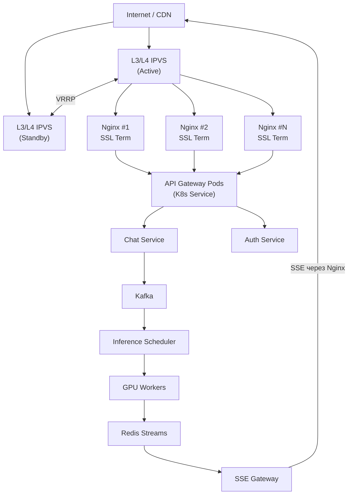
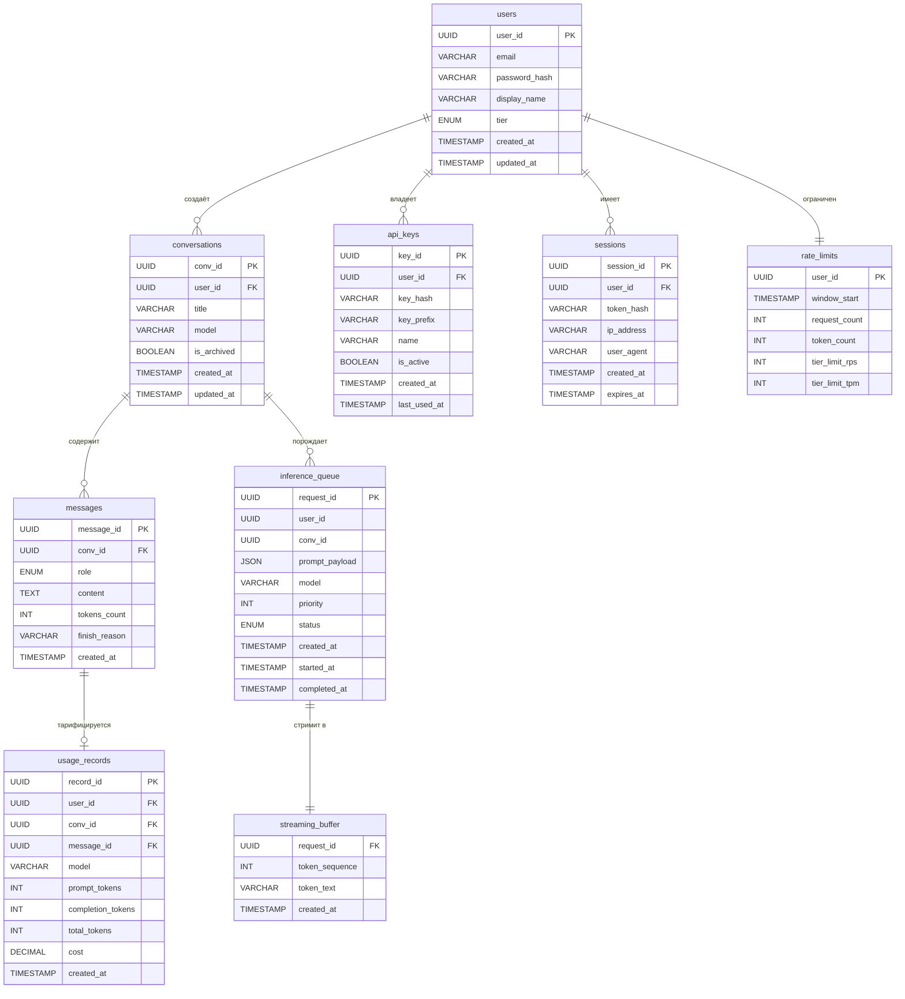
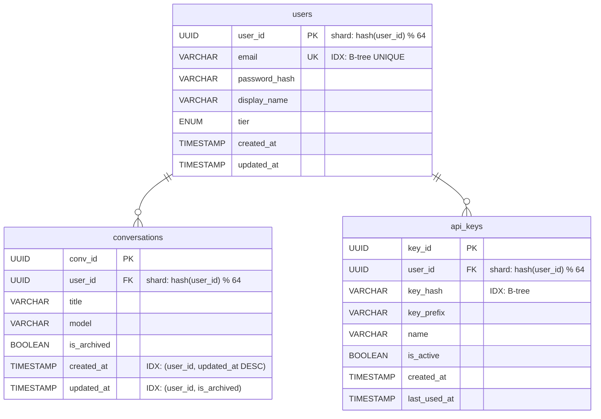
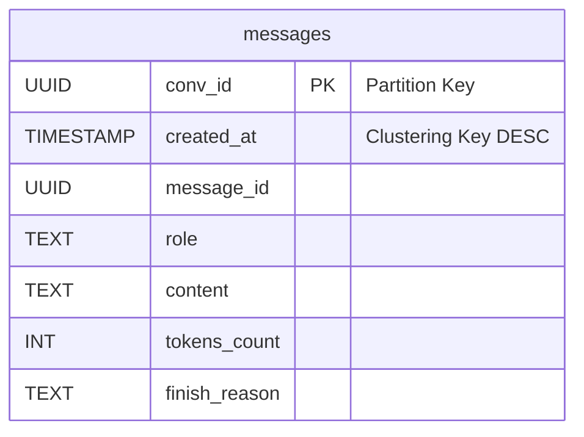
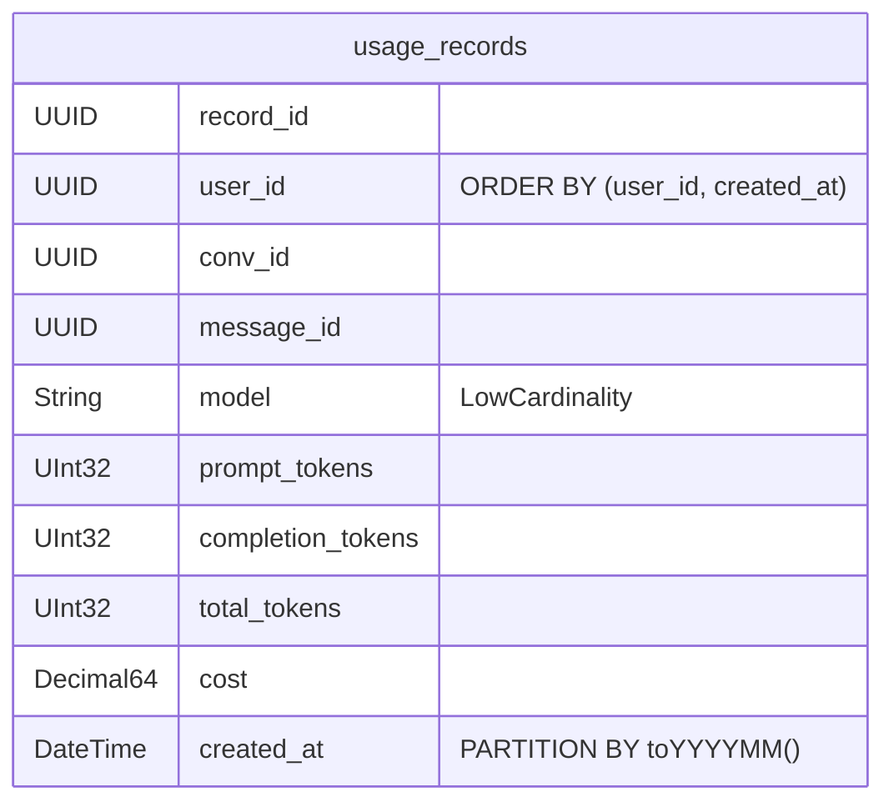
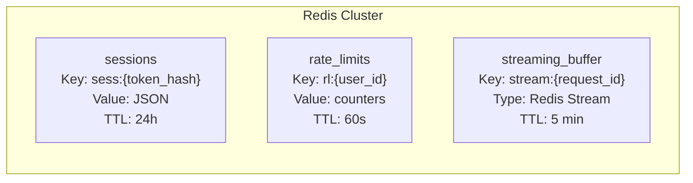
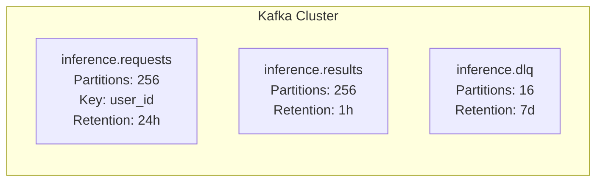
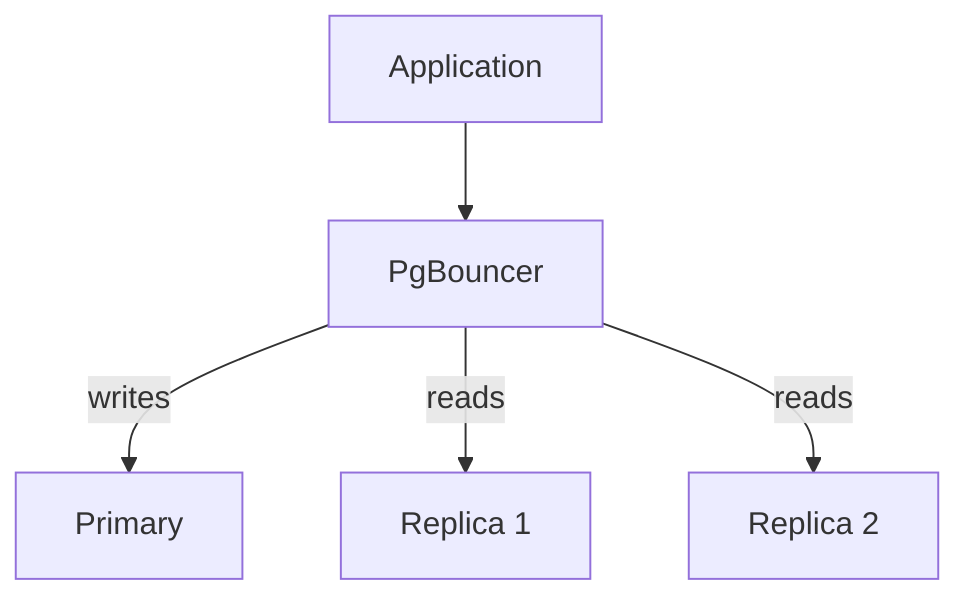

# 1. Тема и целевая аудитория

## Описание

Проектируемая система — публичная AI-платформа, предоставляющая доступ к большим языковым моделям (LLM) через веб-интерфейс и API.

**Основная проектируемая функциональность — полный цикл обработки запроса к LLM: от приёма запроса пользователя до отображения ответа модели.**

Система охватывает весь путь данных:

* приём запроса через веб-интерфейс или API
* маршрутизацию к inference-кластеру
* генерацию ответа на GPU
* потоковую передачу токенов
* отображение результата пользователю

**Реальные аналоги:**

* ChatGPT (OpenAI)
* Claude (Anthropic)
* Gemini (Google)

Эти сервисы демонстрируют наличие устойчивого глобального рынка AI-ассистентов и подтверждают масштаб аудитории.

---

## Ключевой пользовательский сценарий

Пользователь отправляет текстовый запрос → система передаёт его на inference-кластер → модель генерирует ответ токен за токеном → ответ передаётся пользователю в реальном времени (streaming) → отображается в веб-интерфейсе или возвращается через API.

### Характеристики нагрузки

* длительное время генерации ответа (5–30 секунд)
* высокая вычислительная нагрузка на GPU
* большое количество долгоживущих соединений
* потоковая передача ответа

---

## Целевая аудитория

В качестве ориентира используется аудитория сервиса ChatGPT.

По данным OpenAI:

* **>800 млн пользователей в неделю** [^1]
* **>2.5 млрд сообщений в день** [^2]

### Принятая модель аудитории проектируемой системы

| Метрика   | Значение   |
| --------- | ---------- |
| География | глобальная |
| MAU       | 1 млрд     |
| WAU       | 800 млн    |
| DAU       | 350 млн    |

DAU принимается на уровне **≈40–45% WAU**, что соответствует типичным показателям крупных интернет-сервисов.

---

## Требования к функционалу

### Ключевые функции (MVP)

| № | Функция            | Описание                                     |
| - | ------------------ | -------------------------------------------- |
| 1 | Отправка запроса   | Пользователь вводит промпт через веб или API |
| 2 | Inference          | Генерация ответа моделью на GPU              |
| 3 | Streaming ответа   | Передача токенов через SSE                   |
| 4 | Отображение ответа | Рендеринг ответа в UI                        |
| 5 | История чатов      | Сохранение и загрузка диалогов               |
| 6 | Аутентификация     | Регистрация, вход, управление сессиями       |
| 7 | Rate Limiting      | Ограничение частоты запросов                 |

---

## Ключевые продуктовые решения

* **Stateless API** — контекст диалога передаётся в каждом запросе
* **Streaming через SSE** — ответы передаются токен за токеном поверх HTTP
* **Server-side chat history** — история хранится на сервере для доступа с разных устройств
* **Разделение API и Inference** — API-слой отделён от GPU-кластера
* **Горизонтальное масштабирование** — независимое масштабирование компонентов
* **Глобальная балансировка** — распределение нагрузки между регионами
* **Режим работы 24/7** — высокие требования к доступности

---

# 2. Расчёт нагрузки

## 2.1 Исходные данные

В качестве референса используется аудитория сервиса ChatGPT.

По данным OpenAI:

* **>800 млн weekly active users** [^1]
* **≈2.5 млрд сообщений в день** [^2]

Эти значения используются как базовые показатели для моделирования нагрузки.

---

## 2.2 Аудиторные метрики

### Daily Active Users

DAU напрямую не публикуется, поэтому используется типичная пропорция для крупных интернет-сервисов:

```
DAU ≈ 40–50% WAU
```

Расчёт:

```
WAU = 800 млн
DAU ≈ 0.45 × 800 млн ≈ 360 млн пользователей
```

### Сводная таблица аудитории

| Метрика | Значение |
| ------- | -------- |
| MAU     | 1 млрд   |
| WAU     | 800 млн  |
| DAU     | 360 млн  |

---

## 2.3 Поведенческие метрики пользователей

Из данных OpenAI: **2.5 млрд сообщений в день**

Среднее количество сообщений на пользователя:

```
messages_per_user = 2.5B / 360M ≈ 7 сообщений в день
```

### Среднее количество действий пользователя в день

| Действие                   | Количество | Обоснование                                |
| -------------------------- | ---------- | ------------------------------------------ |
| Отправка запроса           | 7          | рассчитано из статистики сообщений         |
| Получение streaming ответа | 7          | один ответ на каждый запрос                |
| Открытие диалога           | 3          | пользователь продолжает несколько диалогов |
| Загрузка списка чатов      | 5          | при каждом входе и переключении            |
| Аутентификация             | 1          | один вход в день                           |

---

## 2.4 Размер данных

OpenAI использует **token-based API**. По документации OpenAI:

```
1 token ≈ 4 символа ≈ 4 bytes
```

### Размер prompt (запрос пользователя)

```
Типичный prompt: 200 tokens
Размер: 200 × 4 bytes ≈ 800 bytes ≈ 1 KB
```

### Размер response (ответ модели)

```
Средний ответ: 800 tokens
Размер: 800 × 4 bytes ≈ 3200 bytes ≈ 4 KB
```

### Размер одного сообщения

| Компонент | Токены | Размер |
| --------- | ------ | ------ |
| Prompt    | 200    | ~1 KB  |
| Response  | 800    | ~4 KB  |
| **Итого** | 1000   | ~5 KB  |

### Размер диалога

Предположение: 10 сообщений в диалоге (5 пар prompt + response)

```
(1 KB + 4 KB) × 5 = 25 KB
```

С учётом metadata, JSON-обёртки, системных сообщений:

```
≈ 40 KB на диалог
```

### Среднее хранилище пользователя

| Тип данных      | Количество | Размер единицы | Общий размер |
| --------------- | ---------- | -------------- | ------------ |
| Диалоги         | 50         | 40 KB          | 2 MB         |
| Метаданные      | —          | —              | 10 KB        |
| Профиль         | 1          | 5 KB           | 5 KB         |
| **Итого**       | —          | —              | ~2 MB        |

---

## 2.5 Расчёт RPS

### Базовый расчёт

Общее количество сообщений в день:

```
2 500 000 000 сообщений
```

Секунд в сутках:

```
86 400 секунд
```

Средний RPS:

```
2 500 000 000 / 86 400 ≈ 28 935 ≈ 29 000 RPS
```

---

## 2.6 Пиковая нагрузка

Пользовательская активность распределена неравномерно в течение суток. Для высоконагруженных систем применяется коэффициент burst-нагрузки:

```
Peak ≈ 3–5 × Average
```

Это значение используется в практиках Google SRE и Facebook capacity planning.

Принимаем:

```
Peak = Average × 4
Peak RPS ≈ 29 000 × 4 ≈ 116 000 RPS
```

---

## 2.7 RPS по типам запросов

### 1. Отправка запроса (Inference)

Каждое сообщение создаёт один inference-запрос:

```
Average RPS = 29 000
Peak RPS = 116 000
```

### 2. Streaming ответа

Streaming выполняется для каждого запроса (1:1):

```
Average RPS = 29 000
Peak RPS = 116 000
```

### 3. Загрузка истории диалога

```
360M пользователей × 3 открытия = 1.08B операций/день
RPS = 1.08B / 86 400 ≈ 12 500 RPS
```

### 4. Список чатов

```
360M пользователей × 5 запросов = 1.8B операций/день
RPS = 1.8B / 86 400 ≈ 21 000 RPS
```

### 5. Аутентификация

```
360M пользователей × 1 вход = 360M операций/день
RPS = 360M / 86 400 ≈ 4 200 RPS
```

### Сводная таблица RPS

| Тип запроса            | Avg RPS | Peak RPS |
| ---------------------- | ------- | -------- |
| Отправка запроса       | 29 000  | 116 000  |
| Streaming ответа       | 29 000  | 116 000  |
| Загрузка истории чата  | 12 500  | 50 000   |
| Список чатов           | 21 000  | 84 000   |
| Аутентификация         | 4 200   | 16 800   |
| **Итого**              | 95 700  | 382 800  |

---

## 2.8 Сетевой трафик

### Размер одного цикла запрос-ответ

```
Prompt: 1 KB
Response: 4 KB
Итого: 5 KB
```

### Суточный трафик

```
2.5B сообщений × 5 KB = 12.5 TB/день
```

### Средний throughput

```
12.5 TB / 86 400 сек ≈ 150 MB/s ≈ 1.2 Gbit/s
```

### Пиковый throughput

```
150 MB/s × 4 = 600 MB/s ≈ 4.8 Gbit/s
```

### Трафик по типам

| Тип трафика           | Суточный объём | Avg Throughput | Peak Throughput |
| --------------------- | -------------- | -------------- | --------------- |
| Inference (prompt)    | 2.5 TB         | 30 MB/s        | 120 MB/s        |
| Streaming (response)  | 10 TB          | 120 MB/s       | 480 MB/s        |
| Chat history          | 0.5 TB         | 6 MB/s         | 24 MB/s         |
| Static content (CDN)  | 1 TB           | 12 MB/s        | 48 MB/s         |
| **Итого**             | ~14 TB         | ~170 MB/s      | ~670 MB/s       |

---

## 2.9 Хранение данных

### Ежедневный прирост

| Тип данных    | Объём/день | Расчёт                    |
| ------------- | ---------- | ------------------------- |
| Prompts       | 2.5 TB     | 2.5B × 1 KB               |
| Responses     | 10 TB      | 2.5B × 4 KB               |
| Metadata      | 0.25 TB    | 2.5B × 100 bytes          |
| **Итого**     | ~12.75 TB  |                           |

### Годовой объём

```
12.75 TB × 365 ≈ 4.65 PB/год
```

### Сводная таблица хранения

| Тип данных        | Ежедневно | Ежемесячно | Ежегодно |
| ----------------- | --------- | ---------- | -------- |
| Сообщения (всего) | 12.5 TB   | 375 TB     | 4.5 PB   |
| Пользователи      | 1 GB      | 30 GB      | 360 GB   |
| Логи/аналитика    | 500 GB    | 15 TB      | 180 TB   |
| **Итого**         | ~13 TB    | ~390 TB    | ~4.7 PB  |

---

# 3. Глобальная балансировка нагрузки

## 3.1 Функциональное разбиение по доменам

Система разделяется на функциональные домены с различными требованиями к размещению:

| Домен             | Компоненты                                          | Требования к размещению                    |
| ----------------- | --------------------------------------------------- | ------------------------------------------ |
| **Edge Layer**    | CDN, DNS, TLS termination, DDoS protection          | Глобально распределён (PoP по всему миру)  |
| **API Layer**     | API Gateway, Auth Service, Rate Limiter, Streaming  | Региональные кластеры (близко к пользователям) |
| **Inference Layer** | GPU Workers, Inference Scheduler, Request Queue   | Централизованно (США, частично Европа)     |
| **Data Layer**    | Chat Storage, User DB, Billing, Analytics           | Региональные реплики + центральный кластер |

### Ключевая особенность архитектуры

**Inference-кластеры нельзя балансировать как обычные HTTP-сервисы:**

* GPU — дорогой и ограниченный ресурс
* Время генерации ответа: 5–60 секунд
* Требуется очередь запросов и приоритизация
* Inference выполняется преимущественно в США (основные GPU-мощности)

```
┌─────────────────────────────────────────────────────────────┐
│                     EDGE LAYER (Global)                      │
│                   CDN / Anycast / GeoDNS                     │
└─────────────────────────────────────────────────────────────┘
                              │
        ┌─────────────────────┼─────────────────────┐
        ▼                     ▼                     ▼
┌───────────────┐     ┌───────────────┐     ┌───────────────┐
│   US Region   │     │   EU Region   │     │  APAC Region  │
│  API Gateway  │     │  API Gateway  │     │  API Gateway  │
│  Auth Service │     │  Auth Service │     │  Auth Service │
│  Chat Service │     │  Chat Service │     │  Chat Service │
└───────┬───────┘     └───────┬───────┘     └───────┬───────┘
        │                     │                     │
        └─────────────────────┼─────────────────────┘
                              ▼
                 ┌─────────────────────────┐
                 │   INFERENCE LAYER (US)  │
                 │     GPU Clusters        │
                 │   Request Queue (Kafka) │
                 │   Inference Scheduler   │
                 └─────────────────────────┘
```

---

## 3.2 Географическое распределение пользователей

Анализ глобального трафика ChatGPT показывает неравномерное распределение [^3][^4]:

| Регион              | Доля трафика | Ключевые страны                        |
| ------------------- | ------------ | -------------------------------------- |
| North America       | ~19–21%      | США (~14–17%), Канада (~2–4%)          |
| Europe              | ~14–28%      | Великобритания, Германия (~3–6% каждая)|
| Asia-Pacific        | ~28–36%      | Индия (~8–16%), Япония, Сингапур       |
| Latin America       | ~5–6%        | Бразилия (~5–6%)                       |
| Middle East & Africa| ~7%          | ОАЭ, Израиль                           |

*Примечание: OpenAI не публикует официальную разбивку по регионам. Данные основаны на аналитических оценках.*

---

## 3.3 Обоснование расположения ДЦ

### План размещения инфраструктуры

| Регион       | Локация                | Роль                      | Обоснование                                    |
| ------------ | ---------------------- | ------------------------- | ---------------------------------------------- |
| **US East**  | Virginia (us-east-1)   | Primary Inference + API   | Крупнейшая аудитория, основные GPU-мощности    |
| **US West**  | Oregon (us-west-2)     | Secondary Inference + API | Резервирование, обслуживание West Coast        |
| **EU Central** | Frankfurt (eu-central-1) | API + Limited Inference | GDPR compliance, низкий latency для Европы   |
| **APAC**     | Singapore (ap-southeast-1) | API + Edge            | Быстрорастущий рынок, обслуживание Азии        |

### Почему Inference преимущественно в США

1. **Концентрация GPU-инфраструктуры** — основные вычислительные мощности расположены в США (проект Stargate: Техас, Нью-Мексико)
2. **Стоимость** — GPU в США дешевле, чем в Европе/Азии
3. **Партнёрство с Azure** — Microsoft Azure предоставляет основную инфраструктуру
4. **Data residency** — для enterprise-клиентов доступен inference residency в Европе [^5]

---

## 3.4 Распределение запросов по ДЦ

### Распределение трафика

На основе географии пользователей и архитектурных решений:

| Регион           | Доля API-запросов | Доля Inference |
| ---------------- | ----------------- | -------------- |
| US (East + West) | 35%               | 80%            |
| EU Central       | 35%               | 15%            |
| APAC             | 30%               | 5%             |

*Inference централизован в США, API-слой распределён по регионам.*

### Распределение RPS по регионам

На основе расчётов из раздела 2 (средний RPS inference = 29 000):

| Регион     | API RPS (avg) | API RPS (peak) | Inference RPS (avg) |
| ---------- | ------------- | -------------- | ------------------- |
| US East    | 5 100         | 20 400         | 11 600              |
| US West    | 5 100         | 20 400         | 11 600              |
| EU Central | 10 150        | 40 600         | 4 350               |
| APAC       | 8 700         | 34 800         | 1 450               |
| **Total**  | **29 000**    | **116 000**    | **29 000**          |

---

## 3.5 Схема DNS балансировки

### GeoDNS

Используется **GeoDNS** для маршрутизации пользователей к ближайшему API-кластеру:

```
┌──────────────┐
│    Client    │
│  (Germany)   │
└──────┬───────┘
       │ DNS query: api.chatgpt.com
       ▼
┌──────────────────────────────────┐
│         GeoDNS Provider          │
│  (Cloudflare / Route53 / Akamai) │
│                                  │
│  Germany → EU Central            │
│  USA → US East/West              │
│  Japan → APAC                    │
└──────┬───────────────────────────┘
       │ Returns: eu-central.api.chatgpt.com
       ▼
┌──────────────┐
│  EU Central  │
│  API Gateway │
└──────────────┘
```

### Конфигурация GeoDNS

| Регион клиента  | Целевой ДЦ                      | TTL  |
| --------------- | ------------------------------- | ---- |
| North America   | US East / US West (latency-based) | 60s  |
| Europe          | EU Central                      | 60s  |
| Asia            | APAC                            | 60s  |
| South America   | US East                         | 60s  |
| Default         | US East                         | 60s  |

**Преимущества GeoDNS:**
* Минимизация latency для пользователей
* Простота реализации
* Автоматический failover при настройке health checks

---

## 3.6 Схема Anycast балансировки

### Anycast для Edge Layer

На уровне CDN и edge-инфраструктуры используется **Anycast routing**:

```
┌─────────────────────────────────────────────────┐
│              Anycast IP: 104.18.x.x             │
│                                                 │
│   ┌─────┐   ┌─────┐   ┌─────┐   ┌─────┐        │
│   │PoP  │   │PoP  │   │PoP  │   │PoP  │  ...   │
│   │ NYC │   │ FRA │   │ SIN │   │ TYO │        │
│   └─────┘   └─────┘   └─────┘   └─────┘        │
└─────────────────────────────────────────────────┘
                       │
        BGP routing → nearest PoP
                       │
              ┌────────┴────────┐
              │    Client       │
              │   (anywhere)    │
              └─────────────────┘
```

### Функции Anycast уровня

| Функция              | Описание                               |
| -------------------- | -------------------------------------- |
| **TLS Termination**  | SSL/TLS завершается на ближайшем PoP   |
| **DDoS Protection**  | Распределение атаки по всем PoP        |
| **Static Content**   | Кэширование статики (JS, CSS, images)  |
| **WebSocket/SSE Proxy** | Проксирование streaming-соединений  |

**Провайдеры:** Cloudflare, Fastly, Akamai

---

## 3.7 Механизм регулировки трафика между ДЦ

### Health Checks

Постоянный мониторинг состояния каждого региона:

| Метрика             | Порог         | Действие                      |
| ------------------- | ------------- | ----------------------------- |
| API Response Time   | > 500ms       | Снижение веса региона         |
| Error Rate          | > 1%          | Снижение веса региона         |
| GPU Queue Depth     | > 1000        | Перенаправление inference     |
| Region Unavailable  | 3 failed checks | Исключение из ротации       |

### Weighted DNS

Распределение трафика с учётом весов:

| ДЦ         | Базовый вес | При деградации EU | При отказе EU |
| ---------- | ----------- | ----------------- | ------------- |
| US East    | 20          | 30                | 40            |
| US West    | 15          | 20                | 25            |
| EU Central | 35          | 15                | 0             |
| APAC       | 30          | 35                | 35            |

### Traffic Shifting

Механизмы перенаправления трафика:

1. **Gradual Shift** — плавное изменение весов (для planned maintenance)
2. **Instant Failover** — мгновенное переключение (при аварии)
3. **Canary Routing** — направление части трафика на новую версию

### Cross-Region Failover

Сценарий отказа региона:

```
Normal State:
  US East: 20% │ US West: 15% │ EU: 35% │ APAC: 30%

EU Region Degraded (high latency):
  US East: 30% │ US West: 20% │ EU: 15% │ APAC: 35%

EU Region Down:
  US East: 40% │ US West: 25% │ EU: 0%  │ APAC: 35%
  
  EU users → routed to US East (increased latency, but available)
```

---

## 3.8 Особенности балансировки Inference-запросов

### Проблема

GPU inference нельзя балансировать как обычные HTTP-запросы:

* Запрос занимает GPU на 5–60 секунд
* Нельзя использовать простой round-robin между GPU
* Требуется очередь и приоритизация

### Решение: централизованная очередь

```
┌─────────────┐     ┌─────────────┐     ┌─────────────┐
│  US API     │     │  EU API     │     │  APAC API   │
└──────┬──────┘     └──────┬──────┘     └──────┬──────┘
       │                   │                   │
       └───────────────────┼───────────────────┘
                           ▼
              ┌─────────────────────────┐
              │    Kafka / SQS Queue    │
              │    (US Region)          │
              │                         │
              │  Priority Queues:       │
              │  - Premium (high)       │
              │  - Standard (medium)    │
              │  - Free tier (low)      │
              └───────────┬─────────────┘
                          │
              ┌───────────┴───────────┐
              │   Inference Scheduler │
              │                       │
              │  - GPU allocation     │
              │  - Batch optimization │
              │  - Queue management   │
              └───────────┬───────────┘
                          │
        ┌─────────────────┼─────────────────┐
        ▼                 ▼                 ▼
   ┌─────────┐       ┌─────────┐       ┌─────────┐
   │ GPU     │       │ GPU     │       │ GPU     │
   │ Worker 1│       │ Worker 2│       │ Worker N│
   └─────────┘       └─────────┘       └─────────┘
```

### Latency для пользователей из разных регионов

| Регион пользователя | Network Latency | Inference Location | Overhead            |
| ------------------- | --------------- | ------------------ | ------------------- |
| US East             | ~10ms           | US                 | minimal             |
| EU                  | ~80ms           | US                 | +160ms round-trip   |
| APAC                | ~150ms          | US                 | +300ms round-trip   |

*Для enterprise-клиентов с EU inference residency — latency ниже.*

---

## 3.9 Итоговая схема глобальной балансировки

```
                         ┌─────────────────────┐
                         │      Internet       │
                         └──────────┬──────────┘
                                    │
                         ┌──────────▼──────────┐
                         │   Anycast CDN/Edge  │
                         │   (Cloudflare)      │
                         │   - TLS termination │
                         │   - DDoS protection │
                         │   - Static caching  │
                         └──────────┬──────────┘
                                    │
                         ┌──────────▼──────────┐
                         │      GeoDNS         │ // TODO: GeoDNS может быть перед AnyCast
                         │   (Route53/CF)      │
                         └──────────┬──────────┘
                                    │
          ┌─────────────────────────┼─────────────────────────┐
          │                         │                         │
          ▼                         ▼                         ▼
   ┌─────────────┐          ┌─────────────┐          ┌─────────────┐
   │  US Region  │          │  EU Region  │          │ APAC Region │
   │             │          │             │          │             │
   │ API Gateway │          │ API Gateway │          │ API Gateway │
   │ Auth Service│          │ Auth Service│          │ Auth Service│
   │ Chat Service│          │ Chat Service│          │ Chat Service│
   │ Rate Limiter│          │ Rate Limiter│          │ Rate Limiter│
   └──────┬──────┘          └──────┬──────┘          └──────┬──────┘
          │                        │                        │
          └────────────────────────┼────────────────────────┘
                                   │
                         ┌─────────▼─────────┐
                         │  Global Message   │
                         │  Queue (Kafka)    │  // TODO: Здесь можно убрать
                         └─────────┬─────────┘
                                   │
                    ┌──────────────┼──────────────┐
                    ▼              ▼              ▼
             ┌───────────┐  ┌───────────┐  ┌───────────┐
             │ US East   │  │ US West   │  │ EU        │
             │ GPU       │  │ GPU       │  │ GPU       │
             │ Cluster   │  │ Cluster   │  │ Cluster   │
             │ (Primary) │  │ (Second.) │  │ (Limited) │
             └───────────┘  └───────────┘  └───────────┘
```

---

# 4. Локальная балансировка нагрузки

## 4.1 Схема балансировки внутри региона



---

## 4.2 Уровни балансировки и резервирование

| Уровень | Компонент | Алгоритм | Резервирование | Обоснование |
| --- | --- | --- | --- | --- |
| L3/L4 | IPVS | Least Connections | **N+1** | Лёгкий, в ядре Linux, VRRP failover < 3 сек |
| L7 | Nginx (SSL termination) | Least Conn + Weight | **N×2** | CPU-intensive TLS + SSE. При потере 50% — остальные держат peak |
| Application | API Gateway (K8s) | Round Robin | **N+1** | K8s auto-reschedule ~30 сек |
| Backend | Chat/Auth Service | Round Robin | **N+1** | K8s auto-reschedule |
| Queue | Kafka | Partitioning | **RF=3** | ISR replication |
| Inference | GPU Workers | Queue-based | **N+1** | При падении GPU — запрос возвращается в очередь |
| Streaming | Redis + SSE Gateway | Hash / Least Conn | Redis **N×2**, SSE **N+1** | Горячие данные + K8s reschedule |

---

## 4.3 Расчёт количества L7 балансировщиков (Nginx)

Исходные данные из раздела 3:

| Регион | API RPS (peak) | Inference RPS (peak) |
| --- | --- | --- |
| US East | 20 400 | 46 400 |
| US West | 20 400 | 46 400 |
| EU Central | 40 600 | 17 400 |
| APAC | 34 800 | 5 800 |

*Inference peak = avg × 4 (burst-коэффициент из раздела 2)*

По данным бенчмарков Nginx [^6][^7]:
- Concurrent connections: **~300 000** на сервер
- Пропускная способность: **10 Gbit/s NIC × 70% ≈ 7 Gbit/s**

### Ограничитель 1: SSL Termination (CPS)

~30% запросов создают новые TLS-соединения (остальные — keep-alive):

| Регион | Peak API RPS | Peak CPS (×0.3) | Nginx нод |
| --- | --- | --- | --- |
| US East | 20 400 | 6 120 | 1 |
| US West | 20 400 | 6 120 | 1 |
| EU Central | 40 600 | 12 180 | 1 |
| APAC | 34 800 | 10 440 | 1 |

### Ограничитель 2: Пропускная способность сети

Peak throughput = 5.4 Gbit/s (из раздела 2), распределение пропорционально API RPS:

| Регион | Доля API | Peak Gbit/s | Nginx нод |
| --- | --- | --- | --- |
| US East | 17.6% | 0.95 | 1 |
| US West | 17.6% | 0.95 | 1 |
| EU Central | 35% | 1.89 | 1 |
| APAC | 30% | 1.62 | 1 |

### Ограничитель 3: SSE concurrent connections (определяющий)

Каждый inference-запрос удерживает SSE-соединение ~15 сек:

| Регион | Peak Inference RPS | Concurrent SSE (×15s) | Nginx нод |
| --- | --- | --- | --- |
| US East | 46 400 | 696 000 | 3 |
| US West | 46 400 | 696 000 | 3 |
| EU Central | 17 400 | 261 000 | 1 |
| APAC | 5 800 | 87 000 | 1 |

### Итог по Nginx

| Регион | По CPS | По сети | По SSE | **Max** | **С N×2** |
| --- | --- | --- | --- | --- | --- |
| US East | 1 | 1 | **3** | 3 | **6** |
| US West | 1 | 1 | **3** | 3 | **6** |
| EU Central | 1 | 1 | **1** | 1 | **2** |
| APAC | 1 | 1 | **1** | 1 | **2** |

---

## 4.4 Расчёт количества L3/L4 балансировщиков

L4 (IPVS) пропускная способность: ~40 Gbit/s на ноду

| Регион | Peak Gbit/s | L4 нод | С N+1 |
| --- | --- | --- | --- |
| US East | 0.95 | 1 | **2** |
| US West | 0.95 | 1 | **2** |
| EU Central | 1.89 | 1 | **2** |
| APAC | 1.62 | 1 | **2** |

---

## 4.5 Сводная таблица

| Компонент | US East | US West | EU | APAC | **Всего** |
| --- | --- | --- | --- | --- | --- |
| L3/L4 (N+1) | 2 | 2 | 2 | 2 | **8** |
| L7 Nginx (N×2) | 6 | 6 | 2 | 2 | **16** |

# 5. Логическая схема БД

## 5.1 ER-диаграмма



---

## 5.2 Описание таблиц

### users

| Поле | Тип | Размер | Описание |
| --- | --- | --- | --- |
| user_id | UUID | 16 B | Первичный ключ |
| email | VARCHAR | ~50 B | Email (уникальный) |
| password_hash | VARCHAR | 60 B | bcrypt hash |
| display_name | VARCHAR | ~50 B | Отображаемое имя |
| tier | ENUM | 1 B | free / plus / enterprise |
| created_at | TIMESTAMP | 8 B | Регистрация |
| updated_at | TIMESTAMP | 8 B | Обновление |

| Метрика | Значение |
| --- | --- |
| Строк | ~1 млрд |
| Размер строки | ~200 B |
| Общий объём | ~200 GB |
| QPS чтение | 4 200 (auth) |
| QPS запись | ~100 (регистрации) |
| Консистентность | Strong |
| Распределение ключей | Равномерное по user_id |

---

### conversations

| Поле | Тип | Размер | Описание |
| --- | --- | --- | --- |
| conv_id | UUID | 16 B | Первичный ключ |
| user_id | UUID | 16 B | Владелец |
| title | VARCHAR | ~100 B | Название диалога |
| model | VARCHAR | 20 B | Модель |
| is_archived | BOOLEAN | 1 B | Флаг архивации |
| created_at | TIMESTAMP | 8 B | Создание |
| updated_at | TIMESTAMP | 8 B | Последнее сообщение |

| Метрика | Значение |
| --- | --- |
| Строк | ~50 млрд |
| Размер строки | ~170 B |
| Общий объём | ~8.5 TB |
| QPS чтение | 33 500 (21 000 список + 12 500 открытие) |
| QPS запись | 29 000 (update при новом сообщении) |
| Консистентность | Strong (per-user) |
| Распределение ключей | Hot keys у активных пользователей |

---

### messages

| Поле | Тип | Размер | Описание |
| --- | --- | --- | --- |
| message_id | UUID | 16 B | Первичный ключ |
| conv_id | UUID | 16 B | FK → conversations |
| role | ENUM | 1 B | user / assistant / system |
| content | TEXT | ~1–4 KB | Текст сообщения |
| tokens_count | INT | 4 B | Количество токенов |
| finish_reason | VARCHAR | 10 B | stop / length / error |
| created_at | TIMESTAMP | 8 B | Время создания |

| Метрика | Значение |
| --- | --- |
| Строк | ~2.5 млрд/день, ~900 млрд/год |
| Размер строки | ~2.5 KB (avg) |
| Общий объём | ~12.5 TB/день, ~4.5 PB/год |
| QPS чтение | 12 500 (загрузка диалога) |
| QPS запись | 58 000 (prompt + response = 2 × 29 000) |
| Консистентность | Eventual (допустим read-after-write delay) |
| Распределение ключей | Hot keys по conv_id активных диалогов |

---

### api_keys

| Поле | Тип | Размер | Описание |
| --- | --- | --- | --- |
| key_id | UUID | 16 B | Первичный ключ |
| user_id | UUID | 16 B | FK → users |
| key_hash | VARCHAR | 64 B | SHA-256 hash |
| key_prefix | VARCHAR | 8 B | Префикс для идентификации |
| name | VARCHAR | 50 B | Имя ключа |
| is_active | BOOLEAN | 1 B | Активен ли |
| created_at | TIMESTAMP | 8 B | Создание |
| last_used_at | TIMESTAMP | 8 B | Последнее использование |

| Метрика | Значение |
| --- | --- |
| Строк | ~100 млн |
| Размер строки | ~180 B |
| Общий объём | ~18 GB |
| QPS чтение | 29 000 (валидация при каждом API-запросе) |
| QPS запись | ~100 |
| Консистентность | Strong |
| Распределение ключей | Равномерное по key_hash |

---

### sessions

| Поле | Тип | Размер | Описание |
| --- | --- | --- | --- |
| session_id | UUID | 16 B | Первичный ключ |
| user_id | UUID | 16 B | FK → users |
| token_hash | VARCHAR | 64 B | Hash токена |
| ip_address | VARCHAR | 45 B | IPv4/IPv6 |
| user_agent | VARCHAR | 200 B | User-Agent |
| created_at | TIMESTAMP | 8 B | Создание |
| expires_at | TIMESTAMP | 8 B | Истечение |

| Метрика | Значение |
| --- | --- |
| Строк | ~360 млн (DAU) |
| Размер строки | ~360 B |
| Общий объём | ~130 GB |
| QPS чтение | 95 700 (проверка на каждый запрос) |
| QPS запись | 4 200 (login) |
| Консистентность | Strong |
| Распределение ключей | Равномерное по token_hash |

---

### usage_records

| Поле | Тип | Размер | Описание |
| --- | --- | --- | --- |
| record_id | UUID | 16 B | Первичный ключ |
| user_id | UUID | 16 B | FK → users |
| conv_id | UUID | 16 B | FK → conversations |
| message_id | UUID | 16 B | FK → messages |
| model | VARCHAR | 20 B | Модель |
| prompt_tokens | INT | 4 B | Токены промпта |
| completion_tokens | INT | 4 B | Токены ответа |
| total_tokens | INT | 4 B | Сумма |
| cost | DECIMAL | 8 B | Стоимость |
| created_at | TIMESTAMP | 8 B | Время |

| Метрика | Значение |
| --- | --- |
| Строк | ~2.5 млрд/день |
| Размер строки | ~120 B |
| Общий объём | ~300 GB/день, ~110 TB/год |
| QPS чтение | ~1 000 (billing dashboard) |
| QPS запись | 29 000 |
| Консистентность | Eventual |
| Распределение ключей | Hot keys у активных пользователей |

---

### rate_limits

| Поле | Тип | Размер | Описание |
| --- | --- | --- | --- |
| user_id | UUID | 16 B | PK |
| window_start | TIMESTAMP | 8 B | Начало окна |
| request_count | INT | 4 B | Счётчик запросов |
| token_count | INT | 4 B | Счётчик токенов |
| tier_limit_rps | INT | 4 B | Лимит RPS |
| tier_limit_tpm | INT | 4 B | Лимит TPM |

| Метрика | Значение |
| --- | --- |
| Строк | ~360 млн |
| Размер строки | ~40 B |
| Общий объём | ~15 GB |
| QPS чтение | 29 000 |
| QPS запись | 29 000 (атомарный инкремент) |
| Консистентность | Strong (per-user) |
| Распределение ключей | Hot keys у активных пользователей |

---

### inference_queue

| Поле | Тип | Размер | Описание |
| --- | --- | --- | --- |
| request_id | UUID | 16 B | Первичный ключ |
| user_id | UUID | 16 B | Инициатор |
| conv_id | UUID | 16 B | Диалог |
| prompt_payload | JSON | ~1–128 KB | Контекст для модели |
| model | VARCHAR | 20 B | Модель |
| priority | INT | 4 B | Приоритет |
| status | ENUM | 1 B | queued / processing / done / failed |
| created_at | TIMESTAMP | 8 B | Постановка |
| started_at | TIMESTAMP | 8 B | Начало |
| completed_at | TIMESTAMP | 8 B | Конец |

| Метрика | Значение |
| --- | --- |
| Строк (in-flight) | ~1–2 млн |
| Размер строки | ~10 KB avg |
| Общий объём (горячий) | ~20 GB |
| QPS чтение | 29 000 (scheduler consume) |
| QPS запись | 29 000 (produce) |
| Консистентность | Strong (ordering важен) |
| Распределение ключей | Равномерное по request_id |

---

### streaming_buffer

| Поле | Тип | Размер | Описание |
| --- | --- | --- | --- |
| request_id | UUID | 16 B | FK → inference_queue |
| token_sequence | INT | 4 B | Порядковый номер |
| token_text | VARCHAR | ~20 B | Текст токена |
| created_at | TIMESTAMP | 8 B | Время генерации |

| Метрика | Значение |
| --- | --- |
| Строк (in-flight) | ~700 млн |
| Размер строки | ~50 B |
| Общий объём (горячий) | ~35 GB |
| QPS чтение | ~2 300 000 (SSE gateway reads) |
| QPS запись | ~2 300 000 (GPU writes) |
| Консистентность | Eventual (ordered by sequence) |
| Распределение ключей | Hot keys по active request_id |
| TTL | Auto-expire 5 мин |

---

## 5.3 Сводная таблица

| Таблица | Строк | Размер строки | Объём | QPS Read | QPS Write | Консистентность |
| --- | --- | --- | --- | --- | --- | --- |
| users | 1 млрд | 200 B | 200 GB | 4 200 | 100 | Strong |
| conversations | 50 млрд | 170 B | 8.5 TB | 33 500 | 29 000 | Strong (user) |
| messages | 900 млрд/год | 2.5 KB | 4.5 PB/год | 12 500 | 58 000 | Eventual |
| api_keys | 100 млн | 180 B | 18 GB | 29 000 | 100 | Strong |
| sessions | 360 млн | 360 B | 130 GB | 95 700 | 4 200 | Strong |
| usage_records | 900 млрд/год | 120 B | 110 TB/год | 1 000 | 29 000 | Eventual |
| rate_limits | 360 млн | 40 B | 15 GB | 29 000 | 29 000 | Strong (user) |
| inference_queue | 2 млн | 10 KB | 20 GB | 29 000 | 29 000 | Strong |
| streaming_buffer | 700 млн | 50 B | 35 GB | 2 300 000 | 2 300 000 | Eventual |

---

# 6. Физическая схема БД

## 6.1 Выбор СУБД

| Таблица | СУБД | Обоснование |
| --- | --- | --- |
| users | PostgreSQL | Реляционные данные, strong consistency, малый объём |
| conversations | PostgreSQL | Связь с users, strong consistency per-user |
| messages | ScyllaDB | Огромный объём (PB/год), write-heavy, eventual consistency |
| api_keys | PostgreSQL | Малый объём, strong consistency, частые lookups |
| sessions | Redis | Высочайший QPS чтение (95k), TTL, key-value |
| usage_records | ClickHouse | Append-only, аналитические агрегации, сжатие |
| rate_limits | Redis | Атомарные инкременты, TTL, low latency |
| inference_queue | Kafka | Message queue, ordering, высокий throughput |
| streaming_buffer | Redis Streams | Pub/sub с ordering, TTL, low latency |

---

## 6.2 Схема с привязкой к СУБД и индексами

### PostgreSQL Cluster



### ScyllaDB



### ClickHouse



### Redis



### Kafka



---

## 6.3 Индексы

| Таблица | Индекс | Тип | Обоснование |
| --- | --- | --- | --- |
| users | PK: user_id | B-tree | Primary lookup |
| users | UNIQUE: email | B-tree | Login |
| conversations | PK: conv_id | B-tree | Primary lookup |
| conversations | (user_id, updated_at DESC) | B-tree | Список чатов с сортировкой |
| conversations | (user_id, is_archived) | B-tree | Фильтр активных/архивных |
| api_keys | PK: key_id | B-tree | Primary lookup |
| api_keys | key_hash | B-tree | Валидация API-ключа |
| api_keys | user_id | B-tree | Список ключей пользователя |
| messages | Partition: conv_id | Hash | Все сообщения чата на одном узле |
| messages | Clustering: created_at DESC | Sorted | Порядок внутри диалога |
| usage_records | ORDER BY (user_id, created_at) | MergeTree | Агрегации по пользователю |
| usage_records | PARTITION BY toYYYYMM(created_at) | Partition | Очистка старых данных |
| sessions | KEY sess:{token_hash} | Hash | O(1) lookup |
| rate_limits | KEY rl:{user_id} | Hash | O(1) lookup |
| streaming_buffer | KEY stream:{request_id} | Stream | Ordered delivery |

---

## 6.4 Денормализация

| Что | Где | Зачем |
| --- | --- | --- |
| title | conversations | Список чатов без JOIN к messages |
| updated_at | conversations | Сортировка списка без scan messages |
| tokens_count | messages | Без повторного tokenize при чтении |
| model | conversations + usage_records | Фильтрация без JOIN |
| total_tokens | usage_records | Быстрая агрегация без суммирования полей |
| Materialized views | ClickHouse | Предагрегация для billing dashboard |

---

## 6.5 Шардирование и резервирование

| СУБД | Shard Key | Шардов | Репликация | Нод |
| --- | --- | --- | --- | --- |
| PostgreSQL | hash(user_id) % 64 | 64 | 1 primary + 2 replicas | 192 |
| ScyllaDB | Murmur3(conv_id) | auto | RF=3 per region | 48 |
| Redis | CRC16 hash slots | 128 | 1 primary + 1 replica | 256 |
| ClickHouse | hash(user_id) % 8 | 8 | 2 replicas per shard | 16 |
| Kafka | hash(user_id) % 256 | 256 partitions | RF=3, Min ISR=2 | 12 |

### Обоснование ключей шардирования

| СУБД | Почему такой ключ |
| --- | --- |
| PostgreSQL | user_id — все данные пользователя на одном шарде, нет cross-shard JOIN |
| ScyllaDB | conv_id — все сообщения диалога в одной партиции, типичный запрос: WHERE conv_id = ? |
| Redis | Стандартный CRC16 по ключу, равномерное распределение |
| ClickHouse | user_id — агрегации billing по пользователю без distributed join |
| Kafka | user_id — ordering запросов одного пользователя внутри партиции |

---

## 6.6 Клиентские библиотеки и балансировка подключений

| СУБД | Клиентская библиотека | Connection Pool / Proxy |
| --- | --- | --- |
| PostgreSQL | asyncpg (Python), pgx (Go) | PgBouncer (transaction mode) |
| ScyllaDB | scylla-driver, gocql | Token-aware routing (built-in) |
| Redis | redis-py, go-redis | Redis Cluster routing (built-in) |
| ClickHouse | clickhouse-connect | HTTP interface, connection reuse |
| Kafka | confluent-kafka, sarama | Built-in producer/consumer |

### Балансировка запросов к PostgreSQL



- **Writes** → Primary only
- **Reads** → реплики через round-robin
- PgBouncer в transaction mode, max 100 connections per pool

---

## 6.7 Схема резервного копирования

| СУБД | Метод | Периодичность | Хранение | RPO | RTO |
| --- | --- | --- | --- | --- | --- |
| PostgreSQL | pg_basebackup + WAL archiving | Full: ежедневно, WAL: непрерывно | S3, 30 дней | < 1 мин | < 15 мин |
| ScyllaDB | nodetool snapshot | Ежедневно | S3, 14 дней | < 1 час | < 1 час |
| Redis | RDB + AOF | RDB: ежечасно, AOF: always | S3, 7 дней | < 1 сек | < 5 мин |
| ClickHouse | BACKUP TABLE → S3 | Ежедневно | S3, 90 дней | < 24 часа | < 1 час |
| Kafka | MirrorMaker 2 | Непрерывно | Второй кластер | < 1 сек | < 1 мин |

*Примечание: streaming_buffer (Redis Streams) не бэкапится — данные эфемерные с TTL 5 минут.*

---

## 6.8 Сводная таблица физической схемы

| Таблица | СУБД | Shard Key | Шардов | Реплик | Нод | Ключевые индексы |
| --- | --- | --- | --- | --- | --- | --- |
| users | PostgreSQL | hash(user_id) | 64 | 3 | 192 | PK user_id, UNIQUE email |
| conversations | PostgreSQL | hash(user_id) | 64 | 3 | * | PK conv_id, IDX (user_id, updated_at) |
| messages | ScyllaDB | Murmur3(conv_id) | auto | 3 | 48 | Partition conv_id, Cluster created_at |
| api_keys | PostgreSQL | hash(user_id) | 64 | 3 | * | PK key_id, IDX key_hash |
| sessions | Redis | CRC16 | 128 | 2 | 256 | KEY sess:{token_hash} |
| rate_limits | Redis | CRC16 | * | 2 | * | KEY rl:{user_id} |
| streaming_buffer | Redis Streams | CRC16 | * | 2 | * | KEY stream:{request_id} |
| usage_records | ClickHouse | hash(user_id) | 8 | 2 | 16 | ORDER BY (user_id, created_at) |
| inference_queue | Kafka | hash(user_id) | 256 | 3 | 12 | Topic partitioning |

*\* — colocation: размещены на тех же нодах что и основные данные Redis / PostgreSQL*

# Источники

[^1]: OpenAI. *ChatGPT usage and adoption patterns at work.* https://openai.com/business/guides-and-resources/chatgpt-usage-and-adoption-patterns-at-work/

[^2]: OpenAI. *New Economic Analysis.* https://openai.com/global-affairs/new-economic-analysis/

[^3]: DemandSage. *ChatGPT Statistics, User Growth & Usage.* https://www.demandsage.com/chatgpt-statistics/

[^4]: Exploding Topics. *ChatGPT Users Statistics.* https://explodingtopics.com/blog/chatgpt-users

[^5]: OpenAI. *Data Residency.* https://openai.com/enterprise-privacy/data-residency/

[^6]: Nginx Blog. *Testing Performance of NGINX Ingress Controller for Kubernetes.* https://blog.nginx.org/blog/testing-performance-nginx-ingress-controller-kubernetes

[^7]: Nginx Blog. *Testing the Performance of NGINX and NGINX Plus Web Servers.* https://blog.nginx.org/blog/testing-the-performance-of-nginx-and-nginx-plus-web-servers
