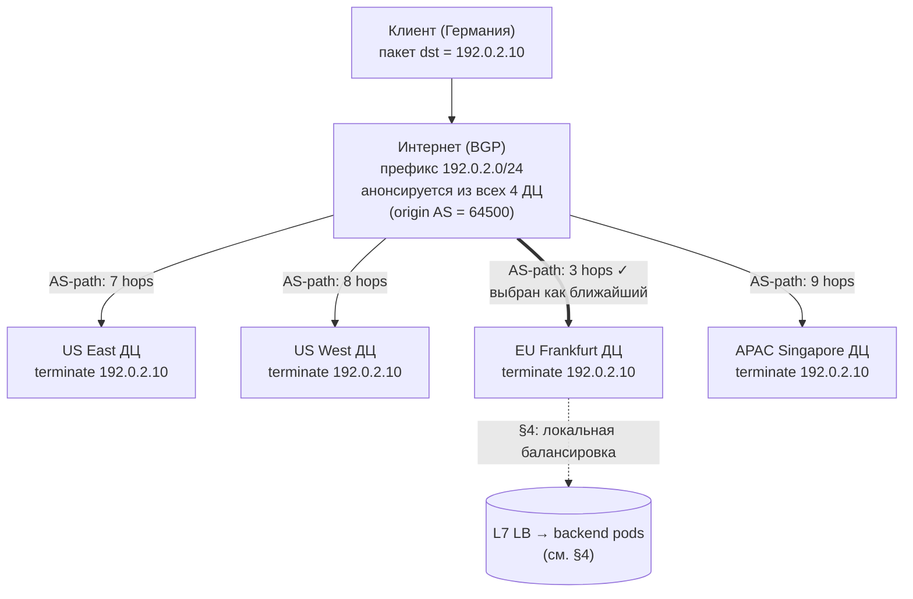
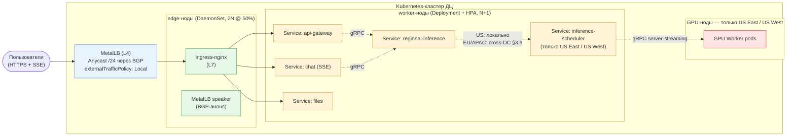
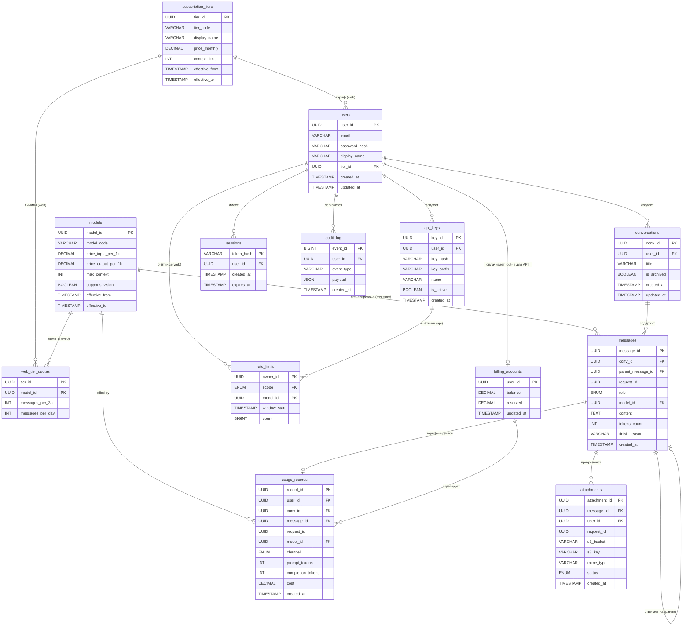
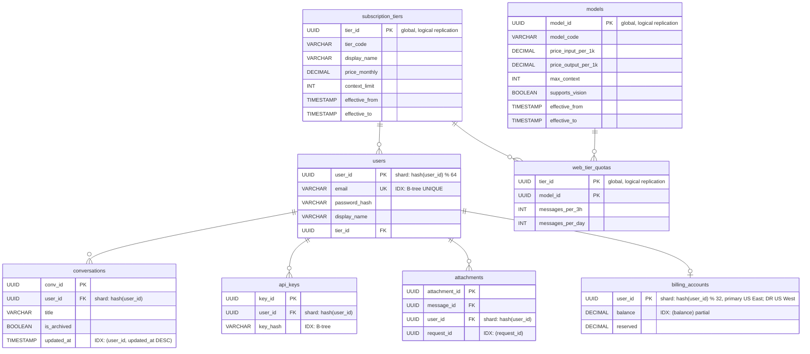
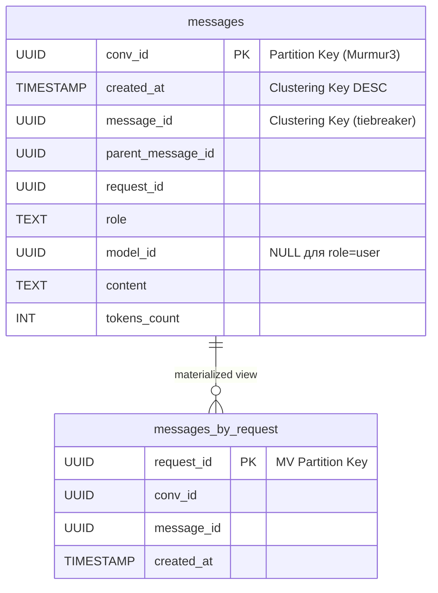
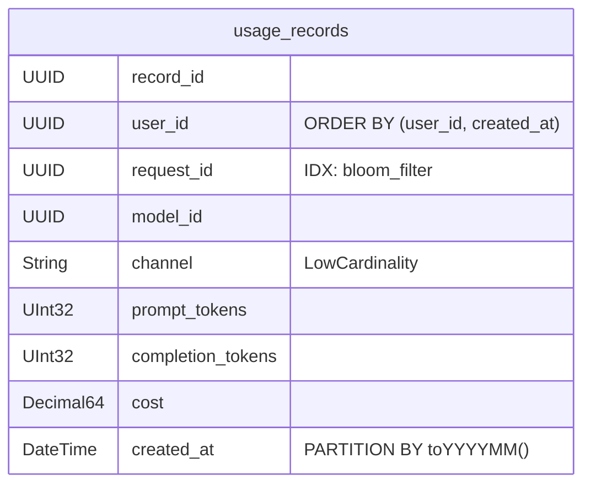
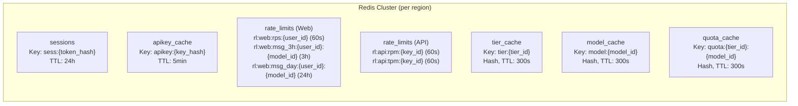

# 1. Тема и целевая аудитория

## Описание

Проектируемая система — публичная AI-платформа, предоставляющая доступ к большой языковой модели (LLM) через два канала:

- **HTTP API** — stateless-интерфейс для разработчиков. Клиент сам передаёт историю диалога в каждом запросе. Сервер не хранит сообщения.
- **Веб-чат** — интерфейс для конечных пользователей. История диалогов хранится на сервере, доступна с любого устройства.

В обоих случаях ядро системы одно: пользователь отправляет запрос → модель генерирует ответ на GPU → токены передаются клиенту в реальном времени через SSE.

Состав запроса:
- текст
- вложения (только фото и документы)

То есть ключевая продуктовая фича: мультимодальная LLM, которая на вход может принимать изображения и документы, а на выход выдавать текст.

## Ключевой пользовательский сценарий

Пользователь отправляет сообщение
- бэкенд собирает контекст (из запроса или из БД)
- контекст уходит на GPU-кластер
- модель генерирует ответ токен за токеном
- токены передаются клиенту через SSE
- пользователь видит ответ по мере генерации

## Дополнительный функционал, обеспечивающий работу бизнеса

- Аутентификация:
  - Для веб-чата: кука, которая прикладывается к каждому запросу. Бэкенд ходит с кукой в Auth Service, который идет в БД за сессиями и сверяет подлинность и время жизни куки (1 месяц).
  - Для API: с каждым запросом прикладываем API токен. Бэкенд ходит с токеном в Auth Service, который идет в БД и сверяет подлинность токена и его время жизни (условимся, что токен можно выдать максимум на 1 месяц).
- Лимитирование:
  - Для веб-чата: лимитирование по тирам подписки: Free, Plus, Pro, Max. Для каждого тира назначается лимит лимит токенов на input и output для каждой модели.
  - Для API: usage-based лимитирование. Назначаем цену за N токенов на input и M токенов на output. По API токену определяется биллинг аккаунт и, перед запросом к inference-кластеру, идет резервирование цены запроса (прогоняем input через tokenizer, а для output считаем по max_output_tokens, которые заранее предопределены для каждой модели). После выполнения запроса возвращаем разницу между предварительной оценкой цены запроса и тем, сколько на самом деле потратилось.

## Реальные аналоги

* ChatGPT (OpenAI), Claude (Anthropic), Gemini (Google) — устойчивый глобальный рынок AI-ассистентов с аудиторией ~1 млрд WAU.

## Характеристики нагрузки

* длительное время генерации ответа (до 1 минуты)
* высокая вычислительная нагрузка на GPU
* большое количество долгоживущих SSE-соединений
* потоковая передача ответа токен за токеном

## Целевая аудитория

Ориентир — аудитория OpenAI. Ключевые публичные метрики:

| Метрика | Значение | Источник |
|---------|----------|----------|
| WAU (всего) | 900 млн | OpenAI [^1] |
| Web-чат | 2.5 млрд сообщений/день | OpenAI [^2] |
| API | 15 млрд токенов/мин ≈ 21.6 трлн токенов/день | OpenAI [^1] |

Web и API — два разных профиля нагрузки: web — короткие промпты от живых пользователей, API — длинный контекст в каждом запросе от сервисов/ботов. Каналы считаем раздельно (см. §2.1).

География [^3][^4][^5]:

| Регион              | Доля трафика | Ключевые страны                        |
| ------------------- | ------------ | -------------------------------------- |
| North America       | ~19–21%      | США (14–17%), Канада (2–4%)          |
| Europe              | ~14–28%      | Великобритания, Германия (~3–6% каждая)|
| Asia-Pacific        | ~28–36%      | Индия (~8–16%), Япония, Сингапур       |
| Latin America       | ~5–6%        | Бразилия (~5–6%)                       |
| Middle East & Africa| ~7%          | ОАЭ, Израиль                           |

## Ключевые продуктовые решения

* **Stateless API** — контекст диалога передаётся в каждом запросе для API
* **Stateful Web** — для веб-чата весь контекст хранится на серверах
* **Streaming через SSE** — ответы передаются токен за токеном поверх HTTP
* **Разделение API и Inference** — API-слой отделён от GPU-кластера
* **Горизонтальное масштабирование** — независимое масштабирование компонентов
* **Глобальная балансировка** — распределение нагрузки между регионами
* **Режим работы 24/7** — высокие требования к доступности
* **Auth** — пользователю выдается идентификатор (кука Session_id для web, API токен для API), который живет 1 месяц. На каждый запрос от пользователя, бэкенду нужно сходить в Auth Service.
* **Лимитирование запросов** — отдельный сервис Rate Limiting Service, который лимитирует запросы для конкретного пользователя
* **Client-side image compression** — web/mobile-клиент ресайзит фото до ~1280×1280 и пережимает в JPEG q=80 перед upload-ом (как WhatsApp/iMessage). Финальный resize до 1024×1024 для vision-encoder делает GPU worker. Документы (PDF/DOCX/PPTX) идут «как есть».
* **Хранение вложений только в исходном виде** — в объектном хранилище лежит оригинал блоба, эмбеддинги картинок не кэшируются

# 2. Расчёт нагрузки

## 2.1 Исходные данные

### Размеры сообщений (датасеты)

| Источник | Период | User (токены) | Assistant (токены) | Профиль |
|----------|--------|---------------|--------------------|---------|
| LMSYS-Chat-1M [^7] | 2023 | ~70 | ~215 | Web |
| WildChat [^8] | 2023–2024 | ~296 | — | Web |
| ShareChat [^9] | 2023–2025 | — | ~1 115 | Web |
| OpenRouter [^10] | 2025 | 6 000 (полный контекст) | ~400 | API |
| Замер DevTools | 2025 | ~250 (1 КБ) | ~500 (8 КБ SSE) | Web |

### Параметры расчёта

| Параметр | Значение | Источник / расчёт |
|----------|----------|-------------------|
| Web messages/day | 2.5 млрд | OpenAI [^2] |
| API tokens/min | 15 млрд → 21.6 трлн/день | OpenAI [^1] |
| **API requests/day** | ~3.375 млрд | 21.6 трлн / 6 400 токенов на запрос |
| Среднее Web-сообщение | ~800 токенов (~300 user + ~500 assistant) | DevTools + WildChat/ShareChat |
| Средний API-запрос | ~6 400 токенов (~6 000 input + ~400 output) | OpenRouter [^10]: полный контекст в каждом запросе |
| Доля Web-сообщений с вложением | **7%** | OpenAI [^6] |
| Средний размер вложения | **~2 МБ** | оценка с учётом client-side compression* |
| Пиковый множитель | ×2 | глобальная аудитория, распределённая по часовым поясам |
| Хранение | Web — бессрочное; API — не требуется (stateless) | продуктовое решение |

\* **Лимиты** OpenAI [^11]: картинки до 20 МБ/файл, документы до 512 МБ, CSV до 50 МБ, per-user cap 25 ГБ. **Реальный микс в чате** (нет публичной статистики OpenAI, оценка автора):

| Тип | Доля | Средний размер | Источник числа |
|-----|------|----------------|----------------|
| Фото (vision) | ~70% | ~1 МБ после client-side compression | бенчмарки мессенджеров: WhatsApp HD 2–5 МБ, iMessage 1–5 МБ; ChatGPT всё равно ресайзит до 1024×1024 → ~1 МБ JPEG q=80 |
| Документы (PDF/DOCX/PPTX) | ~30% | ~5 МБ | PDF Candy industry avg 5 МБ (2022) [^12] |

Взвешенное среднее: 0.7 × 1 + 0.3 × 5 ≈ **2 МБ/вложение**. Документы доминируют по объёму трафика несмотря на меньшую долю по штукам. Для API подавляющий объём ввода — текст, вложения игнорируем.

**Web и API считаем раздельно.** Объединять через DAU нельзя: API-клиенты часто сервисы/боты с тысячами запросов в день. Inference-нагрузку выводим напрямую: для Web — из «2.5 млрд сообщений/день», для API — из «15 млрд токенов/мин» через средний размер запроса.

Все расчёты — для модели класса Claude Sonnet.

## 2.2 Продуктовые метрики

### Аудитория

| Метрика | Значение | Расчёт |
|---------|----------|--------|
| WAU | 900 млн | OpenAI [^1] |
| MAU | ~1 млрд | ~1.1 × WAU |
| Web DAU | ~360 млн | ~0.4 × WAU |
| API customers | ~5–10 млн | оценка (разработчики + B2B); не сводится к DAU |

### Нагрузка по каналам

| Канал | Запросов/день | Avg RPS | Peak RPS (×2) | Tokens/req |
|-------|---------------|---------|---------------|------------|
| **Web** | 2.5 млрд | 28 935 | **57 870** | ~800 |
| **API** | 3.375 млрд | 39 063 | **78 125** | ~6 400 |
| **Итого** | 5.875 млрд | 67 998 | **135 996** | — |

API даёт **больше inference-RPS, чем Web** — длинный контекст в каждом запросе перевешивает меньшее число клиентов.

### Среднее количество действий пользователя (Web)

Для API per-user метрика не определена — клиенты варьируются от 10 до миллионов запросов/день, считаем суммарно по объёму (3.375 млрд req/day, см. таблицу выше).

| Действие | Кол-во/день | Обоснование |
|----------|-------------|-------------|
| Отправка промпта | 7 | 2.5 млрд / 360 млн DAU |
| Получение SSE-ответа | 7 | 1 ответ на запрос |
| Создание нового conversation | ~2.8 | 7 промптов / 2.5 user-msg на conversation (WildChat [^8]) |
| Загрузка списка чатов | 1 | старт сессии |
| Открытие диалога | 3 | переключение чатов |
| Auth check | каждый HTTP-запрос | проверка куки (то же для API-токена) |
| Login / создание токена | 1/мес | TTL куки/токена 1 месяц |

### Размер сетевого payload

DevTools-замер: фиксированный JSON-overhead HTTP-запроса 0.9 КБ; SSE-стрим **17.8 байт/токен** (`data: {...}\n\n`). Для хранения — ~4 байта/токен + 100 байт метаданных.

| Параметр | Токены | Сетевой payload | Для хранения |
|----------|--------|-----------------|--------------|
| Web input (user msg) | ~300 [^8] | 2 КБ | 1.2 КБ |
| Web output (assistant, SSE) | ~500 | 9 КБ | 2 КБ |
| Web context (полный, в GPU) | ~1 150 [^8] | 4.5 КБ | — (собирается из БД) |
| API input (полный контекст) | ~6 000 | 25 КБ | — (stateless) |
| API output (SSE) | ~400 | 7 КБ | — (stateless) |
| Вложение (Web) | — | 2 МБ | 2 МБ |
| Метаданные сообщения | — | — | ~100 байт |

В Web inference в GPU отправляется не отдельное сообщение, а **полный контекст беседы** — сервер собирает его из БД при каждом запросе. Размер по WildChat [^8]: средняя длина диалога 2.5 turn (~5 messages), средний контекст ~1150 токенов = 4.5 КБ.

### Средний размер хранилища пользователя (Web)

Среднее сообщений на пользователя в месяц (Web MAU ≈ 1 млрд):

```
2.5 млрд × 30 / 1 млрд = 75 сообщений/мес
```

| Тип данных | Расчёт | Объём/мес |
|-----------|--------|-----------|
| Текст (user) | 75 × 1.2 КБ | 90 КБ |
| Текст (assistant) | 75 × 2 КБ | 150 КБ |
| Метаданные | 75 × 2 × 0.1 КБ | 15 КБ |
| Вложения | 75 × 0.07 × 2 МБ | 10.5 МБ |
| **Итого** | | **~10.8 МБ/мес** |

Вложения — **~97%** объёма пользователя.

---

## 2.3 Технические метрики

### Размер хранения за 1 год

API stateless, хранилища не требует. Web MAU ≈ 1 млрд.

| Тип данных | Расчёт | Объём/год |
|-----------|--------|-----------|
| Текст (user) | 1 млрд × 12 × 90 КБ | ~1.08 ПБ |
| Текст (assistant) | 1 млрд × 12 × 150 КБ | ~1.80 ПБ |
| Метаданные сообщений | 1 млрд × 12 × 15 КБ | ~0.18 ПБ |
| Вложения | 1 млрд × 12 × 10.5 МБ | **~126 ПБ** |
| **Итого** | | **~129 ПБ/год** |

---

### Concurrent SSE-соединения

Скорость генерации Sonnet ~50 токенов/сек.

| Тип | Output (токены) | Длительность | Avg concurrent | Peak (×2) |
|-----|----------------|--------------|----------------|-----------|
| Web | 500 | 10 сек | 289 350 | **578 700** |
| API | 400 | 8 сек | 312 500 | **625 000** |
| **Итого** | | | 601 850 | **~1.2 млн** |

API даёт чуть больше concurrent SSE, чем Web — больше RPS перевешивает короткий output.

---

### Сетевой трафик (peak ×2)

#### Входящий (user → сервер)

| Тип | Расчёт | Peak Gbit/s |
|-----|--------|-------------|
| Web текст | 57 870 × 2 КБ | 0.93 |
| Web вложения | 57 870 × 0.07 × 2 МБ | **64.81** |
| API текст | 78 125 × 25 КБ | 15.63 |
| **Итого входящий** | | **~81.4 Гбит/с** |

#### Исходящий (сервер → user, SSE)

| Тип | Расчёт | Peak Gbit/s |
|-----|--------|-------------|
| Web SSE | 57 870 × 9 КБ | 4.17 |
| API SSE | 78 125 × 7 КБ | 4.37 |
| **Итого исходящий** | | **~8.54 Гбит/с** |

#### Суточный трафик

| Тип | Расчёт (avg) | Объём/сутки |
|-----|-------------|-------------|
| Входящий текст (Web ~5 ТБ + API ~84 ТБ) | (28 935×2 КБ + 39 063×25 КБ) × 86 400 | ~89 ТБ |
| Входящий вложения | 28 935 × 0.07 × 2 МБ × 86 400 | **~350 ТБ** |
| Исходящий SSE (Web ~22 ТБ + API ~24 ТБ) | (28 935×9 КБ + 39 063×7 КБ) × 86 400 | ~46 ТБ |
| **Итого** | | **~485 ТБ/сутки** |

Вложения дают **~72%** суточного трафика. API — основной источник текстового трафика (84 ТБ против 5 ТБ у Web): полный контекст в каждом запросе.

---

### Сводная таблица RPS

| Тип запроса | Avg RPS | Peak RPS |
|-------------|---------|----------|
| Web inference | 28 935 | 57 870 |
| API inference | 39 063 | 78 125 |
| Открытие диалога | 12 500 | 25 000 |
| Список чатов | 4 170 | 8 340 |
| Auth check | 84 500 | 169 000 |
| Login / создание токена | 386 | 772 |

# 3. Глобальная балансировка нагрузки

## 3.1 Функциональное разбиение по доменам

| Домен              | Назначение                                            | Размещение                  |
| ------------------ | ----------------------------------------------------- | --------------------------- |
| `chat.llm.com`     | Web-чат: HTTP + SSE                                   | Все 4 ДЦ (Anycast IP)       |
| `api.llm.com`      | HTTP API для разработчиков: HTTP + SSE                | Все 4 ДЦ (Anycast IP)       |
| `attach.llm.com`   | API выдачи временной подписанной ссылки (presigned URL — одноразовый URL от S3-совместимого хранилища с подписанными правами и сроком действия) для прямой загрузки/скачивания в объектное хранилище | Все 4 ДЦ (Anycast IP) |
| `cdn.llm.com`      | Статика (JS/CSS, assets)                              | Внешний CDN-провайдер |

---

## 3.2 Расположение ДЦ и обоснование

| ДЦ      | Локация    | Роль                                  | Доля HTTP |
| ------- | ---------- | ------------------------------------- | --------- |
| US East | Virginia   | API + SSE + основной GPU-кластер      | 17.5%     |
| US West | Oregon     | API + SSE + резервный GPU-кластер     | 17.5%     |
| EU      | Frankfurt  | API + SSE                 | 35%       |
| APAC    | Singapore  | API + SSE                 | 30%       |

EU и APAC — только HTTP-слой (terminate TLS, держать SSE-соединения, проксировать inference в US). GPU-кластеров там нет.

**Почему 4 ДЦ:**

* **1 ДЦ** — RTT клиент→ДЦ у пользователя из EU/APAC 100–200 мс. Плюс ещё 80–150 мс на проксирование в US-GPU. Итого TTFT (time-to-first-token) 500–800 мс, ощутимая задержка перед началом ответа.
* **4 ДЦ** — RTT клиент→ближайший ДЦ < 30 мс для ~95% мировой аудитории; TTFT падает до 250–400 мс. Каждый дополнительный ДЦ сверх 4 даёт экономию RTT всего 5–15 мс — пренебрежимо на фоне самой генерации (5–60 сек). Вкладывать в 5-й и 6-й ДЦ не имеет смысла.
* **4 независимых ДЦ — достаточный запас для failover (автоматическое переключение трафика на резервный ДЦ при отказе основного; запас N+1 означает «всегда есть один лишний ДЦ»):** при отказе одного оставшиеся 3 держат пиковую нагрузку с разливом по таблице из §3.5.


**Влияние на продуктовые метрики:**

| Метрика          | Эффект 4-региональной схемы                                                 |
| ---------------- | --------------------------------------------------------------------------- |
| TTFT для EU/APAC | 250–400 мс вместо 500–800 мс при single-region                              |
| Доступность      | 4 независимых ДЦ; отказ одного → клиенты автоматически уходят в ближайший живой (§3.5) |
| Стоимость        | 90% inference в США держит GPU $/токен на минимуме; в EU/APAC — только дешёвый HTTP/SSE-слой без дорогих H100 |

---

## 3.3 Распределение запросов по ДЦ

Раскладываем суммарный HTTP-трафик из §2 (85 054 avg / 170 108 peak RPS, ~1.2 млн concurrent SSE) по регионам пропорционально доле аудитории. Это вход для §4 — сколько Nginx и SSE-серверов держать в каждом ДЦ.

Доли 17.5/17.5/35/30% — worst-case по верхней границе Europe (28% + рост) и Asia-Pacific (32%, середина диапазона) на основе аналитики глобального трафика ChatGPT [^7][^8];

| ДЦ        | HTTP RPS avg | HTTP RPS peak | Concurrent SSE peak |
| --------- | ------------ | ------------- | ------------------- |
| US East   | 14 884       | 29 769        | 210 648             |
| US West   | 14 884       | 29 769        | 210 648             |
| EU        | 29 769       | 59 538        | 421 295             |
| APAC      | 25 516       | 51 032        | 361 110             |
| **Итого** | **85 054**   | **170 108**   | **1 203 700**       |

Auth check (84 500 avg / 169 000 peak из §2.3) в этой таблице **не суммируется** — это не отдельный HTTP-запрос от клиента, а middleware-операция внутри pod-а (lookup в Redis `sess:{token_hash}` или валидация `api_key`), выполняемая на каждый внешний запрос. По нагрузке на ingress они уже учтены в `HTTP RPS peak`; по нагрузке на Redis — в §5.5.

Все inference-запросы (67 998 avg / 135 996 peak RPS из §2) в итоге сходятся на GPU-кластерах в США независимо от того, в каком ДЦ они принимаются: EU/APAC — только HTTP-слой, проксирующий gRPC-стрим в US-GPU.

---

## 3.4 Anycast-балансировка

Полноценной DNS-балансировки нет: домены резолвятся в **один общий IP** для всех 4 ДЦ независимо от географии резолвера. Гео-распределение трафика делает BGP на сетевом уровне — это и есть Anycast.

**DNS-записи (одинаковые для всех клиентов мира):**

| Запись                | Тип    | Значение                          | Назначение                                      |
| --------------------- | ------ | --------------------------------- | ----------------------------------------------- |
| `chat.llm.com`    | A      | `192.0.2.10`                      | Anycast IP, общий для всех 4 ДЦ                 |
| `api.llm.com`     | A      | `192.0.2.10`                      | Anycast IP, общий для всех 4 ДЦ                 |
| `cdn.llm.com`     | CNAME  | `static.cdn-provider.net`         | Статика (JS/CSS) — внешний CDN                  |
| `attach.llm.com`  | A      | `192.0.2.10`                      | Anycast IP — выдача presigned URL → Ceph RGW    |
| `llm.com`         | NS     | 4 anycast-адреса authoritative NS | Сами NS-сервера тоже на anycast (RFC 7094)      |

TTL A-записей — 60 сек (для миграции Anycast-провайдера / IP-блока), DNSSEC включён.

**Anycast** — сетевая техника, при которой один IP анонсируется в Интернет одновременно из нескольких ДЦ через протокол BGP. Каждый ДЦ держит свой edge-роутер, который через BGP-сессию с upstream-провайдерами анонсирует наш `/24`-префикс под нашим ASN. Маршрутизаторы Интернета выбирают **ближайший** анонс по числу хопов — без участия DNS и приложения.



> **Граница раздела.** Глобальная балансировка (§3) заканчивается там, где Anycast-пакет попал в нужный ДЦ. Что происходит дальше — TLS termination, SNI routing по `Host`, выбор Nginx-ноды, distribution по backend pods — это локальная балансировка, **§4**. ASN `64500` — пример из приватного диапазона RFC 6996; в проде у нас был бы зарегистрированный публичный ASN.

---

## 3.5 Регулировка трафика между ДЦ

> Раздел про балансировку **между ДЦ**: какие условия выводят целый регион из ротации и куда уходит его трафик. Балансировка **внутри** одного ДЦ (между Nginx-нодами, между Pod-ами) — отдельная задача, см. §4.

Сам Anycast (§3.4) разбирается с failover автоматически: ДЦ снимает свой BGP-анонс — пакеты уходят к следующему ближайшему. Решение «снять анонс» принимается **внутри** ДЦ по результатам self-health-check всего региона.

**Условия, при которых регион снимает свой анонс / получает пониженный вес:**

| Метрика                 | Порог                  | Действие                              |
| ----------------------- | ---------------------- | ------------------------------------- |
| HTTP latency p95        | > 500 мс               | Снижение веса региона                 |
| Error rate (5xx)        | > 1% за 1 минуту       | Снижение веса региона                 |
| Origin pool недоступен  | 3 подряд failed health-check | Снять BGP-анонс, регион выходит из ротации |
| p99 TTFT US-кластера    | > 2 сек                | Возврат `503` / `Retry-After` на новые inference через Scheduler |

**Реализация (open-source стек на edge-роутере каждого ДЦ):**

| Компонент          | Инструмент                          | Роль                                                                   |
| ------------------ | ----------------------------------- | ---------------------------------------------------------------------- |
| BGP-демон          | BIRD2 (или FRRouting)               | Держит BGP-сессию с интернет-провайдерами ДЦ, анонсирует Anycast-префикс |
| Метрики            | Prometheus + node_exporter          | Скользящие окна по latency / 5xx; GPU Scheduler публикует queue depth  |
| Health checker     | Свой сервис на Go                   | Раз в 1 сек тянет метрики и `/health` бэкендов; принимает решение      |
| Управляющий канал  | `birdc` (CLI BIRD) / ExaBGP REST    | Health checker дёргает BGP-демон: prepend или withdraw                 |

**Что физически делает «снижение веса» и «снять анонс»:**

* **Снижение веса** = **AS-path prepending**. Это BGP-механизм: мы анонсируем тот же `/24` IP, но искусственно повторяем свой ASN в AS-path 1–3 раза. Соседние BGP-роутеры в Интернете при выборе маршрута предпочитают короткий AS-path → часть мира перестаёт выбирать наш ДЦ. Чем больше prepend, тем дальше «отодвигается» регион.
* **Снять анонс** = **route withdraw**. BIRD шлёт BGP UPDATE с withdrawn route — BGP-таблицы в Интернете перестраиваются за 30–90 сек, пакеты уходят в следующий ближайший ДЦ. Это failover-механизм Anycast.
* **GPU overload** (TTFT — Time To First Token, время от запроса до первого токена ответа — поплыл) требует другого ответа: AS-path prepending тут не поможет, потому что HTTP-трафик из EU/APAC всё равно проксируется в один и тот же US-GPU-пул. Inference Scheduler в US начинает возвращать `503 Service Unavailable` / `Retry-After` на новые inference-запросы — это backpressure (сигнал «притормози, я перегружен» от перегруженного сервиса к клиенту) на уровне HTTP, а не BGP.

**Routing policy для HTTP-слоя (куда уходит трафик):**

| Регион клиента      | Primary           | Fallback при отказе primary |
| ------------------- | ----------------- | --------------------------- |
| Северная Америка    | US East / US West | EU                          |
| Европа / MEA        | EU                | US East                     |
| Азия / Океания      | APAC              | US West                     |
| Латинская Америка   | US East           | EU                          |

Эта таблица — про **HTTP-слой** (TLS, Auth, list chats, открытие диалога, UI). Inference — отдельная плоскость: любой ДЦ, принявший запрос, всё равно проксирует gRPC-стрим в US-GPU.

**Inference-failover (на уровне GPU-кластеров в US):**

* US East — primary, US West — резерв. Inference Scheduler держит оба пула в горячем состоянии и переключает запросы на US West, если US East перегружен или недоступен.
* При падении US East: HTTP-клиенты Северной Америки уходят в US West (по таблице выше), inference тоже идёт в US West.
* **При одновременном отказе US East И US West** новый inference недоступен глобально — GPU-площадки только в США. EU/APAC продолжат принимать HTTP-запросы (history, list, login, UI работают), но новые промпты возвращают `503 Service Unavailable` до восстановления хотя бы одного US-региона. Это осознанный компромисс: вторая GPU-площадка вне США удвоила бы инфраструктурные расходы и не оправдана при разнесении US East/West по разным AZ/регионам с независимыми сетевыми и питающими подсистемами.

---

## 3.6 Cross-DC inference-трафик

GPU только в США (§3.2) — значит **65% inference-запросов** (EU 35% + APAC 30%) физически летит из ДЦ-приёмника в US-GPU. Это самостоятельный существенный тип трафика, и сетевые интерфейсы edge-роутеров EU/APAC и обоих US-ДЦ должны его держать.

**Peak-нагрузка (пиковые RPS из §2.3 × доля cross-DC 0.65):**

В GPU при каждом запросе отправляется **полный контекст**: для API — сам payload запроса (stateless, ~25 КБ); для Web — сервер собирает контекст из БД (по WildChat [^8] средний ~4.5 КБ).

| Направление                | Поток        | Расчёт                          |  Peak Гбит/с |
| -------------------------- | ------------ | ------------------------------- | -----------: |
| EU+APAC → US (вход на GPU) | Web context  | 57 870 × 0.65 × 4.5 КБ          |          1.4 |
| EU+APAC → US (вход на GPU) | Web вложения | 57 870 × 0.65 × 0.07 × 2 МБ     |         42.1 |
| EU+APAC → US (вход на GPU) | API context  | 78 125 × 0.65 × 25 КБ           |         10.2 |
| US → EU+APAC (SSE назад)   | Web SSE      | 57 870 × 0.65 × 9 КБ            |          2.7 |
| US → EU+APAC (SSE назад)   | API SSE      | 78 125 × 0.65 × 7 КБ            |          2.8 |
| **Итого**                  |              |                                 | **~54 in / ~5.5 out** |

Среднесуточно (peak ÷ 2) — ~27 Гбит/с inbound в US, что даёт ~292 ТБ/сутки cross-DC. Доминируют Web-вложения (~78% потока): на больших объёмах их имеет смысл сжимать и токенизировать ближе к клиенту (EU/APAC `files` pod), а в US-GPU прокидывать уже компактные эмбеддинги — это снижает cross-DC до ~12 Гбит/с peak.


**Транспорт.** Все 4 ДЦ соединены **выделенными каналами связи** (арендованные у магистральных операторов), не через публичный Интернет.

**Маршрутизация.** Internal BGP (iBGP) между edge-роутерами наших ДЦ. `regional-inference` (EU/APAC) через internal DNS получает primary-адрес `inference-scheduler.us-east.internal`; при недоступности US East переключается на `inference-scheduler.us-west.internal` (см. §3.5).

---

# 4. Локальная балансировка нагрузки

§4 описывает балансировку **внутри одного ДЦ** — после того, как Anycast-пакет приземлился на пул edge-нод (§3.4).

## 4.1 Схема балансировки нагрузки



L4-плоскость (MetalLB) принимает Anycast-пакеты и распределяет их между edge-нодами. Внутри k8s-кластера ingress-nginx (L7) терминирует TLS и маршрутизирует HTTP по `Host` на k8s Service нужного бэкенда; Service балансирует уже на конкретные pod-ы на worker-нодах. Между сервисами (chat / api-gateway → regional-inference → inference-scheduler → GPU Worker) — gRPC client-side LB: клиент сам ходит по списку endpoint-ов из k8s API. Control plane выделен отдельно — он управляет состоянием кластера, но **не находится на пути пользовательского трафика**.

**Cross-DC inference.** `inference-scheduler` и GPU-ноды живут только в US East / US West. В EU/APAC схема та же, но стрелка `regional-inference → inference-scheduler` уходит **из кластера ДЦ через cross-DC backbone в US** (§3.6) — `pod-to-pod` gRPC mTLS, минуя ingress-nginx обоих ДЦ. Поэтому ingress-nginx видит только клиентский HTTPS своего региона; cross-DC поток на его расчёт не влияет.

## 4.2 Пояснение к схеме

**Модель развёртывания и скейлинга:**

| Компонент | k8s-объект | Как скейлится |
| --- | --- | --- |
| `ingress-nginx`, `metallb-speaker` | `DaemonSet` + Service `LoadBalancer` (MetalLB) с `externalTrafficPolicy: Local` | По одной реплике на каждую edge-ноду; добавляем edge-ноду → автоматически появляется pod и MetalLB начинает анонсировать с неё Anycast IP |
| `api-gateway`, `chat`, `files`, `regional-inference`, `inference-scheduler` | `Deployment` + `HorizontalPodAutoscaler` | `replicas: N` в манифесте задаёт минимум (N+1); HPA добавляет pod-ы по CPU/RPS до потолка |
| `gpu-worker` | `Deployment` + `nodeSelector: gpu=true` + `toleration: nvidia.com/gpu` | `replicas` = по числу свободных H100; pod выбирает свободный GPU через NVIDIA device plugin |

DaemonSet для ingress выбран, потому что edge-ноды dedicated и используют `externalTrafficPolicy: Local` — каждая нода анонсирует Anycast IP **только если на ней живёт ingress-nginx pod**. Это убирает лишний `kube-proxy`-hop между внешним пакетом и L7 и даёт прямой путь Anycast → edge-NIC → локальный ingress.

Внешний трафик принимаем **только на L7** — L4 (MetalLB) не умеет TLS termination, не делает прозрачный ретрай по HTTP-кодам и не различает короткие API-запросы (`least_conn`) от длинных SSE-стримов (`ewma`). На L7 это решается annotations ingress-nginx.

Резервирование L7 — модель **2N @ 50%**: при отказе половины парка оставшиеся реплики выходят на 100% без деградации (расчёт в §4.3). Backend pod-ы — **N+1** + HPA: ingress сам ретраит запрос на следующий pod через `proxy_next_upstream` при отказе любого; pod, прошедший `readiness probe`, k8s автоматически добавляет в `Service` endpoints.

## 4.3 Расчёт числа балансировщиков

Через ingress-nginx проходит только внешний клиентский HTTPS соответствующего ДЦ из §3.3. Cross-DC inference §3.6 идёт `pod-to-pod` по backbone (gRPC mTLS `regional-inference` → `inference-scheduler`), минуя ingress US — в расчёт ниже **не входит**.

Сайзим по четырём ограничителям: HTTPS RPS, TLS CPS (новые handshakes/сек), пропускная способность сети и **число одновременных SSE-соединений** (для AI-чата критический фактор: стримы держатся 5–60 сек).

| Характеристика (global peak)                  |     Значение |
| --------------------------------------------- | -----------: |
| Пиковый RPS через ingress                     |      170 108 |
| Доля новых TLS-соединений [^14]               |          30% |
| Пиковый TLS CPS (RPS × 0.3)                   |       51 032 |
| Пиковая пропускная способность через ingress  | 25.10 Гбит/с |
| Пиковое число concurrent SSE                  |    1 203 700 |
| HTTPS RPS на ноду 16 vCPU [^13] (запас 50%)   |      170 000 |
| TLS CPS на ноду 16 vCPU [^13] (запас 50%)     |       28 000 |
| Concurrent SSE на ноду (RAM + fd, запас 50%)  |      100 000 |
| Пропускная способность ноды (1×25 GbE NIC)    |    22 Гбит/с |

Бенчмарк [^13] для ingress-nginx Controller показывает плато после 16 vCPU: на 16 CPU — 341 232 HTTPS RPS и 56 715 SSL TPS (HT on), на 24 CPU те же ~342k / ~58k. Поэтому используем **16-vCPU edge-ноды** напрямую: с 50% production-headroom получаем 170k HTTPS RPS и 28k TLS CPS sustainable per node.

SSE-лимит бенчмарк [^13] не покрывал — он гоняет короткие request-response через `wrk`. Для долгоживущих SSE-стримов реальный потолок — RAM и file descriptors: TLS-state + connection buffers ≈ 60 КБ/conn × 100k ≈ 6 ГБ RAM, что комфортно для 32 ГБ ноды.

Глобальные значения раскладываем по регионам пропорционально доле HTTP-трафика из §3.3 (17.5 / 17.5 / 35 / 30%):

$$N_{min} = \max\left(\left\lceil \tfrac{\text{Peak RPS}}{170\,000} \right\rceil, \left\lceil \tfrac{\text{Peak CPS}}{28\,000} \right\rceil, \left\lceil \tfrac{\text{Peak Gbit/s}}{22} \right\rceil, \left\lceil \tfrac{\text{Peak SSE}}{100\,000} \right\rceil\right); \qquad N_{total} = 2 \times N_{min}$$

| Регион  | Peak RPS | Peak CPS | Peak Gbit/s | Peak SSE | $N_{rps}$ | $N_{cps}$ | $N_{net}$ | $N_{sse}$ | $N_{min}$ | **$N_{total}$ (2N)** |
| ------- | -------: | -------: | ----------: | -------: | --------: | --------: | --------: | --------: | --------: | -------------------: |
| US East |  29 769  |   8 931  |    4.39     |  210 648 |     1     |     1     |     1     |     3     |     3     |              **6**   |
| US West |  29 769  |   8 931  |    4.39     |  210 648 |     1     |     1     |     1     |     3     |     3     |              **6**   |
| EU      |  59 538  |  17 861  |    8.79     |  421 295 |     1     |     1     |     1     |     5     |     5     |             **10**   |
| APAC    |  51 032  |  15 310  |    7.53     |  361 110 |     1     |     1     |     1     |     4     |     4     |              **8**   |

**Итого 30 L7-балансировщиков** (ingress-nginx) на 4 ДЦ. Узким местом во всех регионах оказывается **concurrent SSE** — это характерный профиль AI-чата: стримы держатся 5–60 сек, поэтому одна нода с производительностью 170k RPS «недогружена» по CPU, но забита открытыми соединениями. RPS, CPS и NIC под такой нагрузкой расходуются на считанные единицы, в каждом регионе остаётся 5–10× запас.

## 4.4 Резервирование и реакция на отказы

| Компонент | Модель | Реакция на отказ |
| --- | --- | --- |
| ingress-nginx pod | 2N @ 50% | liveness probe → рестарт; соседние реплики берут трафик |
| edge-нода (HW failure) | k8s drain | MetalLB снимает BGP-анонс с этой ноды; Anycast уводит трафик в следующий ДЦ (§3.5) |
| upstream pod (api-gateway, chat) | N+1 + HPA по CPU 60% | `proxy_next_upstream` прозрачно ретраит на следующий pod |

# 5. Логическая схема БД

## 5.1 ER-диаграмма



---

## 5.2 Связка inference-цикла

Один HTTP-запрос на чат (`POST /v1/chat/completions` или Web-эквивалент) порождает **один inference-цикл** — пара «вопрос → ответ». Все следы цикла связываются двумя идентификаторами:

* **`request_id`** — UUID, генерируется на edge, кладётся в `X-Request-ID` HTTP-ответа. Один и тот же на всех записях цикла: 2 строки `messages` + 1 `usage_records` + N `attachments`.
* **`parent_message_id`** — self-FK внутри `messages`. У `role=assistant` указывает на `message_id` соответствующего `role=user`. Превращает диалог в дерево (закрывает regenerate и branching).

| След | Кол-во на 1 цикл | Связь |
| --- | --- | --- |
| `messages` (Web) | 2 строки: `role=user` + `role=assistant` | общий `request_id`; `assistant.parent_message_id = user.message_id` |
| `usage_records` | 1 строка | `request_id`, `message_id` = assistant |
| `attachments` | 0 или N строк | `request_id`, `message_id` = user |
| `audit_log` | 0–1 строк (значимые события) | `request_id` в `payload` |

In-flight-состояние цикла (какой GPU обслуживает, контекст промпта, поток токенов) **в БД не пишется** — оно живёт в памяти inference-сервиса и в открытом сетевом соединении, переживает не дольше длительности стрима. При сбое клиент ретраит с тем же `request_id` для идемпотентности.

---

## 5.3 Описание таблиц

### subscription_tiers (справочник, **только Web**)

Версионируемый справочник тарифов web-чата. PK — `tier_id` UUID; при изменении цены или `context_limit` создаётся **новая** строка с новым `tier_id`, у старой проставляется `effective_to = NOW()`. `users.tier_id` указывает на актуальную версию; старые версии сохраняются для исторической отчётности.

API-клиенты тиров не имеют (pay-as-you-go); их монетизация — `usage_records` × `billing_accounts`, технические лимиты — системные константы.

| Поле | Тип | Размер | Описание |
| --- | --- | --- | --- |
| tier_id | UUID | 16 B | PK |
| tier_code | VARCHAR | ~10 B | Human-readable код: `'free'` / `'plus'` / `'pro'` / `'max'` (не уникальный — у одного кода может быть несколько версий) |
| display_name | VARCHAR | ~30 B | Название для UI и invoice |
| price_monthly | DECIMAL(10,2) | 8 B | USD / месяц; 0 для free |
| context_limit | INT | 4 B | Макс. tokens в одном промпте |
| effective_from | TIMESTAMP | 8 B | Когда введён |
| effective_to | TIMESTAMP | 8 B | NULL для активного; дата — для архивных версий |

| Метрика | Значение |
| --- | --- |
| Строк | ~50 (5 активных × ~10 версий за всё время) |
| Размер строки | ~100 B |
| Общий объём | < 5 КБ |
| QPS чтение | ~10 (миссы кеша; горячие данные на стороне Rate Limiter) |
| QPS запись | < 0.1 |
| Консистентность | Strong |
| Распределение ключей | Равномерное (справочник, read-mostly) |

---

### models (справочник)

Версионируемый справочник моделей. PK — `model_id` UUID; при изменении цены создаётся новая запись с новым `model_id`, у старой проставляется `effective_to = NOW()`. Это сохраняет историческую корректность `usage_records.cost`.

| Поле | Тип | Размер | Описание |
| --- | --- | --- | --- |
| model_id | UUID | 16 B | PK |
| model_code | VARCHAR | ~30 B | Human-readable: `'llama-3.1-70b'`, `'mistral-large'`, … (не уникальный — у одной модели может быть несколько ценовых версий) |
| price_input_per_1k | DECIMAL(10,6) | 8 B | USD за 1k tokens промпта |
| price_output_per_1k | DECIMAL(10,6) | 8 B | USD за 1k tokens ответа |
| max_context | INT | 4 B | Лимит контекста |
| supports_vision | BOOLEAN | 1 B | Принимает ли мультимодальный вход |
| effective_from | TIMESTAMP | 8 B | Когда введена версия |
| effective_to | TIMESTAMP | 8 B | NULL для активной |

| Метрика | Значение |
| --- | --- |
| Строк | ~100 (10 активных × ~10 версий за всё время) |
| Размер строки | ~130 B |
| Общий объём | ~13 КБ |
| QPS чтение | ~10 (миссы кеша; горячие данные на стороне Chat Service) |
| QPS запись | < 0.1 |
| Консистентность | Strong |
| Распределение ключей | Равномерное (справочник, read-mostly) |

---

### web_tier_quotas (справочник, **только Web**)

Лимиты на использование конкретной модели внутри конкретного web-тарифа.

| Поле | Тип | Размер | Описание |
| --- | --- | --- | --- |
| tier_id | UUID | 16 B | FK → subscription_tiers, часть PK |
| model_id | UUID | 16 B | FK → models, часть PK |
| messages_per_3h | INT NULL | 4 B | Лимит сообщений в 3-часовом окне (NULL = unlimited) |
| messages_per_day | INT NULL | 4 B | Лимит сообщений в сутках |

| Метрика | Значение |
| --- | --- |
| Строк | ~40 (4 tier × 10 моделей) |
| Размер строки | ~40 B |
| Общий объём | < 2 КБ |
| QPS чтение | ~10 (миссы кеша; горячие данные на стороне Rate Limiter) |
| QPS запись | < 0.1 |
| Консистентность | Strong |
| Распределение ключей | Равномерное (справочник, read-mostly) |

---

### users

| Поле | Тип | Размер | Описание |
| --- | --- | --- | --- |
| user_id | UUID | 16 B | Первичный ключ |
| email | VARCHAR | ~50 B | Email (уникальный) |
| password_hash | VARCHAR | 60 B | bcrypt hash |
| display_name | VARCHAR | ~50 B | Отображаемое имя |
| tier_id | UUID | 16 B | FK → `subscription_tiers.tier_id` (текущая версия тарифа) |
| created_at | TIMESTAMP | 8 B | Регистрация |
| updated_at | TIMESTAMP | 8 B | Обновление |

| Метрика | Значение |
| --- | --- |
| Строк | ~1 млрд |
| Размер строки | ~200 B |
| Общий объём | ~200 GB |
| QPS чтение | ~4 200 (profile reads ≈ 1 раз/день на DAU) + 772 peak (lookup при login) |
| QPS запись | ~100 (регистрации) |
| Консистентность | Strong |
| Распределение ключей | Равномерное по user_id |

---

### conversations

| Поле | Тип | Размер | Описание |
| --- | --- | --- | --- |
| conv_id | UUID | 16 B | Первичный ключ |
| user_id | UUID | 16 B | Владелец |
| title | VARCHAR | ~100 B | Название диалога |
| is_archived | BOOLEAN | 1 B | Флаг архивации |
| created_at | TIMESTAMP | 8 B | Создание |
| updated_at | TIMESTAMP | 8 B | Последнее сообщение |

| Метрика | Значение |
| --- | --- |
| Строк | ~366 млрд за year 1 (Web DAU 360M × 2.8 new conv/day × 365, см. §2.2 [^8]) |
| Размер строки | ~140 B |
| Общий объём | ~51 TB |
| QPS чтение | 16 670 avg / 33 340 peak (4 170 список + 12 500 открытие, из §2.3) |
| QPS запись (create) | ~11 700 avg / ~23 400 peak (новые conversations, из §2.2) |
| QPS запись (update) | 28 935 avg / 57 870 peak (update updated_at при новом сообщении = Web inference RPS) |
| Консистентность | Strong (per-user) |
| Распределение ключей | Pareto (см. §5.4) |

---

### messages

| Поле | Тип | Размер | Описание |
| --- | --- | --- | --- |
| message_id | UUID | 16 B | Первичный ключ |
| conv_id | UUID | 16 B | FK → conversations |
| parent_message_id | UUID NULL | 16 B | Self-FK → `messages.message_id`. У `role=assistant` — указывает на свой `role=user`. У `role=user` — NULL (или предыдущий assistant в multi-turn). Закрывает regenerate и branching |
| request_id | UUID | 16 B | Correlation ID одного inference-цикла. Совпадает с `X-Request-ID` HTTP-ответа, `trace_id` в Tempo. Одинаковый у user и assistant пары |
| role | ENUM | 1 B | user / assistant / system |
| model_id | UUID NULL | 16 B | FK → `models.model_id` (конкретная ценовая версия). Заполнен только для `role=assistant`; NULL для user |
| content | TEXT | ~1–4 KB | Текст сообщения |
| tokens_count | INT | 4 B | Количество токенов |
| finish_reason | VARCHAR | 10 B | stop / length / error |
| created_at | TIMESTAMP | 8 B | Время создания |

| Метрика | Значение |
| --- | --- |
| Строк | ~5 млрд/день, ~1.83 трлн/год (1 inference-цикл Web = 2 строки: `role=user` + `role=assistant`; API stateless, не пишет) |
| Размер строки | ~1.7 KB (avg: 1.2 KB user + 2 KB assistant + ~100 B метаданных, см. §2.2; физический overhead — §6.5) |
| Общий объём | ~8.5 TB/день, ~3.1 PB/год (логический; физически ×RF, см. §6.5) |
| QPS чтение | **41 435 avg / 82 870 peak** = 12 500/25 000 открытие диалога + 28 935/57 870 чтение контекста перед каждым inference. Плюс редкие точечные `WHERE request_id=?` (audit, support) |
| QPS запись | 57 870 avg / 115 740 peak Web inference avg 28 935 × 2 messages (user + assistant) |
| Консистентность | Eventual (read-after-write delay допустим: пользователь видит свой prompt и ответ из памяти стрима до фиксации) |
| Распределение ключей | Hot-partitions у активных диалогов; внутри партиции — равномерно по `created_at`. Подробно — §5.4 |

---

### api_keys

| Поле | Тип | Размер | Описание |
| --- | --- | --- | --- |
| key_id | UUID | 16 B | Первичный ключ |
| user_id | UUID | 16 B | FK → users |
| key_hash | VARCHAR | 64 B | SHA-256 hash |
| key_prefix | VARCHAR | 8 B | Префикс для идентификации (видимая часть, e.g. `sk-abc...`) |
| name | VARCHAR | 50 B | Имя ключа |
| is_active | BOOLEAN | 1 B | Активен ли |
| created_at | TIMESTAMP | 8 B | Создание |

| Метрика | Значение |
| --- | --- |
| Строк | ~100 млн |
| Размер строки | ~170 B |
| Общий объём | ~17 GB |
| QPS чтение | 39 063 avg / 78 125 peak (валидация на каждом API-запросе = API peak inference RPS, см. §2.2; в PG бьёт только cache miss — кеш `apikey:{key_hash}` в Redis, §6.8) |
| QPS запись | ~100 (только создание ключа) |
| Консистентность | Strong |
| Распределение ключей | Равномерное по key_hash |

---

### sessions (**только Web**)

API-клиенты авторизуются через `api_keys`; долгоживущих сессий у них нет.

| Поле | Тип | Размер | Описание |
| --- | --- | --- | --- |
| token_hash | VARCHAR | 64 B | PK; SHA-256 от bearer-токена |
| user_id | UUID | 16 B | FK → users (только это и нужно auth-middleware-у) |
| created_at | TIMESTAMP | 8 B | Создание |
| expires_at | TIMESTAMP | 8 B | Истечение (30 сут TTL) |

| Метрика | Значение |
| --- | --- |
| Строк | ~1 млрд (MAU — TTL = 30 сут покрывает весь месячный охват) |
| Размер строки | ~96 B |
| Общий объём | ~96 GB (in-memory, per-region; см. §6) |
| QPS чтение | 84 500 avg / 169 000 peak (auth check на каждый HTTP-запрос, из §2.3) |
| QPS запись | ~386 avg / ~772 peak (login = создание новой сессии, из §2.3) |
| Консистентность | Strong |
| Распределение ключей | Равномерное по token_hash |

---

### billing_accounts

Таблица на «горячем пути» (hot-path — последовательность операций, выполняемая на каждом запросе пользователя; от её latency напрямую зависит TTFT) для резервирования и списания средств под API-запросы pay-as-you-go. Заводится **только при подключении к API** (opt-in). Все суммы в USD; мультивалютность намеренно не поддерживается в MVP.

| Поле | Тип | Размер | Описание |
| --- | --- | --- | --- |
| user_id | UUID | 16 B | PK; FK → users |
| balance | DECIMAL(12,4) | 8 B | Доступные средства (USD) |
| reserved | DECIMAL(12,4) | 8 B | Зарезервировано под in-flight запросы |
| updated_at | TIMESTAMP | 8 B | Последняя операция |

| Метрика | Значение |
| --- | --- | 
| Строк | ~10 млн (только активные API-клиенты, см. §2.2 «API customers ~5–10 млн») |
| Размер строки | ~64 B |
| Общий объём | ~640 MB |
| QPS чтение | 39 063 avg / 78 125 peak (баланс на каждом API-запросе, = API peak inference) |
| QPS запись | 78 125 avg / 156 250 peak (2 операции на API-запрос: `reserve` перед inference + `commit` после) |
| Консистентность | Strong (SERIALIZABLE) |
| Распределение ключей | Перевес в пользу активных API-клиентов (см. §5.4) |

---

### usage_records

Append-only лог завершённых inference-запросов **по обоим каналам** (Web + API): нужен для биллинг-дашбордов (API), маржинальности per канал, anti-abuse-расследований и квот free/plus tier (Web). Одна строка на завершённый цикл.

| Поле | Тип | Размер | Описание |
| --- | --- | --- | --- |
| record_id | UUID | 16 B | Первичный ключ |
| user_id | UUID | 16 B | FK → users |
| conv_id | UUID | 16 B | FK → conversations (NULL для API) |
| message_id | UUID | 16 B | FK → messages (assistant; NULL для API) |
| request_id | UUID | 16 B | Correlation ID цикла (= `messages.request_id`); общий хвост с trace в Tempo |
| channel | ENUM | 1 B | `web` / `api` — источник вызова. Нужен для (1) маржинальности per канал, (2) abuse-детекции, (3) disputes |
| model_id | UUID | 16 B | FK → `models.model_id` (конкретная ценовая версия — цены не «разъезжаются» при изменении прайс-листа) |
| prompt_tokens | INT | 4 B | Токены промпта |
| completion_tokens | INT | 4 B | Токены ответа |
| cost | DECIMAL | 8 B | **Для API:** реальная сумма, списанная с `balance` (= `prompt_tokens × price_input_per_1k / 1000 + completion_tokens × price_output_per_1k / 1000`). **Для Web:** расчётная цена по тому же прайс-листу — клиент платит фиксированную подписку, но cost нужен для FinOps (unit-economics, маржа на одного юзера) |
| created_at | TIMESTAMP | 8 B | Время |

| Метрика | Значение |
| --- | --- |
| Строк | ~5.875 млрд/день, ~2.14 трлн/год (Web 28 935 + API 39 063 циклов/сек × 86 400) |
| Размер строки | ~116 B (после удаления `total_tokens`) |
| Общий объём | ~680 ГБ/день, ~243 ТБ/год |
| QPS чтение | ~1 000 (billing dashboard, anti-abuse-инвестигейшн) |
| QPS запись | 67 998 avg / 135 996 peak (= Total inference RPS из §2.2) |
| Консистентность | Eventual (async insert батчем — допустима задержка до 1 секунды) |
| Распределение ключей | Частые ключи (hot keys) у активных пользователей; партиционирование по `toYYYYMM(created_at)` сглаживает |

---

### attachments

Метаданные вложений (фото и документы). Сами бинарники хранятся отдельно (~126 ПБ/год, §2.3) — в таблице только ссылка (`s3_bucket`, `s3_key`), mime и статус жизненного цикла.

| Поле | Тип | Размер | Описание |
| --- | --- | --- | --- |
| attachment_id | UUID | 16 B | Первичный ключ |
| message_id | UUID | 16 B | FK → messages (user-сообщение, к которому прикреплено вложение) |
| user_id | UUID | 16 B | FK → users (для прав доступа) |
| request_id | UUID | 16 B | Correlation ID цикла (= `messages.request_id` user-сообщения) |
| s3_bucket | VARCHAR | ~30 B | Имя bucket в объектном хранилище (регионально) |
| s3_key | VARCHAR | ~80 B | Путь внутри bucket, `{user_id}/{attachment_id}` |
| mime_type | VARCHAR | ~30 B | `image/png`, `application/pdf`, … — нужен для UI (иконка) и для роутинга vision/non-vision (image → vision encoder) |
| status | ENUM | 1 B | `uploading` / `ready` / `deleted` — автомат жизненного цикла загрузки |
| created_at | TIMESTAMP | 8 B | Создание записи |

| Метрика | Значение |
| --- | --- |
| Строк | ~64 млрд/год (2.5 млрд Web-сообщений/день × 7% с вложением [^6] = 175 млн/день) |
| Средний размер строки | ~210 B (только метаданные) |
| Объём метаданных | ~13 ТБ/год |
| Объём бинарников (вне БД) | ~126 ПБ/год (см. §2.3) |
| QPS запись | 4 050 peak (создание, 7% от Web inference peak) + 4 050 peak (async update статуса после загрузки) = ~8 100 peak |
| QPS чтение | ~3 750 peak (открытие диалога с вложением ≈ 15% от 25 000 peak open-dialog) |
| Консистентность | Strong для метаданных |
| Распределение ключей | Hash по attachment_id, равномерное; hot-partitions не ожидаются (каждое вложение читается 1–3 раза) |

### audit_log

Append-only журнал значимых действий пользователя: логин, смена пароля, создание API-ключа, billing-операции. Нужен для compliance, security-расследований и anti-fraud. Партиционирование по дате; глубина горячего хранения 1 год, дальше — на холодное хранилище (детали — §6).

| Поле | Тип | Размер | Описание |
| --- | --- | --- | --- |
| event_id | BIGINT | 8 B | Первичный ключ (auto-increment) |
| user_id | UUID | 16 B | FK → users |
| event_type | VARCHAR | ~30 B | login_success / api_key_created / billing_topup / … |
| payload | JSON | ~200 B | Контекст события (IP, UA, суммы) |
| created_at | TIMESTAMP | 8 B | Время события; используется как ключ партиционирования |

| Метрика | Значение |
| --- | --- |
| Строк | ~24.4 млрд/год (1 событие/user/15 дней × 1 млрд MAU = ~67M/день × 365) |
| Размер строки | ~280 B |
| Общий объём | ~6.8 ТБ/год |
| QPS запись | ~775 avg / ~1 550 peak |
| QPS чтение | ~50 (support/security investigations) |
| Консистентность | Strong (append-only, не обновляется) |
| Распределение ключей | Равномерное по дате (партиционирование); внутри партиции — по user_id |

### rate_limits

Счётчики rate-limit-а с TTL. Проверяются после Auth, до Billing. Две независимые оси:

**Технические лимиты** (защита от перегрузки сервиса; применяются всегда):

| Счётчик (логический ключ) | Окно | Источник лимита | Канал |
| --- | --- | --- | --- |
| `(user_id, rps)` | 60 сек | системная константа | Web |
| `(key_id, rpm)` | 60 сек | системная константа | API |
| `(key_id, tpm)` | 60 сек | системная константа | API |

Web — **RPS** на 60-секундном окне: живой человек делает burst-ы при F5 / regenerate, секундная гранулярность ловит именно этот паттерн. API — **RPM + TPM**: программный клиент шлёт равномерный поток, секунды не нужны; зато tokens-per-minute обязателен, потому что (а) деньги списываются за токены (см. `usage_records.cost`), (б) GPU-нагрузка ∝ tokens (prefill API-запроса с 6k токенов ≈ ×20 cost от Web-запроса с 300 токенов). Один RPM без TPM не защищает: 100 API-запросов/мин × 6k токенов = 600k токенов/мин, что уже сопоставимо с capacity модели.

**Бизнес-лимиты** (только Web; API монетизируется через `usage_records` × `billing_accounts`):

| Счётчик (логический ключ) | Окно | Источник лимита | Канал |
| --- | --- | --- | --- |
| `(user_id, msg_3h, model_id)` | 3 часа | `web_tier_quotas.messages_per_3h` | Web |
| `(user_id, msg_day, model_id)` | 24 часа | `web_tier_quotas.messages_per_day` | Web |

| Поле | Тип | Размер | Описание |
| --- | --- | --- | --- |
| owner_id | UUID | 16 B | `user_id` (Web) или `key_id` (API) |
| scope | ENUM | 1 B | `rps` / `rpm` / `tpm` / `msg_3h` / `msg_day` |
| model_id | UUID NULL | 16 B | NULL для технических счётчиков |
| window_start | TIMESTAMP | 8 B | Начало текущего окна |
| count | BIGINT | 8 B | Накопленное значение |

| Метрика | Значение |
| --- | --- |
| Строк | ~2 млрд (верхняя оценка с буфером; реалистично ~600M активных в моменте: 540M `msg_day` + 75M `msg_3h` + 5M `rps` + 10M API; буфер ×3 на пики и неравномерность нагрузки) |
| Размер строки | ~50 B логически; ~100 B физически с overhead in-memory KV (см. §6.8) |
| Общий объём | ~100 GB (in-memory, per-region) |
| QPS чтение | ~170 000 peak (1 атомарный Lua-`check_and_incr` на каждый внешний HTTP-запрос; для inference это сразу несколько счётчиков под одним hash-tag, считается как одна Redis-операция) |
| QPS запись | ~170 000 peak (тот же Lua-скрипт инкрементит счётчики атомарно) |
| Консистентность | Strong (per-region); cross-region не реплицируется — пользователь привязан к региону Anycast (§3) |
| TTL | 60 сек / 3 часа / 24 часа (по окну счётчика) |
| Оптимизация (опц.) | На горячем пути можно агрегировать инкременты локально в pod-е (token-bucket в RAM) и sync'ить в Redis раз в 1–5 сек — снижает QPS в 5–10× ценой допустимого overshoot до длительности окна агрегации |

---

### Состояние inference (не в БД)

В БД нет сущностей `inference_queue` и `streaming_buffer` — всё in-flight-состояние живёт в памяти сервисов:

| Сущность | Где живёт | Размер / QPS | Зачем не в БД |
| --- | --- | --- | --- |
| Назначение request → GPU worker | В памяти inference-планировщика | ~1–2 млн активных, 28 940 RPS на создание + удаление | Время жизни 5–60 сек; при сбое клиент ретраит |
| Контекст промпта | В памяти inference-сервиса | ~20 ГБ на регион в пике | Отдаётся на GPU и сразу освобождается |
| Поток токенов | В открытом сетевом соединении до закрытия SSE | ~2.3M tok/s в пике | Любой буфер был бы дополнительной точкой отказа |

Итоговый ответ модели (после закрытия SSE) записывается в `messages` как обычная строка — это и есть единственный след inference-запроса в долговременном хранилище.

---

## 5.4 Распределение нагрузки по ключам

| Таблица | Ключ | Характер распределения |
| --- | --- | --- |
| subscription_tiers | tier_id | Равномерное |
| models | model_id | Равномерное |
| web_tier_quotas | (tier_id, model_id) | Равномерное |
| users | user_id, email | Равномерное |
| conversations | user_id | Перевес в пользу активных пользователей |
| messages | conv_id | Перевес в пользу активных диалогов |
| api_keys | key_hash | Равномерное |
| sessions | token_hash | Равномерное |
| billing_accounts | user_id | Перевес в пользу активных API-клиентов |
| rate_limits | user_id (Web) / key_id (API) | Перевес в пользу активных пользователей и API-клиентов |
| usage_records | user_id | Перевес в пользу активных пользователей |
| attachments | attachment_id | Равномерное |
| audit_log | created_at, user_id | Равномерное |

---

## 5.5 Сводная таблица

| Таблица | Строк | Размер строки | Объём | QPS Read | QPS Write | Консистентность |
| --- | --- | --- | --- | --- | --- | --- |
| subscription_tiers | ~50 | 100 B | < 5 КБ | ~10 (миссы кеша) | < 0.1 | Strong |
| models | ~100 | 130 B | ~13 КБ | ~10 (миссы кеша) | < 0.1 | Strong |
| web_tier_quotas | ~40 | 40 B | < 2 КБ | ~10 (миссы кеша) | < 0.1 | Strong |
| users | 1 млрд | 200 B | 200 GB | 4 200 | 100 | Strong |
| conversations | 366 млрд | 140 B | 51 TB | 16 670 / 33 340 peak | 40 600 / 81 300 peak (11 700 create + 28 935 update) | Strong (user) |
| messages | 1.83 трлн/год | 1.7 KB | 3.1 PB/год | 41 435 / 82 870 peak | 57 870 / 115 740 peak | Eventual |
| api_keys | 100 млн | 170 B | 17 GB | 39 063 / 78 125 peak | 100 | Strong |
| sessions | 1 млрд | 96 B | 96 GB | 84 500 / 169k peak | 386 / 772 peak | Strong |
| rate_limits | ~2 млрд счётчиков (с буфером) | 50 B | ~100 GB | ~170k peak | ~170k peak | Strong (per-region) |
| billing_accounts | 10 млн | 64 B | 640 MB | 39 063 / 78 125 peak | 78 125 / 156 250 peak | Strong (SERIALIZABLE) |
| usage_records | 2.14 трлн/год | 116 B | ~243 TB/год | 1 000 | 67 998 / 135 996 peak | Eventual |
| attachments | 64 млрд/год | 210 B | 13 TB/год метаданные + **~126 ПБ/год бинарники** | 3 750 peak | 8 100 peak (4 050 create + 4 050 status update) | Strong |
| audit_log | 24.4 млрд/год | 280 B | 6.8 TB/год | 50 | 775 / 1 550 peak | Strong (append-only) |

---

# 6. Физическая схема БД

## 6.1 Принципы выбора хранилищ

Один тип базы данных не покрывает все требования одинаково эффективно. В таблице ниже — назначение каждого контура и причина выбора технологии.

| Контур | Хранилище | Почему |
| --- | --- | --- |
| Пользовательские данные (users, conversations, api_keys, attachments) | PostgreSQL + Citus | ACID, SQL, шардирование по distribution column `user_id` и co-location связанных таблиц на одном worker — `GET /v1/profile` обслуживается без cross-shard JOIN |
| Биллинг (billing_accounts) | PostgreSQL (отдельный кластер) | Резерв/списание требуют SERIALIZABLE-транзакций; централизованный кластер в US East снимает distributed coordination и изолирует failure domain от пользовательского кластера |
| Справочники (subscription_tiers, models, web_tier_quotas) | PostgreSQL reference tables | Версионируемые таблицы с бизнес-атрибутами; logical replication раздаёт копию на каждый PG-шард — `JOIN users → subscription_tiers` без cross-shard hop |
| Журнал событий (audit_log) | PostgreSQL | Точечные lookup `(user_id, created_at)` для security-расследований — OLTP-паттерн, не аналитика. Объём <10 ТБ — PG партиции по дате справляются |
| Чат-сообщения (messages) | ScyllaDB | Реляционная БД (PG/Citus) на 3+ ПБ / 116k peak write / 83k peak partition-read диалога не масштабируется: (а) read диалога — это `WHERE conv_id=? ORDER BY created_at LIMIT N`, при шардировании по `user_id` это локальная partition-операция, но vacuum/autovacuum на write-heavy таблице вызывает latency spikes; при шардировании по `conv_id` ломается co-location с users; (б) sustained 116k write RPS на одну PG-таблицу упирается в WAL-checkpoint pauses и bloat. ScyllaDB: LSM-tree write-path без WAL-checkpoint pauses, partition-read диалога одной операцией ≤10 мс на любом объёме, линейное масштабирование добавлением нод |
| Сессии, кеш API-ключей и rate-limit | Redis Cluster | Низкая задержка на каждом HTTP (auth ~169k peak, apikey ~78k peak, rate-limit ~170k peak QPS), TTL, атомарные Lua-скрипты для check-and-incr, 16 384 hash slots для горизонтального масштабирования |
| Биллинг-аналитика (usage_records) | ClickHouse | Append-only ~243 ТБ/год, OLAP-агрегации по большим объёмам; MergeTree + партиции `toYYYYMM` + `LowCardinality(String)` дают ×10 сжатие LZ4 и доли секунды на агрегации |
| Объектное хранилище (attachments blob) | Ceph Object Gateway (RGW) | S3-совместимый API, self-hosted, multisite-репликация; на 126 ПБ/год кратно дешевле managed cloud по storage и egress |

Wide-column: row с фиксированным `partition key` (определяет ноду) + набор clustering-столбцов с локальной сортировкой внутри партиции. Eventual consistency для `messages`: запись подтверждена до полной репликации; короткое окно расхождения версий допустимо для чата.

---

## 6.2 Физическое распределение таблиц

Используемые сокращения: **RF** (Replication Factor — число копий каждой строки в кластере), **AZ** (Availability Zone — изолированная группа стоек внутри ДЦ с независимыми электропитанием и сетью), **RPO** (Recovery Point Objective — макс. потеря данных по времени при сбое), **RTO** (Recovery Time Objective — макс. время восстановления после сбоя).

| Таблица / данные | Хранилище | Шардирование / партиционирование | Репликация | Регион |
| --- | --- | --- | --- | --- |
| `subscription_tiers` | PostgreSQL reference table | не шардится; полная копия на каждом worker | logical replication во все шарды | master US East → все ДЦ |
| `models` | PostgreSQL reference table | не шардится; полная копия на каждом worker | logical replication во все шарды | master US East → все ДЦ |
| `web_tier_quotas` | PostgreSQL reference table | не шардится; полная копия на каждом worker | logical replication во все шарды | master US East → все ДЦ |
| `users` | PostgreSQL + Citus | `hash(user_id) % 64` | 1 primary + 1 sync + 1 async replica | US East + US West |
| `conversations` | PostgreSQL + Citus | `hash(user_id)` (colocated с `users`) | colocated с `users` | US East + US West |
| `api_keys` | PostgreSQL + Citus | `hash(user_id)` (colocated с `users`) | colocated с `users` | US East + US West |
| `attachments` (метаданные) | PostgreSQL + Citus | `hash(user_id)` (colocated с `users`) | colocated с `users` | US East + US West |
| `billing_accounts` | PostgreSQL (отдельный кластер) | `hash(user_id) % 32` | 1 primary + 1 sync replica (другая зона отказа US East) + 1 async replica (US West) | primary US East; DR US West |
| `audit_log` | PostgreSQL | `PARTITION BY toYYYYMMDD(created_at)` + `hash(user_id) % 16` | 1 primary + 1 async replica | US East only |
| `messages` | ScyllaDB | partition `conv_id` (Murmur3), clustering `(created_at DESC, message_id)` | multi-DC: RF=3 в каждом DC; total RF=12 (LOCAL_QUORUM=2 устойчив к отказу 1 ноды) | все 4 ДЦ |
| `usage_records` | ClickHouse | `hash(user_id) % 8`, `PARTITION BY toYYYYMM(created_at)` | ReplicatedMergeTree, 2 реплики на shard | US East only |
| `sessions` | Redis Cluster | 16 384 hash slots по `sess:{token_hash}` | 1 master + 1 replica на slot | per-region (×4) |
| `rate_limits` | Redis Cluster | 16 384 hash slots по `{user_id}` (hash-tag для co-location всех счётчиков юзера) | 1 master + 1 replica на slot | per-region (×4) |
| `attachments` (blob) | Ceph RGW | bucket per region; CRUSH-распределение по OSD | Erasure Coding 8+3 + multisite-репликация | US East+West (origin), EU/APAC (replicas) |

GPU-кластеры — только в US (см. §3.2). Долговременное хранение (durable state) синхронизировано с этим решением: PostgreSQL и ClickHouse централизованы в US, ScyllaDB размазан по всем регионам, Redis — per-region (близость к пользователю для auth/rate-limit на каждом HTTP-запросе).

---

## 6.3 Схема с привязкой к СУБД и индексами

### PostgreSQL Cluster



### ScyllaDB



### ClickHouse



### Redis



---

## 6.4 Шардирование PostgreSQL/Citus

Citus распределяет строки по worker-узлам через distribution column (столбец, по хешу которого выбирается шард). Правильный выбор столбца ключевой: связанные данные оказываются на одних и тех же узлах, что снимает scatter-gather (запрос ко всем шардам с последующей сборкой ответа в координаторе — медленно и нагружает сеть) и ускоряет JOIN. Документация Citus рекомендует выбирать столбец с высокой кардинальностью и частым использованием в фильтрах/JOIN-ах, а маленькие справочники выносить в reference tables (полная копия таблицы на каждом worker-узле, доступна для локального JOIN).

### 6.4.1 Пользовательские данные

Все пользовательские таблицы распределяются по `user_id` и co-located с `users`:

```sql
SELECT create_distributed_table('users',         'user_id');
SELECT create_distributed_table('conversations', 'user_id', colocate_with => 'users');
SELECT create_distributed_table('api_keys',      'user_id', colocate_with => 'users');
SELECT create_distributed_table('attachments',   'user_id', colocate_with => 'users');
```

Обоснование:
1. `GET /v1/profile`, `GET /v1/conversations`, проверка `api_key` — всегда в контексте одного пользователя;
2. co-location позволяет JOIN-ить colocated-таблицы локально на одном worker;
3. `user_id` (UUID) имеет высокую кардинальность — равномерное распределение.

### 6.4.2 Биллинг

`billing_accounts` живёт в **отдельном** PG-кластере, шардируется по `user_id % 32`, но не co-located с пользовательским кластером.

Причины:
- `reserve` / `finalize` требуют SERIALIZABLE-транзакций без distributed coordination — централизованный кластер в US East снимает риск списать одни деньги дважды.
- Failure domain не пересекается с пользовательскими данными: падение billing-кластера не валит весь API-канал.
- Объём (~7 ГБ) намного меньше пользовательского — 32 шардов достаточно.

### 6.4.3 Справочники

`subscription_tiers`, `models` и `web_tier_quotas` — версионируемые reference tables. Полная копия раздаётся на каждый PG-шард через logical replication (лаг < 1 сек):

```sql
SELECT create_reference_table('subscription_tiers');
SELECT create_reference_table('models');
SELECT create_reference_table('web_tier_quotas');
```

При изменении цены или контекста: INSERT новой строки с новым UUID + UPDATE старой `effective_to = NOW()`. Старые `usage_records.model_id` и `messages.model_id` продолжают ссылаться на исторические версии — аналитика по выручке и UI-ярлычок «дано моделью X» стабильны при изменениях прайс-листа.

### 6.4.4 Количество шардов

| Таблица | Шардов | Обоснование |
| --- | --- | --- |
| users + colocated | 64 | 1 млрд users / 64 ≈ 15.6 млн строк на shard; один shard помещается в RAM worker-узла для hot-set |
| billing_accounts | 16 | 10 млн API-клиентов / 16 ≈ 625k строк на shard; небольшое число шардов минимизирует distributed transaction overhead на `reserve`/`commit` |
| audit_log | 16 | Партиционирование по дате — основной механизм; шардирование по user_id внутри партиции для security-расследований |

---

## 6.5 Шардирование ScyllaDB

Для `messages` partition key (ключ партиции — определяет, на какой ноде кластера лежат данные) — `conv_id`. Hash-функция Murmur3 (быстрая non-cryptographic hash-функция, стандарт для Cassandra/Scylla) считает хеш от `conv_id` и по нему выбирает ноду. Все сообщения одного диалога физически лежат на одной ноде → типичный запрос `WHERE conv_id=? LIMIT 50` обслуживается одной нодой, без межузлового сбора результатов.

```cql
CREATE TABLE messages (
    conv_id           UUID,
    created_at        TIMESTAMP,
    message_id        UUID,
    parent_message_id UUID,
    request_id        UUID,
    role              TEXT,
    model_id          UUID,
    content           TEXT,
    tokens_count      INT,
    finish_reason     TEXT,
    PRIMARY KEY (conv_id, created_at, message_id)
) WITH CLUSTERING ORDER BY (created_at DESC, message_id ASC);
```

`DESC` оптимизирует «последние N сообщений» (самые свежие читаются с начала SSTable — отсортированного immutable файла на диске, в котором Scylla хранит данные); `message_id` — дополнительный ключ упорядочивания (tiebreaker) на случай двух вставок с одинаковым `created_at`.

**Multi-DC keyspace** (keyspace в Scylla = namespace для таблиц с настройками репликации, multi-DC keyspace = разный RF в разных ДЦ) через `NetworkTopologyStrategy`:

```cql
CREATE KEYSPACE chat WITH replication = {
    'class': 'NetworkTopologyStrategy',
    'us_east': 3,
    'us_west': 3,
    'eu_central': 3,
    'apac': 3
};  -- total RF = 12
```

Чтение/запись с `LOCAL_QUORUM` (кворум в локальном ДЦ — ⌈RF_local/2⌉+1 нод, без межконтинентального round-trip). RF=3 в каждом DC — production-минимум: LOCAL_QUORUM = 2 устойчив к отказу одной локальной ноды без cross-DC fallback (RF=1 или RF=2 не дают этого: при потере ноды read падает либо в недоступность, либо в `ALL`-strong-consistency = отказ).

Storage cost: 3.1 ПБ логических × RF=12 = **37 ПБ effective per year** (+ ~10% overhead на Bloom-фильтры и индексы).

**Materialized View** (материализованное представление — Scylla автоматически поддерживает вторую копию таблицы с другим partition key, синхронизация — асинхронная за каждой записью) `messages_by_request` использует `request_id` как partition key. Это даёт O(1)-lookup «найти оба сообщения цикла по `request_id`» (audit, support, GDPR) ценой ×1.05 storage и +1 write per insert. Горячий путь по `conv_id` не затрагивается. Альтернатива — Secondary Index — реализована через scatter-gather по всем нодам, latency нестабильна на PB-объёмах.

Запрос без partition key (`WHERE message_id=?`) — full scan, **антипаттерн**, запрещён в API.

### Количество нод

Реалистичная Scylla-нода: 24 × 4 TB NVMe = 96 TB raw → ~60 TB usable (запас 30% на TWCS-compaction + 10% Bloom/index overhead).

| Регион | RF | Объём данных (year 1) | Нод |
| --- | --- | --- | --- |
| US East | 3 | 9.3 ПБ | 155 |
| US West | 3 | 9.3 ПБ | 155 |
| EU Central | 3 | 9.3 ПБ | 155 |
| APAC | 3 | 9.3 ПБ | 155 |
| **Итого** | RF=12 | ~37 ПБ effective | **~620** |

TWCS (Time-Window Compaction Strategy — оптимизация для time-series workload) даёт атомарное удаление старых SSTable по окну; TTL для `messages` в MVP не задан, но архитектура готова к hot/cold-политике (Phase 2 — выселять холодные SSTable старше 90 дней в Ceph RGW, что сократит парк Scylla в ~10 раз). Точные конфигурации — §11.

---

## 6.6 Шардирование ClickHouse

`usage_records` — append-only OLAP, типовой запрос `GROUP BY user_id`. Шардирование по `hash(user_id) % 8`, ReplicatedMergeTree с 2 репликами на shard.

```sql
CREATE TABLE usage_records ON CLUSTER analytics (
    record_id        UUID,
    user_id          UUID,
    request_id       UUID,
    model_id         UUID,
    channel          LowCardinality(String),
    prompt_tokens    UInt32,
    completion_tokens UInt32,
    cost             Decimal64(6),
    created_at       DateTime
) ENGINE = ReplicatedMergeTree
PARTITION BY toYYYYMM(created_at)
ORDER BY (user_id, created_at)
SETTINGS index_granularity = 8192;

ALTER TABLE usage_records ADD INDEX request_id_bloom request_id TYPE bloom_filter GRANULARITY 4;
```

Партиции по месяцу: горячие данные за 3 месяца на NVMe, постарше — на HDD, после 1 года — drop партиции. Skipping-индекс типа `bloom_filter` (для каждого блока в 8192 строки CH строит компактный bitmap, по которому быстро отбрасывает блоки, где точно нет искомого значения — экономит чтение с диска) по `request_id` обслуживает точечные audit-запросы, не мешая основным агрегациям по `(user_id, created_at)`.

`cost` зафиксирован в момент записи (денормализация, см. §6.10) — ClickHouse не делает JOIN с `models` на горячем пути. Разбивка выручки по моделям — через external dictionary (подгрузка справочника `models` из PG в RAM ClickHouse с TTL 5 мин).

Кластер централизован в US East (8 shards × 2 replicas = 16 нод). Регионалы льют биллинг через HTTP async insert (терпит +150 мс, биллинг — не критичный путь).

---

## 6.7 Объектное хранилище Ceph RGW

Bucket в S3-совместимом API — логический контейнер для объектов. Разные buckets имеют разные политики доступа, lifecycle и шифрование.

| Bucket | Назначение | Lifecycle |
| --- | --- | --- |
| `llm-attachments-{region}` | Пользовательские вложения (изображения, документы) | hot 90 дней → cold (HDD-tier) 3 года |
| `llm-backups` | Бэкапы PG / Scylla / CH / Redis | per-СУБД, см. §6.12 |
| `llm-audit-archive` | Партиции `audit_log` старше 1 года | 7 лет (compliance) |

Хранилище ключей пользователей — `{user_id}/{attachment_id}`. Это и шардирующий ключ для **CRUSH** (Controlled Replication Under Scalable Hashing — алгоритм Ceph, который по ключу объекта детерминированно вычисляет, на каких OSD-узлах он лежит, без обращения к центральному metadata-сервису). Один объект разбивается на data + parity chunks и раскладывается по разным **OSD** (Object Storage Daemon — процесс Ceph на одном HDD/SSD-диске, отвечает за хранение и репликацию объектов) на основе CRUSH map (карта дерева узлов: host → rack → DC), failure domain = rack/host.

### Сайзинг

Целевой объём — 126 ПБ/год накопления (см. §2.4). Hot-tier (быстрые NVMe-диски для свежих данных, год активного хранения) + cold-tier (медленные HDD, 1–3 года) = 378 ПБ raw. Erasure Coding 8+3 (объект режется на 8 data chunks + 3 parity chunks, parity считаются по схеме Reed-Solomon; переживает потерю 3 любых из 11 фрагментов; overhead по месту ×1.375 vs ×3 у простой replication):

```text
Physical_capacity = 378 ПБ × 1.375 ≈ 520 ПБ
OSD_node_capacity = 24 × 18 TB HDD = 432 TB
Nodes_total = 520 ПБ / 432 TB ≈ 1 200 OSD-нод
Service_nodes = 3 (MON/MGR/RGW) × 4 региона = 12 узлов
```

Распределение по регионам: US East ≈ 480 (40%), US West ≈ 360 (30%, основной DR-таргет), EU ≈ 240 (20%), APAC ≈ 120 (10%). Multisite-репликация US East → US West (sync) + US East → EU/APAC (async, для регуляторики).

Доступ приложений: `POST /v1/files` выдаёт presigned PUT URL → клиент льёт файл напрямую в региональный RGW endpoint, минуя ingress-nginx. Bucket-notification (S3-event) обновляет `attachments.status = ready` в PG.

---

## 6.8 Кэширование и rate limiting (Redis Cluster)

Redis Cluster в каждом регионе обслуживает 4 паттерна:

| Ключ | Тип | TTL | Назначение |
| --- | --- | --- | --- |
| `sess:{token_hash}` | String (JSON) | 24h | Сессия Web-юзера: `{user_id, tier_id, expires_at}` (`tier_id` денормализован для hot-path rate-limit, см. §6.10) |
| `apikey:{key_hash}` | String (JSON) | 5 min | Валидация API-ключа на каждом API-запросе: `{key_id, user_id, is_active}`. Без кеша 78 125 peak RPS бьют напрямую в PG `api_keys` |
| `rl:web:rps:{user_id}` | Counter | 60s | Технический burst-cap (системная константа) |
| `rl:web:msg_3h:{user_id}:{model_id}` | Counter | 3h | Бизнес-лимит на модель (`web_tier_quotas.messages_per_3h`) |
| `rl:web:msg_day:{user_id}:{model_id}` | Counter | 24h | Бизнес-лимит на модель (`web_tier_quotas.messages_per_day`) |
| `rl:api:rpm:{key_id}` | Counter | 60s | Технический requests-per-minute на API-ключ |
| `rl:api:tpm:{key_id}` | Counter | 60s | Технический tokens-per-minute на API-ключ |
| `tier:{tier_id}` | Hash | 300s | Кеш атрибутов справочника `subscription_tiers` |
| `model:{model_id}` | Hash | 300s | Кеш атрибутов справочника `models` (цены, `max_context`) |
| `quota:{tier_id}:{model_id}` | Hash | 300s | Кеш `web_tier_quotas` |

Ключи распределяются Redis Cluster по 16 384 hash slots; на каждый master-slot — 1 replica для failover.

Rate Limiter использует атомарный Lua-скрипт `check_and_incr`. Для Web — три счётчика (`rps`, `msg_3h`, `msg_day`), все co-located через hash-tag `{user_id}`; для API — два счётчика (`rpm`, `tpm`), co-located через `{key_id}`. Лимиты API — фиксированные системные константы (защита от перегрузки), бизнес-монетизация API идёт через `usage_records` × `billing_accounts.balance`/`reserved` (Strong SERIALIZABLE, §6.4.2).

Шаги Lua-скрипта: 1) `HMGET` справочника лимитов; 2) `GET` счётчиков; 3) сравнение → `DENY` (HTTP 429 с указанием исчерпанного окна) или продолжение; 4) `INCR` + `EXPIRE`; 5) `ALLOW`. Один RTT под ~250k Lua-операций в пик.

Справочники (`tier_cache` / `model_cache` / `quota_cache`) — read-through; источник истины — PG (§6.4.3); инвалидация через pub/sub `cache:invalidate` (lag < 1 сек). `sess:` и `rl:*` cross-region не реплицируются — пользователь привязан к региону Anycast (§3).

---

## 6.9 Индексы

| Таблица | Индекс | Тип | Зачем |
| --- | --- | --- | --- |
| `subscription_tiers` | PK `tier_id` | B-tree | FK target |
| `subscription_tiers` | `(tier_code) WHERE effective_to IS NULL` | Partial B-tree | Найти активную версию тарифа по коду |
| `models` | PK `model_id` | B-tree | FK target |
| `models` | `(model_code) WHERE effective_to IS NULL` | Partial B-tree | Найти активную версию модели по коду |
| `web_tier_quotas` | PK `(tier_id, model_id)` | B-tree | Lookup лимитов по тарифу и модели (горячий путь rate-limit) |
| `users` | UNIQUE `email` | B-tree | Login |
| `users` | `(tier_id)` | B-tree | Аналитика «сколько юзеров на каждом тарифе» |
| `conversations` | `(user_id, updated_at DESC)` | B-tree | Список чатов с сортировкой |
| `api_keys` | UNIQUE `key_hash` | B-tree | Валидация API-ключа на каждый запрос |
| `billing_accounts` | `(balance) WHERE balance < threshold` | Partial B-tree | Проактивные уведомления о низком балансе |
| `attachments` | `(message_id)`, `(request_id)`, `(user_id, created_at DESC)` | B-tree | Список вложений сообщения, audit-lookup по request_id, квоты юзера |
| `audit_log` | `(user_id, created_at DESC)` per partition | B-tree | Security investigation |
| `messages` | Partition `conv_id`, Clustering `(created_at DESC, message_id)` | Scylla SSTable | Все сообщения чата на одной ноде, обратный хронологический порядок |
| `messages_by_request` | Partition `request_id` | Scylla Materialized View | O(1) lookup всех сообщений цикла по request_id |
| `usage_records` | ORDER BY `(user_id, created_at)`, PARTITION BY `toYYYYMM` | MergeTree | Агрегации по юзеру + быстрое удаление старых партиций |
| `usage_records` | `request_id` | bloom_filter (8k granule) | Точечный lookup без нагрузки на hot-path аналитики |
| `sessions`, `rate_limits` | по ключу | Redis hash | O(1) lookup |

---

## 6.10 Денормализация

| Поле | Где | Зачем |
| --- | --- | --- |
| `conversations.title`, `conversations.updated_at` | PG | Список чатов без JOIN к `messages` и без scan |
| `messages.tokens_count` | Scylla | Без повторного tokenize при чтении |
| `messages.model_id` (только для `role=assistant`) | Scylla | UI-ярлычок «дано моделью X» одним lookup в `model_cache`, без JOIN с `usage_records` через `request_id` |
| `usage_records.cost` | ClickHouse | Цена per-token зафиксирована в момент записи; CH не делает JOIN с прайс-листом в hot-path |
| `sess:{token_hash}.tier_id` | Redis | Авторизация и rate-limit за один lookup, без второго запроса `users.tier_id`; обновляется через pub/sub `cache:invalidate` при смене тарифа |
| Reference tables `subscription_tiers` / `models` / `web_tier_quotas` на каждом PG-шарде | PG | Локальный JOIN `users → subscription_tiers` без cross-shard hop; overhead < 20 КБ на шард |

---

## 6.11 Клиентские библиотеки и пулы подключений

PgBouncer — легковесный пулер соединений для PostgreSQL: приложение коннектится в PgBouncer, PgBouncer держит ограниченный пул живых соединений к PG и переиспользует их между клиентами. Стоит перед каждым PG-кластером в `transaction mode` (соединение возвращается в пул после каждой транзакции — самый плотный режим), лимит 100 соединений на пул. Снимает накладные на open/close TCP на каждом HTTP-запросе.

| СУБД | Клиентская библиотека | Connection pool / proxy | Балансировка |
| --- | --- | --- | --- |
| PostgreSQL | asyncpg (Python), pgx (Go) | PgBouncer (transaction mode) | Writes → primary, reads → replicas (round-robin) |
| ScyllaDB | scylla-driver, gocql | Token-aware routing в драйвере | Драйвер считает Murmur3-хеш ключа и шлёт запрос сразу на нужную ноду, без координатора |
| Redis | redis-py, go-redis | Redis Cluster routing (built-in) | Клиент знает hash-slot → master mapping, шлёт команду сразу на нужную ноду |
| ClickHouse | clickhouse-connect | HTTP-интерфейс с async insert и connection reuse | Distributed-таблица на одной ноде сама шлёт на shards |
| Ceph RGW | boto3 / aws-sdk-go (S3 API) | HTTP keep-alive | Клиент льёт presigned PUT напрямую в региональный endpoint |

---

## 6.12 Резервное копирование

Все PG-кластеры используют схему `pg_basebackup` (полный снимок кластера) + WAL archiving (Write-Ahead Log — журнал PG со всеми изменениями), что даёт PITR (Point-In-Time Recovery — восстановление на любой момент времени накатом WAL поверх базового снимка). Бэкапы складываются в Ceph RGW (`llm-backups`).

Для **stateful-кластеров с большим объёмом** (ScyllaDB ~37 ПБ, Redis ~100 ГБ на регион) основной механизм отказоустойчивости — **онлайн-репликация** (RF в кластере + кросс-региональные реплики), а **резервное копирование закрывает только catastrophic recovery** (corruption, accidental DROP, ransomware). Поэтому RTO бэкапа на таком объёме измеряется часами, а production-RPO/RTO достигается через failover, не через restore.

| Хранилище | Failover (онлайн) | Backup (catastrophic) | Хранение бэкапа |
| --- | --- | --- | --- |
| PostgreSQL (user data) | sync replica в US East даёт RPO=0 при отказе primary; async replica в US West для потери региона, RPO = фактический WAL replay lag | pg_basebackup + WAL archiving (RPO < 1 мин, RTO < 15 мин) | 30 дней |
| PostgreSQL (billing_accounts) | sync replica в другой зоне отказа US East даёт RPO=0 при отказе primary/зоны; async replica в US West для DR, promote только при `replay_lag ≤ 5 сек`, иначе RPO = фактический lag | pg_basebackup + WAL archiving (RPO < 1 мин, RTO < 15 мин) | 1 год |
| PostgreSQL (attachments метаданные) | sync replica в US East даёт RPO=0 при отказе primary; async replica в US West для потери региона, RPO = фактический WAL replay lag | pg_basebackup + WAL archiving (RPO < 1 мин, RTO < 15 мин) | 30 дней |
| PostgreSQL (audit_log) | async replica; online RPO = фактический WAL replay lag | pg_basebackup + WAL + dump старых партиций (RPO < 1 мин, RTO < 30 мин) | cold-tier, 7 лет |
| ScyllaDB | RF=3 в каждом DC; потеря 1 ноды → LOCAL_QUORUM из 2 (RPO=0, RTO=0); потеря целого DC → RPO = lag меж-ДЦ репликации для последних записей | `nodetool snapshot` ежедневно, инкрементальный backup (commitlog) каждые 15 мин — для отката от corruption / accidental delete (RPO ≤ 15 мин, RTO 2–6 ч на восстановление одного DC из бэкапа) | 14 дней |
| ClickHouse | ReplicatedMergeTree 2 реплики; после принятого insert отказ 1 реплики не теряет данные, но async insert у клиента допускает задержку записи до ~1 сек | `BACKUP TABLE`, ежедневно (RPO < 24 ч, RTO < 1 ч) | 90 дней |
| Redis (sessions, apikey_cache) | 1 master + 1 replica на slot; auto-failover Redis Cluster ~5–15 сек; RPO не является бизнес-гарантией, потому что cache/session пересоздаются из PG или логина | RDB ежечасно + AOF (RPO < 1 ч); RTO для полного restore 100 ГБ — 30–60 мин (загрузка с диска, прогрев). На практике используется failover, не restore | 7 дней |
| Redis (rate_limits) | replica failover ~5 сек | не бэкапится — TTL 60 сек / 3 ч / 24 ч, восстанавливается из живого трафика | — |
| Ceph RGW (attachments blob) | EC 8+3 даёт RPO=0 при отказе OSD; при потере региона RPO = lag multisite-репликации, целевой <15 мин | Object Versioning + replica buckets (RPO < 15 мин cross-region, RTO native через смену endpoint) | cold-tier 3 года |

Кэш Redis и in-flight inference-состояние не являются источником истины: sessions пересоздаются на логине, rate-limits — из текущего трафика, in-flight inference — клиент ретраит с тем же `request_id`.

# 7. Алгоритмы

Раздел описывает алгоритмы, способ реализации которых **существенно** влияет на профиль нагрузки, организацию данных или архитектуру компонентов. Стандартные механизмы СУБД (LSM-tree, MergeTree, CRUSH, Murmur3, Erasure Coding) и сетевые протоколы (TLS handshake, HTTP/2, SSE, BGP failover) сюда не входят — они описаны в §3 и §6.

## 7.1 Continuous batching на GPU

**Где применяется:** `gpu-worker` pods в US East / US West (§4.1).

**Задача:** обслужить пиковые 137 996 inference-запросов/сек при autoregressive token-generation так, чтобы парк H100 был минимально возможным, а TTFT ≤ 300 мс.

**Ограничения:** длина output варьируется (Web ~500 ток, API ~400 ток, std large); KV-cache живёт в HBM3 GPU и расходует память пропорционально длине контекста; одна H100 (80 ГБ HBM3) фит ограниченное число параллельных запросов; новые запросы прибывают в течение всего decode-цикла уже идущих.

**Шаги работы:**

1. На каждом decode-step (одна итерация = +1 токен для каждого активного запроса в батче) scheduler GPU-worker-а пересобирает батч.
2. Запросы, у которых сработал `finish_reason` (`stop` / `length` / `error` — см. `messages.finish_reason` в §5.3), **немедленно** освобождают свои KV-cache blocks и уходят из батча.
3. Если в очереди есть новые запросы и есть свободные KV-cache blocks — добавляются в батч до следующего step.
4. KV-cache аллоцируется блоками по `block_size` токенов (PagedAttention [^15]) — память переиспользуется без фрагментации.

**Структуры данных:**
- KV-cache blocks (~16 токенов/блок, аллоцируются по требованию).
- Per-worker request queue (FIFO с приоритетом).
- Page table «logical → physical block» (per-request).

**Альтернативы:**
- **Static batching** (батч фиксируется при заполнении, обрабатывается до конца самого длинного запроса) — короткие запросы простаивают, ждут самого длинного: GPU idle >50%.
- **Dynamic batching без continuous** (батч пересобирается между запросами, но не внутри них) — те же простои на разной длине output.

**Обоснование:** vLLM с PagedAttention даёт ×2–24 throughput на той же модели по сравнению с HuggingFace Transformers за счёт continuous batching + почти полной утилизации HBM под KV-cache (96%+) [^15]. Подход формализован в Orca [^16].

**Влияние на архитектуру:**
- парк H100 сокращается в ~5 раз против static batching при той же SLA.
- in-flight состояние (KV-cache, очередь, поток токенов) **не персистируется** — живёт в HBM и в открытом SSE-сокете до закрытия стрима. При сбое клиент ретраит с тем же `request_id` (§5.2).
- scheduler управляет backpressure через 503 / Retry-After на основе queue depth, а не RPS.

## 7.2 Выбор GPU-воркера для запроса (inference scheduling)

**Где применяется:** `inference-scheduler` pods (US East primary, US West warm-standby).

**Задача:** для нового inference-запроса выбрать GPU-воркер так, чтобы минимизировать TTFT и максимизировать переиспользование KV-cache от похожих prompt-ов (общий system-prompt, few-shot, длинная история диалога).

**Ограничения:** ~270+ GPU-воркеров в US (точное число — §11), peak 137 996 запросов/сек, каждый воркер хранит частичный KV-cache от уже обработанных prompt-ов до eviction по LRU.

**Шаги работы — Prefix-aware least-loaded:**

1. На входе scheduler получает префикс промпта (первые K токенов, обычно K=512) и считает по нему стабильный хеш.
2. Lookup `prefix_hash → worker_id` в Redis (TTL 5 мин).
3. Если попадание И `worker.queue_depth < threshold`:
   - Шлём запрос на этот воркер.
   - Воркер пропускает **prefill** stage для совпадающего prefix-а (KV-cache уже в HBM) → TTFT падает на 30–50% [^17].
4. Иначе — выбираем worker с минимальным `queue_depth`; обновляем `prefix_hash → worker_id`.

**Структуры данных:**
- Redis: `prefix:{hash} → worker_id` (TTL 5 мин).
- Метрики per-worker: queue depth, KV-cache utilization (Prometheus scrape раз в 1 сек).

**Альтернативы:**
- **Round-robin / Random** — простой, но KV-cache не переиспользуется; TTFT хуже на ~30–50% для запросов с общим системным промптом.
- **Sticky by `user_id`** — помогает только в рамках одного диалога, не использует переиспользование между юзерами с одинаковым system prompt.
- **Consistent hashing по `conv_id`** — теряет least-loaded свойство при skew нагрузки.

**Обоснование:** prefix-aware routing — стандартный приём в production-серверах LLM (SGLang [^17], vLLM prefix caching). Для AI-чата с типовыми system-prompt и многоraund-диалогами 40–70% запросов имеют значимый shared prefix.

**Влияние на архитектуру:**
- §4: `inference-scheduler` — отдельный Deployment с HPA, queue depth публикуется через Prometheus.
- §6.8: дополнительный паттерн в Redis (`prefix:{hash}`).
- §3.6: scheduler централизован в US (US East primary), EU/APAC `regional-inference` шлёт ему gRPC.

## 7.3 Сборка контекста Web-инференса из ScyllaDB

**Где применяется:** `chat` pods (§4.1).

**Задача:** на каждый Web inference-запрос собрать историю диалога из БД и сформировать массив `messages[]` для GPU (system + история + новый user-msg) длиной ≤ `context_limit` модели.

**Ограничения:** 28 935 / 57 870 peak Web inference RPS (§2.2); средний контекст ~1 150 токенов / ~4.5 КБ (WildChat [^8]); ScyllaDB partition по `conv_id` (§6.5); цель — latency этапа сборки ≤ 20 мс.

**Шаги работы:**

1. Single-partition read: `SELECT message_id, role, content, tokens_count, created_at FROM messages WHERE conv_id=? ORDER BY created_at DESC LIMIT 50`.
2. Идём по результату от свежего к старому, накапливаем `Σ tokens_count`, пока сумма + reserve под output < `models.max_context - safety_margin`.
3. Срезаем массив на точке overflow, переворачиваем хронологически.
4. Получаем итоговое `messages[]` = `[system_prompt, m_k, m_{k+1}, ..., user_new]`, шлём на GPU.

**Структуры данных:**
- ScyllaDB partition (`conv_id` → clustering `(created_at DESC, message_id)`) — все сообщения диалога физически на одной ноде.
- Денормализованное поле `messages.tokens_count` (§6.10) — trim делается без повторного tokenize.

**Альтернативы:**
- **Кешировать собранный контекст в Redis** — Web DAU 360 млн × ~7 разных диалогов/день — cache miss rate 90%+, кеш не окупается.
- **Хранить tokenized context в Ceph RGW** — overhead на каждый запрос (HTTP в RGW), latency хуже single-partition read из Scylla.
- **RAG / vector DB для отбора релевантных messages** — оправдано для длинных историй (1000+ turns); средний chat — 2.5 turns (WildChat [^8]), линейная история эффективнее.
- **Шардирование `messages` по `user_id`** — теряем locality сообщений одного диалога, scatter-gather на читателе.

**Обоснование:** ScyllaDB partition read укладывается в ≤10 мс на любом объёме (§6.5); денормализованный `tokens_count` снимает повторный tokenize. Это минимально возможный путь по latency для линейной истории.

**Влияние на архитектуру:**
- §5.3 `messages.QPS чтение`: 28 935 / 57 870 peak — ровно это и есть «1 partition read на 1 Web inference».
- §6.5: выбор partition key `conv_id` обоснован именно этим алгоритмом.
- §6.10: `tokens_count` — обязательная денормализация (без неё этап trim требовал бы tokenize всего prompt-а).

## 7.4 Rate limiting: атомарный Lua с co-location через hash-tag

**Где применяется:** `api-gateway` / `chat` middleware + Redis Cluster (§6.8).

**Задача:** на каждом внешнем запросе проверить N счётчиков (Web: 3, API: 2) и атомарно их инкрементнуть; результат — `ALLOW` / `DENY` (HTTP 429) за один RTT под пиком 170 000 op/s.

**Ограничения:** Redis Cluster 16 384 hash slots; multi-key команды разрешены только если все ключи в одном slot; race conditions недопустимы (юзер может уйти за лимит на ~1 RPS).

**Шаги работы:**

1. Все счётчики одного юзера/ключа кладутся под общим **hash-tag** в `{}`:
   - Web: `rl:web:rps:{user_id}`, `rl:web:msg_3h:{user_id}:{model_id}`, `rl:web:msg_day:{user_id}:{model_id}` — `{user_id}` гарантирует один slot.
   - API: `rl:api:rpm:{key_id}`, `rl:api:tpm:{key_id}` — co-located по `{key_id}`.
2. Middleware шлёт **один** `EVALSHA` (cached Lua-script `check_and_incr`) с этими ключами.
3. Внутри Lua (atomic, без преэмпции):
   - `HMGET` лимитов из `quota:{tier_id}:{model_id}` (или системных констант для API).
   - `GET` текущих значений счётчиков.
   - Если хоть один счётчик ≥ лимита → `return {0, reason}` (DENY).
   - Иначе `INCR` каждого + `EXPIRE` если ключ новый → `return {1}`.

**Структуры данных:**
- Redis counters (INT64), TTL = окно счётчика (60 с / 3 ч / 24 ч).
- Redis hash `quota:{tier_id}:{model_id}` (TTL 300 с, read-through из PG `web_tier_quotas`).
- Один кешированный SHA-скрипт `check_and_incr`.

**Альтернативы:**
- **Несколько MULTI/EXEC + WATCH** — retry под contention, в 5–10× медленнее на пике.
- **Application-side locking** — не масштабируется по нодам приложения.
- **Token-bucket в локальном RAM каждого pod-а** — описан как Phase 2 оптимизация в §5.3 (rate_limits): снижает Redis QPS в 5–10× ценой overshoot до окна агрегации.
- **DynamoDB-стиле conditional updates** — не подходит: нужен мульти-ключевой atomic check.

**Обоснование:** hash-tag → один slot → одна Redis-нода → Lua-script атомарен и идёт за один RTT. Это самая дешёвая возможная реализация мульти-счётчикового rate-limit.

**Влияние на архитектуру:**
- §5.3 / §6.8: ключи и счётчики rate-limit структурированы под hash-tag.
- §6.8: cluster routing — token-aware client делает один hop по slot, без `MOVED` redirects.

# 8. Технологии

### Backend и сетевой слой

| Технология | Область применения | Почему |
| --- | --- | --- |
| Go | `api-gateway`, `chat`, `files`, `regional-inference`, `inference-scheduler` | Высокий RPS, дешёвая многопоточность через goroutines, низкое потребление RAM на горячем пути SSE-стримов |
| gRPC + Protocol Buffers | Межсервисное взаимодействие (`chat → regional-inference → inference-scheduler → gpu-worker`) | Server-streaming для токенов, бинарный формат, нативный flow control HTTP/2 (backpressure) |
| SSE (Server-Sent Events) | `chat / api-gateway → клиент` | Однонаправленный стрим токенов поверх HTTP; не требует WebSocket-state, лучше работает через корп. прокси |

### Балансировка и роутинг

| Технология | Область применения | Почему |
| --- | --- | --- |
| BIRD2 / FRRouting | BGP-демон на edge-роутерах, Anycast-анонс `/24` (§3.4) | Open-source стандарт для BGP в дата-центрах; CLI `birdc` для управления withdraw / prepend |
| MetalLB | L4 в k8s, ECMP-распределение Anycast-пакетов по edge-нодам (§4.1) | Нативная интеграция с k8s `Service: LoadBalancer`, BGP-mode даёт корректное распределение без NAT-bottleneck |
| ingress-nginx | L7: TLS termination, маршрутизация по `Host`, SSE-passthrough (§4.1) | Бенчмарк-материал в требованиях [^13]; нативная поддержка SSE через `proxy_buffering off`, аннотации для sticky / `proxy_next_upstream` |

### Базы данных и хранилища

| Технология | Область применения | Почему |
| --- | --- | --- |
| PostgreSQL 16 | `users`, `conversations`, `api_keys`, `attachments` (метаданные), `subscription_tiers`, `models`, `web_tier_quotas`, `audit_log` | ACID, SQL, partial-индексы, JSON-payload в `audit_log`; стандарт для OLTP |
| Citus | Шардирование PG по `user_id`, co-location, reference tables (§6.4) | Расширение PG (не отдельная БД), даёт горизонтальное масштабирование без смены драйверов и SQL-диалекта |
| Patroni + etcd | HA-оркестрация PostgreSQL: автоматический failover, управление ролями primary/replica | Стандарт для production PG; etcd хранит leader-state, переключение за ~10 сек |
| PgBouncer | Connection pool перед PG (transaction mode) | Снимает накладные на TCP open/close; 100 соединений в пул обслуживают тысячи клиентских коннектов |
| ScyllaDB | `messages` (3.1 ПБ/год), partition по `conv_id` (§6.5) | Wide-column, LSM-tree write-path без WAL-checkpoint pauses, multi-DC `NetworkTopologyStrategy`, partition-read диалога ≤ 10 мс на PB-объёме |
| ClickHouse | `usage_records` (~243 ТБ/год), OLAP-агрегации (§6.6) | MergeTree + `LowCardinality` + LZ4 = ×10 сжатие; партиции по `toYYYYMM` для drop-по-времени; async-insert батчем |
| Redis Cluster 7 | Sessions, apikey-cache, rate-limit counters, reference-кеш (§6.8) | Низкая latency (<1 мс), TTL, Lua-script atomicity, 16 384 hash slots для горизонтального масштабирования, hash-tag `{}` для co-location |
| Ceph (RGW + RADOS) | Объектное хранилище: вложения (~126 ПБ/год), бэкапы PG/Scylla/CH/Redis | S3-совместимый API, self-hosted, Erasure Coding 8+3 (overhead ×1.375 vs ×3 у replication), multisite-репликация между ДЦ |

### Inference / GPU

| Технология | Область применения | Почему |
| --- | --- | --- |
| NVIDIA H100 (SXM5, 80 ГБ HBM3) | `gpu-worker` pods в US East/West | Текущий production-выбор для inference-серверов LLM; HBM3 даёт пропускную способность памяти под KV-cache |
| vLLM | Inference-движок на GPU-воркерах | PagedAttention + continuous batching (§7.1); throughput ×2-24 vs HF Transformers [^15]; production-проверен |
| NCCL / InfiniBand | Tensor-parallel между GPU внутри одной ноды | Стандарт для collective-операций (`all-reduce`) при TP-инференсе моделей >70B параметров |

### Контейнеризация и оркестрация

| Технология | Область применения | Почему |
| --- | --- | --- |
| Docker | Сборка и упаковка сервисов | Стандарт; одинаковый артефакт от dev до prod |
| Kubernetes | Оркестрация stateless-пулов, HPA, self-healing, rolling update (§4) | Декларативная модель `Deployment` / `DaemonSet` / `Service`, нативная интеграция с MetalLB и ingress-nginx |
| Helm | Параметризация и версионирование манифестов | Один и тот же чарт раскатывается в 4 ДЦ с разными values; rollback одной командой |

### Наблюдаемость

| Технология | Область применения | Почему |
| --- | --- | --- |
| Prometheus | Time-series метрики: RPS, latency, queue depth, GPU utilization | Pull-модель, scrape `/metrics` со всех pod-ов; histogram quantile для p95/p99 SLI |
| Grafana | Дашборды и алерты | Единый UI поверх Prometheus / Loki / Tempo |
| Loki | Централизованные логи (`request_id`-correlated) | Дешёвое хранение (object storage backend), запросы LogQL по labels без полнотекстового индекса |
| Tempo (Grafana) | Distributed traces (`trace_id` = `request_id`, см. §5.2) | Trace-id sharding; backend в Ceph RGW; интеграция с Grafana без отдельного UI |

# 9. Обеспечение надёжности

## 9.1 Резервирование компонентов

RPO/RTO ниже относится к онлайн-failover, а не к восстановлению из бэкапа. Для sync-реплик RPO=0 верен только при отказе primary-ноды или одной зоны отказа; для async-реплик RPO равен фактическому lag репликации.

| Компонент | Схема резервирования | Поведение при отказе |
| --- | --- | --- |
| Anycast `/24` | 4 ДЦ анонсируют один префикс; failover через BGP withdraw / AS-path prepending (§3.5) | Отказ ДЦ → withdraw → клиенты Anycast-рутятся в ближайший живой ДЦ за 30–90 сек |
| Edge L4 (MetalLB) | DaemonSet на каждой edge-ноде; `externalTrafficPolicy: Local`, ECMP по живым speaker-pod-ам | Отказ edge-ноды → MetalLB снимает её из ECMP, трафик уходит на соседние edge-ноды |
| Edge L7 (ingress-nginx) | DaemonSet на каждой edge-ноде, **2N @ 50%** (§4.3) — 30 нод глобально | Отказ половины парка → оставшиеся выходят на 100% без деградации |
| Stateless backend (`api-gateway`, `chat`, `files`, `regional-inference`, `inference-scheduler`) | `Deployment` + `HPA`, **N+1**; `proxy_next_upstream` ретраит на следующий pod (§4.4) | Отказ pod-а → readiness probe → kube-proxy исключает из Service; ретрай прозрачен для клиента |
| GPU workers | N+M (запас под отказ ноды); inference-scheduler возвращает 503 / Retry-After при перегрузке | Отказ GPU-ноды → scheduler перестаёт назначать; клиент ретраит с тем же `request_id` (§5.2) |
| PostgreSQL (user data + attachments metadata) | Patroni + etcd; **1 primary + 1 sync replica в US East + 1 async replica в US West** на шард; PgBouncer перед PG; Citus reference tables на всех worker-ах | Отказ primary-ноды → Patroni promote sync-реплики за ~10 сек, RPO=0. Потеря US East → promote async-реплики в US West, RPO = фактический WAL replay lag |
| PostgreSQL (audit_log) | Append-only PG-кластер: primary + async replica + WAL archiving / cold-tier archive (§6.12) | Отказ primary → promote async-реплики, RPO = фактический WAL replay lag; восстановление из бэкапа даёт RPO < 1 мин |
| PostgreSQL (billing_accounts) | Отдельный кластер в US East: **1 primary + 1 sync replica в другой зоне отказа** для локального RPO=0; **async replica в US West** для DR; lag контролируется через `pg_stat_replication.replay_lag`, порог 5 сек | Отказ primary/зоны отказа → promote sync (RPO=0, RTO <5 сек). Полный отказ US East → API pay-as-you-go fail-closed; ручной promote US West только если `replay_lag ≤ 5 сек`, иначе RPO = фактический lag async-реплики |
| ScyllaDB (messages) | Multi-DC `NetworkTopologyStrategy`, **RF=3 в каждом DC, total RF=12**; LOCAL_QUORUM=2 (§6.5) | Отказ 1 ноды в DC → LOCAL_QUORUM из 2 (RPO=0, RTO=0). Потеря целого DC → клиент-драйвер переключается на соседний DC; RPO для последних записей = lag меж-ДЦ репликации |
| Redis Cluster (sessions, api_key cache, rate_limits, caches) | **1 master + 1 replica на slot** в каждом регионе; auto-failover 5–15 сек; Redis не является source of truth для денег или сообщений | Отказ master → replica promote; cache warm-up из PG, `sess:` пересоздаётся на логине, `rl:` восстанавливается из текущего трафика. Для rate-limit RPO не применяется, потому что счётчики TTL-based |
| ClickHouse (usage_records) | ReplicatedMergeTree, **2 реплики на shard** (8 shards × 2 = 16 нод) в US East | Отказ одной реплики → запросы идут на вторую. Потеря обеих реплик shard-а → restore из backup с RPO <24 ч; биллинг-резерв (`billing_accounts`) остаётся в PG и не зависит от CH |
| Ceph RGW (вложения, бэкапы) | **Erasure Coding 8+3** (переживает потерю 3 OSD одновременно); multisite-репликация между регионами | Отказ OSD → RPO=0, CRUSH перестраивает placement. Потеря региона → клиент уходит в соседний RGW endpoint; RPO = lag multisite-репликации, целевой <15 мин |
| Cross-DC backbone | 2× 100 Гбит/с DWDM с geo-diverse физическими путями между US East ↔ US West / EU / APAC | Обрыв одного линка → BGP внутри iBGP переключает на резервный путь за единицы секунд |
| Kubernetes control plane | **3 master-ноды + 3 etcd** в каждом ДЦ; кворум переживает отказ 1 ноды | Отказ master / etcd-ноды → API-сервер остаётся доступен, scheduler-leader перевыбирается |
| Observability (Prometheus, Grafana, Loki, Tempo) | 2 экземпляра Prometheus / Alertmanager / Grafana в HA; Loki/Tempo с storage backend в Ceph RGW | Отказ одного экземпляра → второй продолжает; пользовательский трафик не затронут |

## 9.2 Сценарии деградации

| Сценарий | Что остаётся доступным | Что деградирует | Почему система не падает |
| --- | --- | --- | --- |
| Отказ одной edge-ноды | Весь трафик ДЦ продолжает приниматься | -1 нода из 6–10 (зависит от региона) — снижается запас по пропускной способности | MetalLB снимает BGP-анонс, остальные ноды в 2N-парке держат всю нагрузку |
| Отказ одного stateless pod-а | Все API работают | Кратковременный рост latency | N+1 + HPA: остальные реплики разбирают нагрузку, k8s поднимает новый pod |
| Отказ primary PG (user data) | После failover (~10 сек) — все API работают | Кратковременная недоступность login / write-операций | Patroni promote sync-реплики; reads с async-реплики не прерываются |
| Отказ primary PG (billing) | Чтение баланса работает с реплики; новые API-запросы блокируются на reserve до promote | Кратковременная недоступность API pay-as-you-go | Sync-реплика в другой зоне отказа US East promote за <5 сек, RPO=0 |
| Полный отказ US East для billing | Web и неплатёжные API работают | Новые API pay-as-you-go fail-closed до ручного решения; in-flight paid-запросы ретраятся клиентом с тем же `request_id` | Async-реплика в US West не промоутится автоматически: если `replay_lag ≤ 5 сек`, promote с RPO до 5 сек; если lag выше, RPO равен фактическому lag async-реплики |
| Отказ 1 ноды ScyllaDB в DC | Чтение/запись всех сообщений работают | Нет деградации | LOCAL_QUORUM=2 при RF=3 переживает отказ 1 ноды локально |
| Полный отказ ДЦ EU | Web/API для пользователей EU уходит в US East (Anycast fallback, §3.5) | TTFT для EU +80–150 мс; нагрузка на US East ×2 на короткое окно | Anycast withdraw; ScyllaDB-данные есть в остальных ДЦ, кроме последних записей в пределах lag меж-ДЦ репликации; inference уже централизован в US |
| Полный отказ US East И US West (одновременный) | HTTP-слой EU/APAC работает: history, list, login, UI | Новые inference возвращают 503 — GPU только в США | Осознанный компромисс: вторая GPU-площадка вне США удвоила бы инфраструктурные расходы (§3.5) |
| Отказ Redis-кластера в регионе | Чтение PG работает | Сессии теряются (юзер перелогинится); Web rate-limit переходит на локальный token-bucket, API fail-closed / консервативный лимит; reference-cache → PG (повышенная нагрузка) | Source of truth — PG; Redis не авторитетен. После восстановления sessions пересоздаются на логине |
| Отказ Ceph RGW в регионе | Чтение старых вложений работает (multisite копия) | Новые upload-ы недоступны в регионе до восстановления | EC 8+3 переживает потерю 3 OSD одновременно; полный отказ региона → клиент льёт в соседний |
| Отказ ClickHouse | API/Web работают | Биллинг-дашборды и анти-абуз недоступны | `usage_records` — append-only OLAP, не на горячем пути; биллинг-резерв (`billing_accounts`) идёт в PG, не CH |
| Отказ Observability | Весь пользовательский трафик работает | Метрики, логи, трейсы недоступны | Observability не на serving path; алерты дублируются через PagerDuty webhook |

# Источники

[^1]: OpenAI. *The next phase of enterprise AI* https://openai.com/index/next-phase-of-enterprise-ai/

[^2]: OpenAI. *New Economic Analysis.* https://openai.com/global-affairs/new-economic-analysis/

[^3]: OpenAI. *Signals Data* https://openai.com/signals/data/

[^4]: DemandSage. *ChatGPT Statistics, User Growth & Usage.* https://www.demandsage.com/chatgpt-statistics/

[^5]: Exploding Topics. *ChatGPT Users Statistics.* https://explodingtopics.com/blog/chatgpt-users

[^6]: OpenAI. *How people are using ChatGPT.* https://openai.com/index/how-people-are-using-chatgpt/ [Полная версия статьи](https://cdn.openai.com/pdf/a253471f-8260-40c6-a2cc-aa93fe9f142e/economic-research-chatgpt-usage-paper.pdf)

[^7]: LMSYS-Chat-1M dataset (2023)

[^8]: WildChat dataset (1M–50M реальных диалогов с chatbot-ами) — avg 295.58 user tokens per turn, avg context 1143.4 tokens, avg 2.52 turn per conversation, 41% multi-turn, 3.7% > 10 turn. https://wildchat.allen.ai/

[^9]: ShareChat dataset — avg 1,115.30 assistant tokens per turn 

[^10]: OpenRouter — avg prompt ~6K tokens, completion ~400 tokens (2025) https://openrouter.ai/state-of-ai

[^11]: OpenAI. *File Uploads FAQ* (лимиты 20 МБ / 512 МБ / 50 МБ / 25 ГБ user cap) https://help.openai.com/en/articles/8555545-file-uploads-faq

[^12]: PDF Candy. *Average PDF Sizes by Use Case* (industry avg PDF ~5 МБ, 2022) https://pdfcandy.com/blog/average-pdf-sizes-by-use-case.html

[^13]: Nginx Blog. *Testing Performance of NGINX Ingress Controller for Kubernetes.* https://blog.nginx.org/blog/testing-performance-nginx-ingress-controller-kubernetes

[^14]: Nginx Blog. *Testing the Performance of NGINX and NGINX Plus Web Servers.* https://blog.nginx.org/blog/testing-the-performance-of-nginx-and-nginx-plus-web-servers

[^15]: Kwon W., Li Z., Zhuang S. et al. *Efficient Memory Management for Large Language Model Serving with PagedAttention* (vLLM, SOSP 2023). https://arxiv.org/abs/2309.06180

[^16]: Yu G.-I., Jeong J. S., Kim G.-W. et al. *Orca: A Distributed Serving System for Transformer-Based Generative Models* (OSDI 2022). https://www.usenix.org/conference/osdi22/presentation/yu

[^17]: Zheng L., Yin L., Xie Z. et al. *SGLang: Efficient Execution of Structured Language Model Programs* (2024). https://arxiv.org/abs/2312.07104
