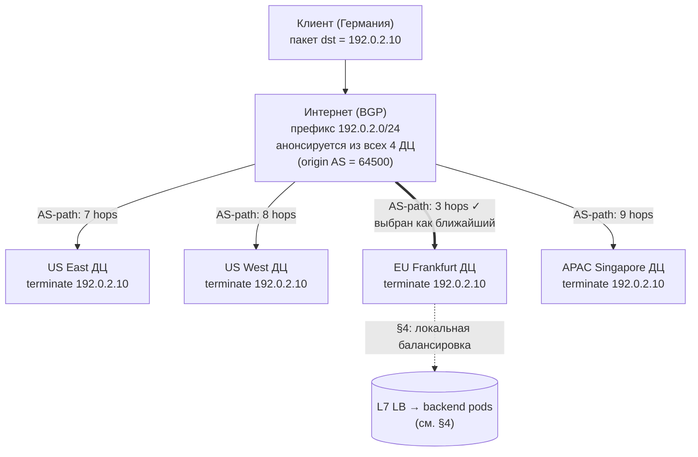
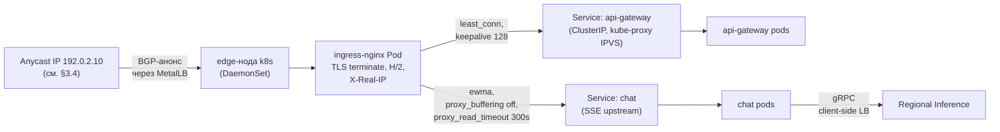
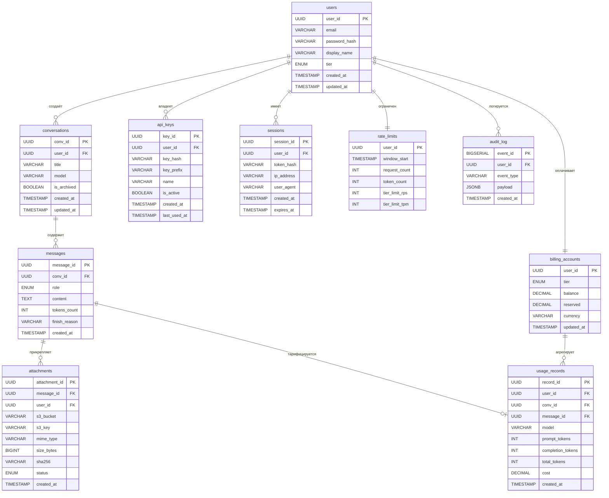
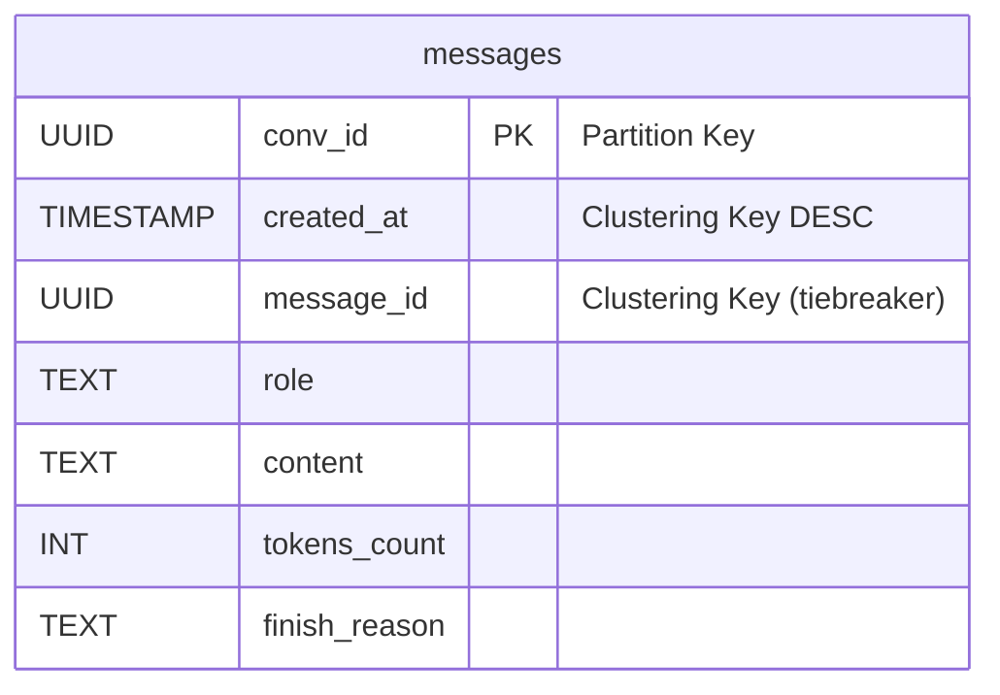
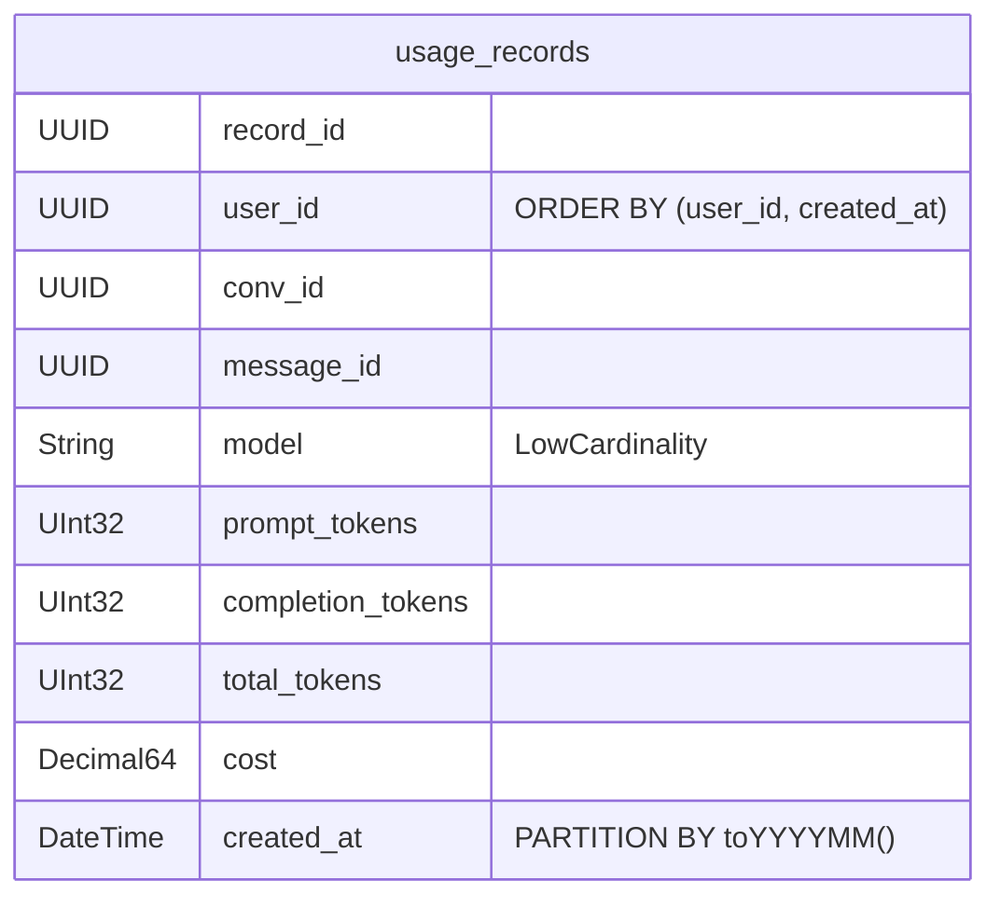
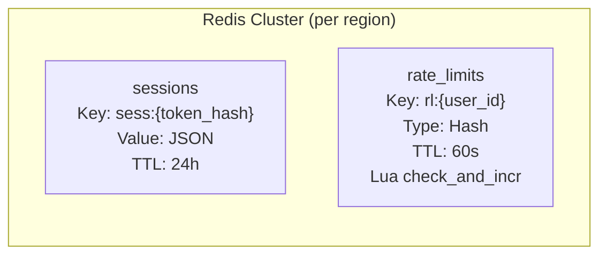
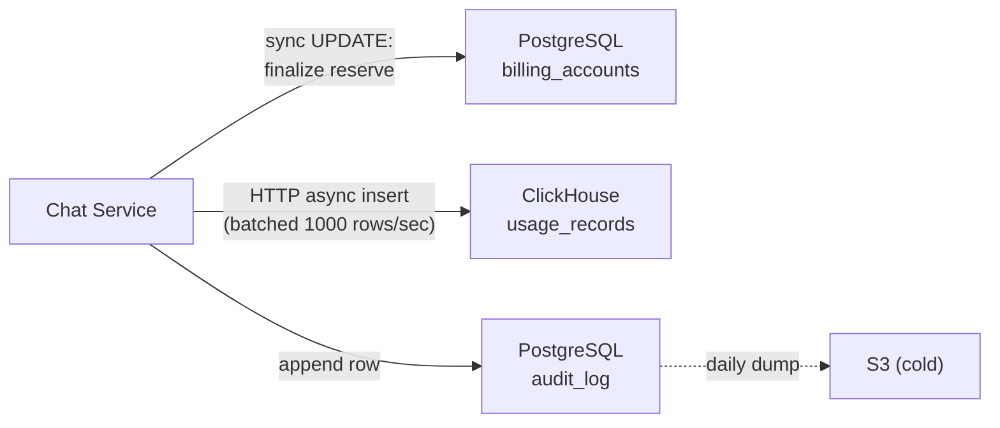
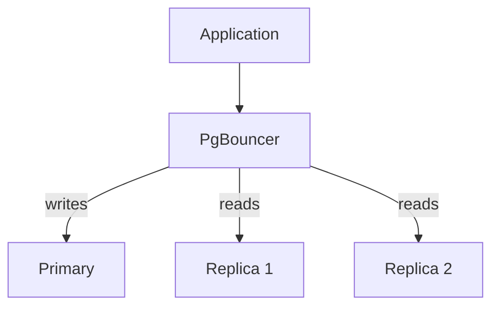

# 1. Тема и целевая аудитория

## Описание

Проектируемая система — публичная AI-платформа, предоставляющая доступ к большой языковой модели (LLM) через два канала:

- **HTTP API** — stateless-интерфейс для разработчиков. Клиент сам передаёт историю диалога в каждом запросе. Сервер не хранит сообщения.
- **Веб-чат** — интерфейс для конечных пользователей. История диалогов хранится на сервере, доступна с любого устройства.

В обоих случаях ядро системы одно: пользователь отправляет запрос → модель генерирует ответ на GPU → токены передаются клиенту в реальном времени через SSE.

Состав запроса:
- текст
- вложения (только фото и документы)

То есть ключевая продуктовая фича: мультимодальная LLM, которая на вход может принимать изображения и документы, а на выход выдавать текст.

## Ключевой пользовательский сценарий

Пользователь отправляет сообщение
- бэкенд собирает контекст (из запроса или из БД)
- контекст уходит на GPU-кластер
- модель генерирует ответ токен за токеном
- токены передаются клиенту через SSE
- пользователь видит ответ по мере генерации

## Дополнительный функционал, обеспечивающий работу бизнеса

- Аутентификация:
  - Для веб-чата: кука, которая прикладывается к каждому запросу. Бэкенд ходит с кукой в Auth Service, который идет в БД за сессиями и сверяет подлинность и время жизни куки (1 месяц).
  - Для API: с каждым запросом прикладываем API токен. Бэкенд ходит с токеном в Auth Service, который идет в БД и сверяет подлинность токена и его время жизни (условимся, что токен можно выдать максимум на 1 месяц).
- Лимитирование:
  - Для веб-чата: лимитирование по тирам подписки: Free, Plus, Pro, Max. Для каждого тира назначается лимит лимит токенов на input и output для каждой модели.
  - Для API: usage-based лимитирование. Назначаем цену за N токенов на input и M токенов на output. По API токену определяется биллинг аккаунт и, перед запросом к inference-кластеру, идет резервирование цены запроса (прогоняем input через tokenizer, а для output считаем по max_output_tokens, которые заранее предопределены для каждой модели). После выполнения запроса возвращаем разницу между предварительной оценкой цены запроса и тем, сколько на самом деле потратилось.

## Реальные аналоги

* ChatGPT (OpenAI), Claude (Anthropic), Gemini (Google) — устойчивый глобальный рынок AI-ассистентов с аудиторией ~1 млрд WAU.

## Характеристики нагрузки

* длительное время генерации ответа (до 1 минуты)
* высокая вычислительная нагрузка на GPU
* большое количество долгоживущих SSE-соединений
* потоковая передача ответа токен за токеном

## Целевая аудитория

Ориентир — аудитория OpenAI. Ключевые публичные метрики:

| Метрика | Значение | Источник |
|---------|----------|----------|
| WAU (всего) | 900 млн | OpenAI [^1] |
| Web-чат | 2.5 млрд сообщений/день | OpenAI [^2] |
| API | 15 млрд токенов/мин ≈ 21.6 трлн токенов/день | OpenAI [^1] |

Web и API — два разных профиля нагрузки: web — короткие промпты от живых пользователей, API — длинный контекст в каждом запросе от сервисов/ботов. Каналы считаем раздельно (см. §2.1).

География [^3][^4][^5]:

| Регион              | Доля трафика | Ключевые страны                        |
| ------------------- | ------------ | -------------------------------------- |
| North America       | ~19–21%      | США (14–17%), Канада (2–4%)          |
| Europe              | ~14–28%      | Великобритания, Германия (~3–6% каждая)|
| Asia-Pacific        | ~28–36%      | Индия (~8–16%), Япония, Сингапур       |
| Latin America       | ~5–6%        | Бразилия (~5–6%)                       |
| Middle East & Africa| ~7%          | ОАЭ, Израиль                           |

## Ключевые продуктовые решения

* **Stateless API** — контекст диалога передаётся в каждом запросе для API
* **Stateful Web** — для веб-чата весь контекст хранится на серверах
* **Streaming через SSE** — ответы передаются токен за токеном поверх HTTP
* **Разделение API и Inference** — API-слой отделён от GPU-кластера
* **Горизонтальное масштабирование** — независимое масштабирование компонентов
* **Глобальная балансировка** — распределение нагрузки между регионами
* **Режим работы 24/7** — высокие требования к доступности
* **Auth** — пользователю выдается идентификатор (кука Session_id для web, API токен для API), который живет 1 месяц. На каждый запрос от пользователя, бэкенду нужно сходить в Auth Service.
* **Лимитирование запросов** — отдельный сервис Rate Limiting Service, который лимитирует запросы для конкретного пользователя
* **Client-side image compression** — web/mobile-клиент ресайзит фото до ~1280×1280 и пережимает в JPEG q=80 перед upload-ом (как WhatsApp/iMessage). Финальный resize до 1024×1024 для vision-encoder делает GPU worker. Документы (PDF/DOCX/PPTX) идут «как есть».
* **Хранение вложений только в исходном виде** — в S3 лежит оригинал блоба, эмбеддинги картинок не кэшируются

# 2. Расчёт нагрузки

## 2.1 Исходные данные

### Размеры сообщений (датасеты)

| Источник | Период | User (токены) | Assistant (токены) | Профиль |
|----------|--------|---------------|--------------------|---------|
| LMSYS-Chat-1M [^7] | 2023 | ~70 | ~215 | Web |
| WildChat [^8] | 2023–2024 | ~296 | — | Web |
| ShareChat [^9] | 2023–2025 | — | ~1 115 | Web |
| OpenRouter [^10] | 2025 | 6 000 (полный контекст) | ~400 | API |
| Замер DevTools | 2025 | ~250 (1 КБ) | ~500 (8 КБ SSE) | Web |

### Параметры расчёта

| Параметр | Значение | Источник / расчёт |
|----------|----------|-------------------|
| Web messages/day | 2.5 млрд | OpenAI [^2] |
| API tokens/min | 15 млрд → 21.6 трлн/день | OpenAI [^1] |
| **API requests/day** | ~3.375 млрд | 21.6 трлн / 6 400 токенов на запрос |
| Среднее Web-сообщение | ~800 токенов (~300 user + ~500 assistant) | DevTools + WildChat/ShareChat |
| Средний API-запрос | ~6 400 токенов (~6 000 input + ~400 output) | OpenRouter [^10]: полный контекст в каждом запросе |
| Доля Web-сообщений с вложением | **7%** | OpenAI [^6] |
| Средний размер вложения | **~2 МБ** | оценка с учётом client-side compression* |
| Пиковый множитель | ×2 | глобальная аудитория, распределённая по часовым поясам |
| Хранение | Web — бессрочное; API — не требуется (stateless) | продуктовое решение |

\* **Лимиты** OpenAI [^11]: картинки до 20 МБ/файл, документы до 512 МБ, CSV до 50 МБ, per-user cap 25 ГБ. **Реальный микс в чате** (нет публичной статистики OpenAI, оценка автора):

| Тип | Доля | Средний размер | Источник числа |
|-----|------|----------------|----------------|
| Фото (vision) | ~70% | ~1 МБ после client-side compression | бенчмарки мессенджеров: WhatsApp HD 2–5 МБ, iMessage 1–5 МБ; ChatGPT всё равно ресайзит до 1024×1024 → ~1 МБ JPEG q=80 |
| Документы (PDF/DOCX/PPTX) | ~30% | ~5 МБ | PDF Candy industry avg 5 МБ (2022) [^12] |

Взвешенное среднее: 0.7 × 1 + 0.3 × 5 ≈ **2 МБ/вложение**. Документы доминируют по объёму трафика несмотря на меньшую долю по штукам. Для API подавляющий объём ввода — текст, вложения игнорируем.

**Web и API считаем раздельно.** Объединять через DAU нельзя: API-клиенты часто сервисы/боты с тысячами запросов в день. Inference-нагрузку выводим напрямую: для Web — из «2.5 млрд сообщений/день», для API — из «15 млрд токенов/мин» через средний размер запроса.

Все расчёты — для модели класса Claude Sonnet.

## 2.2 Продуктовые метрики

### Аудитория

| Метрика | Значение | Расчёт |
|---------|----------|--------|
| WAU | 900 млн | OpenAI [^1] |
| MAU | ~1 млрд | ~1.1 × WAU |
| Web DAU | ~360 млн | ~0.4 × WAU |
| API customers | ~5–10 млн | оценка (разработчики + B2B); не сводится к DAU |

### Нагрузка по каналам

| Канал | Запросов/день | Avg RPS | Peak RPS (×2) | Tokens/req |
|-------|---------------|---------|---------------|------------|
| **Web** | 2.5 млрд | 28 935 | **57 870** | ~800 |
| **API** | 3.375 млрд | 39 063 | **78 125** | ~6 400 |
| **Итого** | 5.875 млрд | 67 998 | **135 996** | — |

API даёт **больше inference-RPS, чем Web** — длинный контекст в каждом запросе перевешивает меньшее число клиентов.

### Среднее количество действий пользователя (Web)

Для API per-user метрика не определена — клиенты варьируются от 10 до миллионов запросов/день, считаем суммарно по объёму (3.375 млрд req/day, см. таблицу выше).

| Действие | Кол-во/день | Обоснование |
|----------|-------------|-------------|
| Отправка промпта | 7 | 2.5 млрд / 360 млн DAU |
| Получение SSE-ответа | 7 | 1 ответ на запрос |
| Загрузка списка чатов | 1 | старт сессии |
| Открытие диалога | 3 | переключение чатов |
| Auth check | каждый HTTP-запрос | проверка куки (то же для API-токена) |
| Login / создание токена | 1/мес | TTL куки/токена 1 месяц |

### Размер сетевого payload

DevTools-замер: фиксированный JSON-overhead HTTP-запроса 0.9 КБ; SSE-стрим **17.8 байт/токен** (`data: {...}\n\n`). Для хранения — ~4 байта/токен + 100 байт метаданных.

| Параметр | Токены | Сетевой payload | Для хранения |
|----------|--------|-----------------|--------------|
| Web input (user msg) | ~300 | 2 КБ | 1.2 КБ |
| Web output (assistant, SSE) | ~500 | 9 КБ | 2 КБ |
| API input (полный контекст) | ~6 000 | 25 КБ | — (stateless) |
| API output (SSE) | ~400 | 7 КБ | — (stateless) |
| Вложение (Web) | — | 2 МБ | 2 МБ |
| Метаданные сообщения | — | — | ~100 байт |

### Средний размер хранилища пользователя (Web)

Среднее сообщений на пользователя в месяц (Web MAU ≈ 1 млрд):

```
2.5 млрд × 30 / 1 млрд = 75 сообщений/мес
```

| Тип данных | Расчёт | Объём/мес |
|-----------|--------|-----------|
| Текст (user) | 75 × 1.2 КБ | 90 КБ |
| Текст (assistant) | 75 × 2 КБ | 150 КБ |
| Метаданные | 75 × 2 × 0.1 КБ | 15 КБ |
| Вложения | 75 × 0.07 × 2 МБ | 10.5 МБ |
| **Итого** | | **~10.8 МБ/мес** |

Вложения — **~97%** объёма пользователя.

---

## 2.3 Технические метрики

### Размер хранения за 1 год

API stateless, хранилища не требует. Web MAU ≈ 1 млрд.

| Тип данных | Расчёт | Объём/год |
|-----------|--------|-----------|
| Текст (user) | 1 млрд × 12 × 90 КБ | ~1.08 ПБ |
| Текст (assistant) | 1 млрд × 12 × 150 КБ | ~1.80 ПБ |
| Метаданные сообщений | 1 млрд × 12 × 15 КБ | ~0.18 ПБ |
| Вложения | 1 млрд × 12 × 10.5 МБ | **~126 ПБ** |
| **Итого** | | **~129 ПБ/год** |

---

### Concurrent SSE-соединения

Скорость генерации Sonnet ~50 токенов/сек.

| Тип | Output (токены) | Длительность | Avg concurrent | Peak (×2) |
|-----|----------------|--------------|----------------|-----------|
| Web | 500 | 10 сек | 289 350 | **578 700** |
| API | 400 | 8 сек | 312 500 | **625 000** |
| **Итого** | | | 601 850 | **~1.2 млн** |

API даёт чуть больше concurrent SSE, чем Web — больше RPS перевешивает короткий output.

---

### Сетевой трафик (peak ×2)

#### Входящий (user → сервер)

| Тип | Расчёт | Peak Gbit/s |
|-----|--------|-------------|
| Web текст | 57 870 × 2 КБ | 0.93 |
| Web вложения | 57 870 × 0.07 × 2 МБ | **64.81** |
| API текст | 78 125 × 25 КБ | 15.63 |
| **Итого входящий** | | **~81.4 Гбит/с** |

#### Исходящий (сервер → user, SSE)

| Тип | Расчёт | Peak Gbit/s |
|-----|--------|-------------|
| Web SSE | 57 870 × 9 КБ | 4.17 |
| API SSE | 78 125 × 7 КБ | 4.37 |
| **Итого исходящий** | | **~8.54 Гбит/с** |

#### Суточный трафик

| Тип | Расчёт (avg) | Объём/сутки |
|-----|-------------|-------------|
| Входящий текст (Web ~5 ТБ + API ~84 ТБ) | (28 935×2 КБ + 39 063×25 КБ) × 86 400 | ~89 ТБ |
| Входящий вложения | 28 935 × 0.07 × 2 МБ × 86 400 | **~350 ТБ** |
| Исходящий SSE (Web ~22 ТБ + API ~24 ТБ) | (28 935×9 КБ + 39 063×7 КБ) × 86 400 | ~46 ТБ |
| **Итого** | | **~485 ТБ/сутки** |

Вложения дают **~72%** суточного трафика. API — основной источник текстового трафика (84 ТБ против 5 ТБ у Web): полный контекст в каждом запросе.

---

### Сводная таблица RPS

| Тип запроса | Avg RPS | Peak RPS |
|-------------|---------|----------|
| Web inference | 28 935 | 57 870 |
| API inference | 39 063 | 78 125 |
| Открытие диалога | 12 500 | 25 000 |
| Список чатов | 4 170 | 8 340 |
| Auth check | 84 500 | 169 000 |
| Login / создание токена | 386 | 772 |

# 3. Глобальная балансировка нагрузки

## 3.1 Функциональное разбиение по доменам

| Домен              | Назначение                                            | Размещение                  |
| ------------------ | ----------------------------------------------------- | --------------------------- |
| `chat.llm.com`     | Web-чат: HTTP + SSE                                   | Все 4 ДЦ (Anycast IP)       |
| `api.llm.com`      | HTTP API для разработчиков: HTTP + SSE                | Все 4 ДЦ (Anycast IP)       |
| `attach.llm.com`   | API выдачи presigned URL для S3 (загрузка/скачивание) | Все 4 ДЦ (Anycast IP)       |
| `cdn.llm.com`      | Статика (JS/CSS, assets)                              | Внешний CDN-провайдер (CNAME) |

Три первых домена резолвятся в **один общий Anycast IP** — гео-разделение по ДЦ происходит на сетевом уровне через BGP (см. §3.4–§3.5), а не в DNS. Сами бинарники вложений лежат в S3 и качаются по presigned URL напрямую с S3-эндпоинтов, через нашу инфраструктуру не проходят.

---

## 3.2 Расположение ДЦ и обоснование

| ДЦ      | Локация    | Роль                                  | Доля HTTP |
| ------- | ---------- | ------------------------------------- | --------- |
| US East | Virginia   | API + SSE + основной GPU-кластер      | 17.5%     |
| US West | Oregon     | API + SSE + резервный GPU-кластер     | 17.5%     |
| EU      | Frankfurt  | API + SSE termination                 | 35%       |
| APAC    | Singapore  | API + SSE termination                 | 30%       |

EU и APAC — только HTTP-слой (terminate TLS, держать SSE-соединения, проксировать inference в US). GPU-кластеров там нет.

**Почему 4 ДЦ:**

* **1 ДЦ** — RTT клиент→ДЦ у пользователя из EU/APAC 100–200 мс. Плюс ещё 80–150 мс на проксирование в US-GPU. Итого TTFT (time-to-first-token) 500–800 мс, ощутимая задержка перед началом ответа.
* **4 ДЦ** — RTT клиент→ближайший ДЦ < 30 мс для ~95% мировой аудитории; TTFT падает до 250–400 мс. Каждый дополнительный ДЦ сверх 4 даёт экономию RTT всего 5–15 мс — пренебрежимо на фоне самой генерации (5–60 сек). Вкладывать в 5-й и 6-й ДЦ не имеет смысла.
* **4 независимых ДЦ — достаточный запас для failover (N+1):** при отказе одного оставшиеся 3 держат пиковую нагрузку с разливом по таблице из §3.5.

**Почему GPU только в US — три причины (по убыванию веса):**

1. **Утилизация — главный фактор.** GPU-inference экономически выгоден только при высокой утилизации: continuous batching формирует крупный batch только когда очередь полная. Если разнести GPU на 4 региона, общая очередь делится на 4 → пиковая утилизация падает с ~80% до ~50% → для той же пропускной способности нужно **вдвое больше** H100. На масштабе тысяч GPU это перевешивает любую разницу в цене инстанса.
2. **Доступность H100/GB200.** Пулы свежих GPU у крупных облаков (AWS, Azure, Oracle) в EU и APAC заметно меньше: capacity и quotas в `us-east-1` / `us-west-2` выдаются быстрее и большими объёмами, чем в `eu-central-1` / `ap-southeast-1`. Плюс электричество в Virginia / Oregon на ~15% дешевле, чем во Frankfurt — это даёт ~10–15% к цене часа GPU-инстанса (вторичный, но реальный фактор).
3. **Operational overhead.** Каждая GPU-площадка требует отдельной инфры: Inference Scheduler, мониторинг GPU/VRAM, pipeline деплоя моделей, on-call. ×4 региона = ×4 overhead без выигрыша по продуктовым метрикам.

Latency на это **не влияет**: RTT EU/APAC↔US-GPU 80–150 мс — это <3% от 5–60 сек самой генерации, пользователь разницы не заметит.

**Влияние на продуктовые метрики:**

| Метрика          | Эффект 4-региональной схемы                                                 |
| ---------------- | --------------------------------------------------------------------------- |
| TTFT для EU/APAC | 250–400 мс вместо 500–800 мс при single-region                              |
| Доступность      | 4 независимых ДЦ; отказ одного → клиенты автоматически уходят в ближайший живой (§3.5) |
| Стоимость        | 90% inference в США держит GPU $/токен на минимуме; в EU/APAC — только дешёвый HTTP/SSE-слой без дорогих H100 |

---

## 3.3 Распределение запросов по ДЦ

Раскладываем суммарный HTTP-трафик из §2 (85 054 avg / 170 108 peak RPS, ~1.2 млн concurrent SSE) по регионам пропорционально доле аудитории. Это вход для §4 — сколько Nginx и SSE-серверов держать в каждом ДЦ.

Доли 17.5/17.5/35/30% — worst-case по верхней границе Europe (28% + рост) и Asia-Pacific (32%, середина диапазона) на основе аналитики глобального трафика ChatGPT [^7][^8]; OpenAI официальной региональной разбивки не публикует.

| ДЦ        | HTTP RPS avg | HTTP RPS peak | Concurrent SSE peak |
| --------- | ------------ | ------------- | ------------------- |
| US East   | 14 884       | 29 769        | 210 648             |
| US West   | 14 884       | 29 769        | 210 648             |
| EU        | 29 769       | 59 538        | 421 295             |
| APAC      | 25 516       | 51 032        | 361 110             |
| **Итого** | **85 054**   | **170 108**   | **1 203 700**       |

Все inference-запросы (67 998 avg / 135 996 peak RPS из §2) в итоге сходятся на GPU-кластерах в США независимо от того, в каком ДЦ они принимаются: EU/APAC — только HTTP-слой, проксирующий gRPC-стрим в US-GPU.

---

## 3.4 Anycast-балансировка

Полноценной DNS-балансировки нет: домены резолвятся в **один общий IP** для всех 4 ДЦ независимо от географии резолвера. Гео-распределение трафика делает BGP на сетевом уровне — это и есть Anycast.

**DNS-записи (одинаковые для всех клиентов мира):**

| Запись                | Тип    | Значение                          | Назначение                                      |
| --------------------- | ------ | --------------------------------- | ----------------------------------------------- |
| `chat.llm.com`    | A      | `192.0.2.10`                      | Anycast IP, общий для всех 4 ДЦ                 |
| `api.llm.com`     | A      | `192.0.2.10`                      | Anycast IP, общий для всех 4 ДЦ                 |
| `cdn.llm.com`     | CNAME  | `static.cdn-provider.net`         | Статика (JS/CSS) — внешний CDN                  |
| `attach.llm.com`  | A      | `192.0.2.10`                      | Anycast IP — выдача presigned URL → S3          |
| `llm.com`         | NS     | 4 anycast-адреса authoritative NS | Сами NS-сервера тоже на anycast (RFC 7094)      |

TTL A-записей — 60 сек (для миграции Anycast-провайдера / IP-блока), DNSSEC включён.

**Anycast** — сетевая техника, при которой один IP анонсируется в Интернет одновременно из нескольких ДЦ через протокол BGP. Каждый ДЦ держит свой edge-роутер, который через BGP-сессию с upstream-провайдерами анонсирует наш `/24`-префикс под нашим ASN. Маршрутизаторы Интернета выбирают **ближайший** анонс по числу AS-hop — без участия DNS и приложения.



> **Граница раздела.** Глобальная балансировка (§3) заканчивается там, где Anycast-пакет попал в нужный ДЦ. Что происходит дальше — TLS termination, SNI routing по `Host`, выбор Nginx-ноды, distribution по backend pods — это локальная балансировка, **§4**. ASN `64500` — пример из приватного диапазона RFC 6996; в проде у нас был бы зарегистрированный публичный ASN.

<!-- Контр-аргументы для устной защиты («зачем Anycast, а не GeoDNS», DDoS-распределение,
     проблема геолокации мобильных resolver-ов и т.п.) — в notes/defense-cheatsheet.md.
     В РПЗ оставляем минимально достаточный текст; всё остальное — на защиту устно. -->

---

## 3.5 Регулировка трафика между ДЦ

> Раздел про балансировку **между ДЦ**: какие условия выводят целый регион из ротации и куда уходит его трафик. Балансировка **внутри** одного ДЦ (между Nginx-нодами, между Pod-ами) — отдельная задача, см. §4.

Сам Anycast (§3.4) разбирается с failover автоматически: ДЦ снимает свой BGP-анонс — пакеты уходят к следующему ближайшему. Решение «снять анонс» принимается **внутри** ДЦ по результатам self-health-check всего региона.

**Условия, при которых регион снимает свой анонс / получает пониженный вес:**

| Метрика                 | Порог                  | Действие                              |
| ----------------------- | ---------------------- | ------------------------------------- |
| HTTP latency p95        | > 500 мс               | Снижение веса региона                 |
| Error rate (5xx)        | > 1% за 1 минуту       | Снижение веса региона                 |
| Origin pool недоступен  | 3 подряд failed health-check | Снять BGP-анонс, регион выходит из ротации |
| GPU queue depth (US-кластер) | > 1000 задач      | Возврат `503` на новые inference через Scheduler (HTTP-backpressure) |

**Реализация (open-source стек на edge-роутере каждого ДЦ):**

| Компонент          | Инструмент                          | Роль                                                                   |
| ------------------ | ----------------------------------- | ---------------------------------------------------------------------- |
| BGP-демон          | BIRD2 (или FRRouting)               | Держит BGP-сессию с upstream-провайдерами, анонсирует Anycast-префикс  |
| Метрики            | Prometheus + node_exporter          | Скользящие окна по latency / 5xx; GPU Scheduler публикует queue depth  |
| Health checker     | Свой сервис на Go                   | Раз в 1 сек тянет метрики и `/health` бэкендов; принимает решение      |
| Управляющий канал  | `birdc` (CLI BIRD) / ExaBGP REST    | Health checker дёргает BGP-демон: prepend или withdraw                 |

**Что физически делает «снижение веса» и «снять анонс»:**

* **Снижение веса** = **AS-path prepending**. Это BGP-механизм: мы анонсируем тот же `/24` IP, но искусственно повторяем свой ASN в AS-path 1–3 раза. Соседние BGP-роутеры в Интернете при выборе маршрута предпочитают короткий AS-path → часть мира перестаёт выбирать наш ДЦ. Чем больше prepend, тем дальше «отодвигается» регион.
* **Снять анонс** = **route withdraw**. BIRD шлёт BGP UPDATE с withdrawn route — BGP-таблицы в Интернете перестраиваются за 30–90 сек, пакеты уходят в следующий ближайший ДЦ. Это failover-механизм Anycast.
* **GPU queue overflow** требует другого ответа: AS-path prepending тут не поможет (HTTP-трафик из EU/APAC всё равно проксируется в US-GPU). Inference Scheduler в US начинает возвращать `503 Service Unavailable` / `Retry-After` на новые inference-запросы — это backpressure на уровне HTTP, а не BGP.

**Routing policy для HTTP-слоя (куда уходит трафик):**

| Регион клиента      | Primary           | Fallback при отказе primary |
| ------------------- | ----------------- | --------------------------- |
| Северная Америка    | US East / US West | EU                          |
| Европа / MEA        | EU                | US East                     |
| Азия / Океания      | APAC              | US West                     |
| Латинская Америка   | US East           | EU                          |

Эта таблица — про **HTTP-слой** (TLS, Auth, list chats, открытие диалога, UI). Inference — отдельная плоскость: любой ДЦ, принявший запрос, всё равно проксирует gRPC-стрим в US-GPU.

**Inference-failover (на уровне GPU-кластеров в US):**

* US East — primary, US West — резерв. Inference Scheduler держит оба пула в горячем состоянии и переключает запросы на US West, если US East перегружен или недоступен.
* При падении US East: HTTP-клиенты Северной Америки уходят в US West (по таблице выше), inference тоже идёт в US West.
* **При одновременном отказе US East И US West** новый inference недоступен глобально — GPU-площадки только в США. EU/APAC продолжат принимать HTTP-запросы (history, list, login, UI работают), но новые промпты возвращают `503 Service Unavailable` до восстановления хотя бы одного US-региона. Это осознанный компромисс: вторая GPU-площадка вне США удвоила бы инфраструктурные расходы и не оправдана при разнесении US East/West по разным AZ/регионам с независимыми сетевыми и питающими подсистемами.

**Пример частичного отказа** (один ДЦ, не GPU-кластер): при отказе EU 35% HTTP-трафика разливается US East ≈ 25% + US West ≈ 10%; inference как раньше идёт в US-GPU. Latency для пострадавших клиентов растёт на 80–150 мс, но сервис полностью доступен.

**Способы переключения:**

1. **Gradual shift** — плавное изменение веса региона через AS-path prepending для planned maintenance или регионального rollout. Чем длиннее искусственный AS-path, тем меньше Интернета считает наш ДЦ ближайшим.
2. **Instant failover** — моментальное снятие BGP-анонса (route withdraw) по сработавшему health-check при аварии.

---

<!-- §3.6+ (inference flow, multimodal pull, Rate Limiter / Billing placement)
     перенесены в notes/section-7-10-drafts.md — материал относится к §7 (Алгоритмы)
     и §10 (Схема проекта), не к глобальной балансировке. -->

# 4. Локальная балансировка нагрузки

§4 — про балансировку **внутри одного ДЦ**: что происходит после того, как Anycast-пакет приземлился на пул edge-нод (§3.4). Граница с §3 — на входной IP ДЦ; граница с §6 — БД балансятся отдельным механизмом и описаны в §6.

## 4.1 Слои балансировки внутри ДЦ

В ДЦ есть три места, где принимается решение «на какой инстанс отправить запрос»:

| Слой | Где | Что делает | Технология | Алгоритм |
| --- | --- | --- | --- | --- |
| **Внешний (edge)** | Между интернетом и k8s-кластером | TLS termination, HTTP/2, маршрутизация по `Host`, sticky/affinity, rate-limit, X-Real-IP | **k8s ingress-nginx (L7)** | `least_conn` (API), `ewma` (SSE) |
| **Intra-cluster** | Между Pod-ами одного Service в k8s | TCP-роутинг ClusterIP → endpoint Pod-ов | `kube-proxy` (IPVS / iptables — L4) | round-robin |
| **Application-to-application** | Внутри сервиса (API → Inference, Inference → GPU Worker) | gRPC server-streaming с динамическим списком воркеров | gRPC client-side LB | round-robin / endpoint-aware (Inference Scheduler выдаёт endpoint, см. §10) |

Внешний трафик (HTTPS + SSE) принимаем **только на L7**:

* **L4 не годится для длинных keep-alive соединений:** «выбор бэкенда в момент установки соединения, дисбаланс при небольшом числе соединений; смещение соединений при мигании бэкендов». У нас 1.2 млн concurrent SSE — каждый стрим живёт 8–10 сек; L4 не сможет ровно их размазать.
* **L7 даёт всё нужное одной коробкой:** TLS termination, sticky sessions (если понадобятся), HTTP/2 multiplexing к upstream, gzip, `proxy_next_upstream` для failover, `X-Real-IP` для прокидывания IP клиента — это типовой набор фич L7 reverse proxy.
* **Решение проблемы медленных клиентов:** L7 буферизует запрос → upstream получает ровный поток без таймаутов от долго печатающего пользователя.

Платим за это «относительно низкой производительностью» (цитата из лекции) — но узкое место у нас всё равно в TLS handshake и CPU, а не в линейной скорости сети, см. §4.3.

L4 (kube-proxy) и gRPC client-side упомянуты потому, что без них не объяснить путь запроса от ingress-а до GPU. Но сами решения там тривиальные и фиксированные платформой (k8s) — детализировать их в §4 нечем.

---

## 4.2 Edge: ingress-nginx как единственный приём внешнего трафика

Anycast IP (§3.4) приземляется на ноды k8s через **MetalLB в BGP-режиме** — это open-source адаптер, который анонсирует наш `/24` с k8s-нод тем же BGP-демоном, что описан в §3.5 (BIRD2). Внутри кластера трафик попадает на DaemonSet `ingress-nginx` (по одной реплике на edge-ноду).



**Алгоритмы и параметры (annotations ingress-nginx, open-source):**

| Параметр | API upstream | SSE upstream | Зачем |
| --- | --- | --- | --- |
| `load-balance` | `least_conn` | `ewma` | API — короткие однородные запросы; SSE — длинные стримы, `ewma` (exponentially weighted moving average по latency) учитывает «тяжесть» бэкенда |
| `affinity` | off | off | Sticky sessions выключены: SSE-стрим = одно соединение = один pod автоматически. Resume по `Last-Event-ID` в MVP не реализуем (см. defense-cheatsheet) |
| `proxy-read-timeout` | 30 сек | 300 сек | Из лекции: «разные настройки для разных типов запросов» — длинный таймаут только там, где он нужен |
| `proxy-buffering` | on | **off** | Буферизация SSE убила бы стриминг токенов |
| `keepalive` (upstream) | 128 | 32 | TCP multiplexing к upstream, экономит TCP/TLS-handshake между ingress и Pod |
| `proxy-next-upstream` | `error timeout http_502 http_503` | то же | Failover-политика из лекции: при отказе upstream-а ingress сам переиграет запрос |

`X-Real-IP` / `X-Forwarded-For` ingress-nginx прокидывает по умолчанию — `Real-IP from` указывает на **CIDR** (Classless Inter-Domain Routing — нотация диапазона IP вида `192.0.2.0/24`) edge-нод, иначе можно подделать заголовок снаружи.

**TLS termination на ingress:** TLS 1.3, ECDSA P-256, session tickets включены (60–70% reuse в реальных профилях [^14]), Let's Encrypt через cert-manager. Session cache в shared memory ingress-а — этого хватает, потому что Anycast уже привязал клиента к одному ДЦ (§3.4), и в большинстве случаев он попадает на один и тот же edge-pod.

**Почему ingress-nginx (open-source), а не Nginx Plus:** для MVP всё нужное (TLS, HTTP/2, `least_conn`, `ewma`, proxy_next_upstream, sticky cookie) есть в open-source — Plus-фичи (`least_time`, live-activity API, JWT validation) добавили бы ~$30k/год за лицензии без качественного перехода. Аргументы для устной защиты — в `notes/defense-cheatsheet.md`.

**Что НЕ делает ingress-nginx:** не балансит intra-cluster трафик (это `kube-proxy`), не балансит gRPC между сервисами (это client-side LB), не балансит запросы к БД (это PgBouncer / driver, см. §6).

---

## 4.3 Расчёт числа реплик ingress-nginx

Сайзим по **трём ограничителям** (как в требованиях курса и в эталонной работе): HTTPS RPS, TLS CPS, пропускная способность сети. Concurrent connections — sanity-check, не ограничитель: для SSE число соединений ≠ нагрузка на CPU/сеть.

### Исходные данные

Из §3.3 (пиковый трафик per-region) и §2.3 (сетевой трафик через ingress, без вложений — они идут напрямую в S3 по presigned URL):

```
Через ingress peak (global):
  Входящий текст:  Web 0.93 + API 15.63 = 16.56 Gbit/s
  Исходящий SSE:   Web 4.17 + API 4.37  =  8.54 Gbit/s
  Итого:                                 25.10 Gbit/s
```

Раскладываем по регионам пропорционально доле HTTP-трафика из §3.3 (17.5 / 17.5 / 35 / 30%). Доля новых TLS-соединений (без re-use) — 30%; TLS resumption через session tickets даёт 60–70% reuse в реальных профилях [^14], берём консервативно 70% reuse → 30% new.

| Регион | Peak RPS | Peak CPS (RPS × 0.3) | Peak Gbit/s через ingress |
| --- | --- | --- | --- |
| US East | 29 769 |  8 931 | 4.39 |
| US West | 29 769 |  8 931 | 4.39 |
| EU      | 59 538 | 17 861 | 8.79 |
| APAC    | 51 032 | 15 310 | 7.53 |

### Паспортные потолки на одну реплику ingress-nginx

Прямой синтетический бенчмарк ingress-nginx Controller на 16 vCPU [^13]:

| Метрика | 16 vCPU (паспорт) | С запасом 50% |
| --- | --- | --- |
| HTTPS RPS | 56 175 | ~28 000 |
| TLS CPS (handshakes/sec, в бенчмарке колонка «SSL TPS») | 6 676 | ~3 300 |
| Throughput | 8.8 Гбит/с | 8.8 Гбит/с |

Throughput в бенчмарке упирается в **NIC** (Network Interface Card — сетевая карта), а не в CPU, поэтому 50% запас к нему не применяем (как в эталонной работе).

Используем edge-ноды **32 vCPU / 64 GB / 2×25 GbE NIC** (две сетевые карты по 25 Гбит/с, суммарно 50 Гбит/с full-duplex; см. §11) — масштаб ×2 от референсной 16-vCPU конфигурации даёт паспорт ×2:

| Метрика на ноду 32 vCPU | Паспорт (×2) | **В расчёт (с запасом 50%)** |
| --- | --- | --- |
| HTTPS RPS | 112 350 | **56 000** |
| TLS CPS (handshakes/sec) | 13 352 | **6 600** |
| Throughput | 17.6 Гбит/с | **17.6 Гбит/с** (NIC-bound, без запаса) |
| Concurrent connections | ~300 000 | sanity-check |

> Терминология: в бенчмарке [^13] используется **«SSL TPS»** (SSL Transactions Per Second) — это новые TLS-handshakes в секунду; в нашем расчёте называем эту же метрику **«TLS CPS»** (Connections Per Second), как принято в требованиях курса. Это одна и та же величина.

### Ограничитель 1 — HTTPS RPS

$$N_{rps} = \lceil \frac{\text{Peak RPS}}{56\,000} \rceil$$

| Регион | Peak RPS | $N_{rps}$ |
| --- | --- | --- |
| US East | 29 769 | **1** |
| US West | 29 769 | **1** |
| EU      | 59 538 | **2** |
| APAC    | 51 032 | **1** |

### Ограничитель 2 — TLS termination (CPS)

$$N_{cps} = \lceil \frac{\text{Peak CPS}}{6\,600} \rceil$$

| Регион | Peak CPS | $N_{cps}$ |
| --- | --- | --- |
| US East |  8 931 | **2** |
| US West |  8 931 | **2** |
| EU      | 17 861 | **3** |
| APAC    | 15 310 | **3** |

### Ограничитель 3 — пропускная способность сети

$$N_{net} = \lceil \frac{\text{Peak Gbit/s}}{17.6} \rceil$$

| Регион | Peak Gbit/s | $N_{net}$ |
| --- | --- | --- |
| US East | 4.39 | **1** |
| US West | 4.39 | **1** |
| EU      | 8.79 | **1** |
| APAC    | 7.53 | **1** |

Ни один регион не упирается в bandwidth — узкое место везде TLS handshake.

### Минимум и резервирование 2N @ 50%

$$N_{min} = \max(N_{rps}, N_{cps}, N_{net}); \qquad N_{total} = 2 \times N_{min}$$

В штатном режиме каждая реплика загружена ≤ 50% потолка по всем трём метрикам. При отказе половины парка оставшиеся выходят на 100% без деградации.

| Регион | $N_{rps}$ | $N_{cps}$ | $N_{net}$ | $N_{min}$ | **$N_{total}$ (2N)** | Загрузка штатно (RPS / CPS / Gbit/s) |
| --- | --- | --- | --- | --- | --- | --- |
| US East | 1 | 2 | 1 | 2 | **4** | 13% / 34% / 6% |
| US West | 1 | 2 | 1 | 2 | **4** | 13% / 34% / 6% |
| EU      | 2 | 3 | 1 | 3 | **6** | 18% / 45% / 8% |
| APAC    | 1 | 3 | 1 | 3 | **6** | 15% / 39% / 7% |

Везде связывает TLS CPS — это ожидаемо для HTTPS-сервиса с долей новых соединений 30%.

### Sanity-check — concurrent SSE на реплику

Не ограничитель, проверка «не упёрлись ли в file-descriptor-ы». Peak SSE из §3.3 / число реплик:

| Регион | Peak SSE | Реплик | SSE/реплика | % от паспорта (300k) |
| --- | --- | --- | --- | --- |
| US East | 210 648 | 4 |  52 662 | 18% |
| US West | 210 648 | 4 |  52 662 | 18% |
| EU      | 421 295 | 6 |  70 216 | 23% |
| APAC    | 361 110 | 6 |  60 185 | 20% |

Запас в 4–5× — связывает CPU TLS-handshake, а не число открытых соединений.

---

## 4.4 Резервирование и реакция на отказы

| Компонент | Модель | Как обнаруживается отказ | Реакция |
| --- | --- | --- | --- |
| ingress-nginx pod | **2N @ 50%** (DaemonSet на edge-нодах: 4 в US East/West, 6 в EU/APAC — см. §4.3) | k8s liveness probe `/healthz` (1 сек) → перезапуск; readiness probe → исключение из Service endpoints | Соседние реплики берут трафик; при отказе всей edge-ноды MetalLB снимает её BGP-анонс — Anycast уводит трафик в следующий ближайший ДЦ (§3.5) |
| upstream pod (api-gateway, chat) | **N+1**, **HPA** (Horizontal Pod Autoscaler — k8s-контроллер, масштабирует число Pod-ов по метрикам) на CPU 60% | ingress active health-check → `proxy_next_upstream` ретраит запрос на следующий pod; readiness probe k8s исключает из Service | Пользователь не видит ошибку (ретрай прозрачный для не-стримовых запросов; для SSE — клиент переоткроет соединение) |
| edge-нода (HW failure) | k8s drain + reschedule | Node NotReady (kubelet 40 сек) | DaemonSet pod уезжает с ноды; MetalLB снимает BGP-анонс с этой ноды |

Из лекции: оркестрация k8s сама держит реестр живых эндпоинтов через **readiness probe** — отдельный service-discovery (Consul / etcd) поверх k8s не нужен. Это и есть «использование оркестрации» из лекции.

---

## 4.5 Сводная таблица

| Компонент | US East | US West | EU | APAC | Всего | Резервирование |
| --- | --- | --- | --- | --- | --- | --- |
| ingress-nginx (edge L7, 32 vCPU нода) | 4 | 4 | 6 | 6 | **20** | 2N @ 50% |
| MetalLB speaker (BGP) | per-edge-node | per-edge-node | per-edge-node | per-edge-node | DaemonSet | один speaker на ноду |
| kube-proxy (intra-cluster L4) | per-node | per-node | per-node | per-node | k8s built-in | DaemonSet, отказ ноды → reschedule |

Отдельный L4-слой (LVS, IPVS на edge-роутере) **не разворачиваем**: его задачи (приём Anycast-IP, распределение по edge-нодам) покрыты MetalLB + ingress-nginx; добавление LVS дало бы лишний hop без выигрыша.

# 5. Логическая схема БД

## 5.1 ER-диаграмма



---

## 5.2 Связка inference-цикла

Один HTTP-запрос на чат (`POST /v1/chat/completions` или Web-эквивалент) порождает **один inference-цикл** — пара «вопрос → ответ». В долговременное хранилище уходит:

| След в БД | Кол-во на 1 цикл | Что хранится |
| --- | --- | --- |
| `messages` (Web) | **2 строки** | `role=user` (промпт) + `role=assistant` (ответ модели). Связаны общим `conv_id`, упорядочены по `created_at`. API-канал stateless и в `messages` не пишет |
| `usage_records` | **1 строка** | `prompt_tokens`, `completion_tokens`, `cost`, `model`. Ссылается на `message_id` финального assistant-сообщения для аудита |
| `attachments` (опц.) | 0 или N строк | Только если запрос мультимодальный; одна строка на каждый загруженный файл, FK на `message_id` пользовательского сообщения |
| `audit_log` | 0–1 строк | Только для значимых событий (превышение лимита, billing-резерв) — не пишется на каждый успешный цикл |

Само in-flight состояние цикла (`request_id → GPU worker`, контекст промпта в памяти, поток токенов в gRPC stream) **не хранится в БД** — живёт в памяти Inference Scheduler (in-memory + Raft-журнал для **HA**, High Availability) и Regional Inference Service. Переживает не дольше длительности стрима; при сбое клиент ретраит. Детали потока — `notes/section-7-10-drafts.md` (переедут в §7/§10).

Порядок записи (после закрытия SSE): `messages.user` фиксируется в начале цикла (до GPU), `messages.assistant` — после получения финального токена. `usage_records` пишется параллельно с финализацией `billing_accounts`. Подробная диаграмма потока — в §6.3.

---

## 5.3 Описание таблиц

### users

| Поле | Тип | Размер | Описание |
| --- | --- | --- | --- |
| user_id | UUID | 16 B | Первичный ключ |
| email | VARCHAR | ~50 B | Email (уникальный) |
| password_hash | VARCHAR | 60 B | bcrypt hash |
| display_name | VARCHAR | ~50 B | Отображаемое имя |
| tier | ENUM | 1 B | free / plus / enterprise |
| created_at | TIMESTAMP | 8 B | Регистрация |
| updated_at | TIMESTAMP | 8 B | Обновление |

| Метрика | Значение |
| --- | --- |
| Строк | ~1 млрд |
| Размер строки | ~200 B |
| Общий объём | ~200 GB |
| QPS чтение | 4 200 (auth) |
| QPS запись | ~100 (регистрации) |
| Консистентность | Strong |
| Распределение ключей | Равномерное по user_id |

---

### conversations

| Поле | Тип | Размер | Описание |
| --- | --- | --- | --- |
| conv_id | UUID | 16 B | Первичный ключ |
| user_id | UUID | 16 B | Владелец |
| title | VARCHAR | ~100 B | Название диалога |
| model | VARCHAR | 20 B | Модель |
| is_archived | BOOLEAN | 1 B | Флаг архивации |
| created_at | TIMESTAMP | 8 B | Создание |
| updated_at | TIMESTAMP | 8 B | Последнее сообщение |

| Метрика | Значение |
| --- | --- |
| Строк | ~50 млрд |
| Размер строки | ~170 B |
| Общий объём | ~8.5 TB |
| QPS чтение | 33 500 avg / 67 000 peak (21 000 список + 12 500 открытие) |
| QPS запись | 28 935 avg / 57 870 peak (update updated_at при новом сообщении = Web inference RPS) |
| Консистентность | Strong (per-user) |
| Распределение ключей | Pareto (см. §5.4) |

---

### messages

| Поле | Тип | Размер | Описание |
| --- | --- | --- | --- |
| message_id | UUID | 16 B | Первичный ключ |
| conv_id | UUID | 16 B | FK → conversations |
| role | ENUM | 1 B | user / assistant / system |
| content | TEXT | ~1–4 KB | Текст сообщения |
| tokens_count | INT | 4 B | Количество токенов |
| finish_reason | VARCHAR | 10 B | stop / length / error |
| created_at | TIMESTAMP | 8 B | Время создания |

| Метрика | Значение |
| --- | --- |
| Строк | ~5 млрд/день, ~1.83 трлн/год (1 inference-цикл Web = 2 строки: `role=user` + `role=assistant`; API stateless, не пишет) |
| Размер строки | ~2.5 KB (avg) |
| Общий объём | ~12.5 TB/день, ~4.5 PB/год |
| QPS чтение | 12 500 avg / 25 000 peak (загрузка диалога при открытии) |
| QPS запись | 57 870 avg / 115 740 peak (Web inference avg 28 935 × 2 messages) |
| Консистентность | Eventual (read-after-write delay допустим: пользователь видит свой prompt и ответ из памяти стрима до фиксации) |
| Распределение ключей | Hot-partitions у активных диалогов; внутри партиции — равномерно по `created_at`. Подробно — §5.4 |

---

### api_keys

| Поле | Тип | Размер | Описание |
| --- | --- | --- | --- |
| key_id | UUID | 16 B | Первичный ключ |
| user_id | UUID | 16 B | FK → users |
| key_hash | VARCHAR | 64 B | SHA-256 hash |
| key_prefix | VARCHAR | 8 B | Префикс для идентификации |
| name | VARCHAR | 50 B | Имя ключа |
| is_active | BOOLEAN | 1 B | Активен ли |
| created_at | TIMESTAMP | 8 B | Создание |
| last_used_at | TIMESTAMP | 8 B | Последнее использование |

| Метрика | Значение |
| --- | --- |
| Строк | ~100 млн |
| Размер строки | ~180 B |
| Общий объём | ~18 GB |
| QPS чтение | 8 680 peak (валидация на каждом API-запросе; Web-трафик идёт через sessions) |
| QPS запись | ~100 (создание ключа, update last_used_at батчами) |
| Консистентность | Strong |
| Распределение ключей | Равномерное по key_hash |

---

### sessions

| Поле | Тип | Размер | Описание |
| --- | --- | --- | --- |
| session_id | UUID | 16 B | Первичный ключ |
| user_id | UUID | 16 B | FK → users |
| token_hash | VARCHAR | 64 B | Hash токена |
| ip_address | VARCHAR | 45 B | IPv4/IPv6 |
| user_agent | VARCHAR | 200 B | User-Agent |
| created_at | TIMESTAMP | 8 B | Создание |
| expires_at | TIMESTAMP | 8 B | Истечение |

| Метрика | Значение |
| --- | --- |
| Строк | ~1 млрд (MAU — TTL = 30 сут покрывает весь месячный охват) |
| Размер строки | ~360 B |
| Общий объём | ~360 GB |
| QPS чтение | 95 700 (проверка на каждый запрос) |
| QPS запись | 4 200 (login) |
| Консистентность | Strong |
| Распределение ключей | Равномерное по token_hash |

---

### billing_accounts

Hot-path таблица для резервирования и списания средств под inference-запросы (только API). Web-tier ограничения не затрагивают эту таблицу — они закрываются Rate Limiter-ом.

| Поле | Тип | Размер | Описание |
| --- | --- | --- | --- |
| user_id | UUID | 16 B | PK |
| tier | ENUM | 1 B | free / plus / pro / max / api |
| balance | DECIMAL(12,4) | 8 B | Доступные средства |
| reserved | DECIMAL(12,4) | 8 B | Зарезервировано под in-flight запросы |
| currency | VARCHAR | 3 B | USD |
| updated_at | TIMESTAMP | 8 B | Последняя операция |

| Метрика | Значение |
| --- | --- |
| Строк | ~100 млн (только API-пользователи) |
| Размер строки | ~80 B |
| Общий объём | ~8 GB |
| QPS чтение | 17 360 (2 операции на API-запрос: reserve + finalize) |
| QPS запись | 17 360 |
| Консистентность | **Strong (SERIALIZABLE)** — нельзя списать одни деньги дважды |
| Распределение ключей | Hot keys у самых активных API-клиентов |

---

### usage_records

Append-only лог завершённых inference-запросов **по обоим каналам** (Web + API): нужен для биллинг-дашбордов (API), anti-abuse-расследований и квот free/plus tier (Web). Одна строка на завершённый цикл.

| Поле | Тип | Размер | Описание |
| --- | --- | --- | --- |
| record_id | UUID | 16 B | Первичный ключ |
| user_id | UUID | 16 B | FK → users |
| conv_id | UUID | 16 B | FK → conversations (NULL для API) |
| message_id | UUID | 16 B | FK → messages (NULL для API) |
| channel | ENUM | 1 B | web / api |
| model | VARCHAR | 20 B | Модель |
| prompt_tokens | INT | 4 B | Токены промпта |
| completion_tokens | INT | 4 B | Токены ответа |
| total_tokens | INT | 4 B | Сумма |
| cost | DECIMAL | 8 B | Стоимость (для Web — расчётная, для биллинг-аналитики) |
| created_at | TIMESTAMP | 8 B | Время |

| Метрика | Значение |
| --- | --- |
| Строк | ~5.875 млрд/день, ~2.14 трлн/год (Web 28 935 + API 39 063 циклов/сек × 86 400) |
| Размер строки | ~120 B |
| Общий объём | ~700 ГБ/день, ~250 ТБ/год |
| QPS чтение | ~1 000 (billing dashboard, anti-abuse-инвестигейшн) |
| QPS запись | 67 998 avg / 135 996 peak (= Total inference RPS из §2.2) |
| Консистентность | Eventual (async insert батчем — допустима задержка до 1 секунды) |
| Распределение ключей | Hot keys у активных пользователей; партиционирование по `toYYYYMM(created_at)` сглаживает |

---

### attachments

Метаданные вложений (фото и документы). Сами бинарные данные хранятся в S3 (см. §6.1) — в таблице только ссылка (`s3_bucket`, `s3_key`), size, mime и статус (`uploading` / `ready` / `deleted`). Бинарники в S3 — ~97% физического объёма данных сервиса (~126 ПБ/год, §2.3), поэтому исключать вложения из логической схемы нельзя.

Upload flow (direct-to-S3, не через ingress-nginx): клиент запрашивает presigned PUT у Chat Service → получает URL + `attachment_id` в статусе `uploading` → заливает файл напрямую в S3 → S3 event notification меняет статус на `ready`. Подробности — `notes/section-7-10-drafts.md` (multimodal flow).

| Поле | Тип | Размер | Описание |
| --- | --- | --- | --- |
| attachment_id | UUID | 16 B | Первичный ключ |
| message_id | UUID | 16 B | FK → messages (к какому сообщению) |
| user_id | UUID | 16 B | FK → users (для прав доступа и биллинга объёма) |
| s3_bucket | VARCHAR | ~30 B | Имя bucket (регионально) |
| s3_key | VARCHAR | ~80 B | Путь внутри bucket, `{user_id}/{attachment_id}` |
| mime_type | VARCHAR | ~30 B | `image/png`, `application/pdf`, … |
| size_bytes | BIGINT | 8 B | Размер файла (после client-side compression, ~2 МБ avg) |
| sha256 | VARCHAR | 64 B | Хэш для дедупликации и целостности |
| status | ENUM | 1 B | uploading / ready / deleted |
| created_at | TIMESTAMP | 8 B | Создание записи |

| Метрика | Значение |
| --- | --- |
| Строк | ~64 млрд/год (2.5 млрд Web-сообщений/день × 7% с вложением [^6] = 175 млн/день) |
| Средний размер файла | 2 МБ (после client-side compression до 1024×1024, см. §2.2) |
| Средний размер строки в БД | ~280 B (только метаданные) |
| Объём метаданных | ~18 ТБ/год |
| Объём бинарных данных в S3 | ~126 ПБ/год (см. §2.3) |
| QPS запись (create) | 4 050 peak (7% от Web inference peak 57 870); +такая же RPS на async status update от S3 event notification |
| QPS чтение | ~3 750 peak (открытие диалога с вложением ≈ 15% от 25 000 peak open-dialog) |
| Пик трафика на S3 | 64.81 Гбит/с incoming (см. §2.3); исходящий — через внешний CDN (cdn.llm.com) |
| Консистентность | Strong для метаданных; S3 eventual для object listing, read-your-write для GET по ключу |
| Распределение ключей | Hash по attachment_id, равномерное; hot-partitions не ожидаются (каждое вложение читается 1–3 раза) |

### audit_log

Append-only лог значимых действий пользователя (логин, смена пароля, создание API-ключа, billing-операции). Нужен для compliance, security-расследований и anti-fraud. Хранится 1 год в PostgreSQL (партиционирование по дате), старше — в S3.

| Поле | Тип | Размер | Описание |
| --- | --- | --- | --- |
| event_id | BIGSERIAL | 8 B | Первичный ключ (auto-increment per partition) |
| user_id | UUID | 16 B | FK → users |
| event_type | VARCHAR | ~30 B | login_success / api_key_created / billing_topup / … |
| payload | JSONB | ~200 B | Контекст события (IP, UA, суммы) |
| created_at | TIMESTAMP | 8 B | PARTITION BY RANGE (created_at) — суточные партиции |

| Метрика | Значение |
| --- | --- |
| Строк | ~10 млрд/год (средне: 25 событий/пользователя/день × 1 млрд MAU / 365 ≈ 68M/день, peak ≈ 2 000 RPS) |
| Размер строки | ~280 B |
| Общий объём | ~3 ТБ/год (в PG, с партициями) |
| QPS запись | ~2 000 peak |
| QPS чтение | ~50 (support/security investigations) |
| Консистентность | Strong (append-only, не обновляется) |
| Распределение ключей | Равномерное по дате (партиционирование); внутри партиции — по user_id |

### rate_limits

Redis-ключи `rl:{user_id}` — счётчики **sliding-window** (скользящее окно по времени) с алгоритмом **token bucket** (виртуальное «ведро» с N токенами, регенерируется по rate; запрос забирает 1 токен, при пустом ведре — 429). Проверяются Rate Limiter-ом на **каждом** HTTP-запросе, до Auth и до Billing. Живут локально в регионе (Rate Limiter — per-region, см. §3.3 и `notes/section-7-10-drafts.md`), без межрегиональной синхронизации.

| Поле (внутри Hash) | Тип | Размер | Описание |
| --- | --- | --- | --- |
| user_id | UUID | 16 B | Ключ Hash (`rl:{user_id}`) |
| window_start | TIMESTAMP | 8 B | Начало текущего окна |
| request_count | INT | 4 B | Запросов в окне |
| token_count | INT | 4 B | Выданных токенов в окне |
| tier_limit_rps | INT | 4 B | Лимит RPS (из tier) |
| tier_limit_tpm | INT | 4 B | Лимит TPM (из tier) |

| Метрика | Значение |
| --- | --- |
| Строк | ~360 млн (DAU в пик) |
| Размер строки | ~40 B |
| Общий объём | ~15 GB (резидентно в RAM Redis) |
| QPS чтение | 173 200 peak (каждый HTTP-запрос) |
| QPS запись | 173 200 peak (атомарный инкремент через Lua) |
| Консистентность | Strong **внутри региона**, eventual cross-region |
| TTL | 60 сек на ключ (скользящее окно) |
| Распределение ключей | Hot keys у активных пользователей |

---

### Состояние inference (не в БД)

В БД нет сущностей `inference_queue` и `streaming_buffer` — всё in-flight-состояние живёт в памяти сервисов:

| Сущность | Где живёт | Размер / QPS | Зачем не в БД |
| --- | --- | --- | --- |
| Назначение request → GPU worker | Inference Scheduler (in-memory + Raft-журнал для HA) | ~1–2 млн активных; 28 940 RPS на запись + 28 940 RPS на delete | Время жизни 5–60 сек, переживать рестарт не требуется — клиент всегда ретраит |
| Контекст промпта | Regional Inference Service (heap) | ~20 ГБ на регион при пике | Отдаётся на GPU и сразу освобождается |
| Поток токенов | gRPC stream (TCP-буфер + HTTP/2 окно) | ~2.3M tok/s в пике | HTTP/2 flow control даёт нативный backpressure; любой буфер был бы дополнительной точкой отказа |

Итоговый ответ модели (после закрытия SSE) записывается в `messages` как обычная строка — это и есть единственный след inference-запроса в долговременном хранилище.

---

## 5.4 Распределение нагрузки по ключам

| Таблица | Ключ доступа | Характер распределения | Hot keys |
| --- | --- | --- | --- |
| users | `user_id`, `email` | Равномерное | Активные пользователи, но без концентрации |
| conversations | `(user_id, updated_at)` | Pareto: top 1% активных дают ~25% запросов; top 10% — ~60% | Power-users с тысячами диалогов |
| messages | `conv_id` | Hot-partitions у активных диалогов; внутри партиции — равномерное по `created_at` | Диалоги в активной фазе генерации |
| api_keys | `key_hash` | Равномерное (хэш) | — |
| sessions | `token_hash` | Равномерное (хэш) | — |
| billing_accounts | `user_id` | Hot keys у самых активных API-клиентов (B2B-боты) | Топ-100 коммерческих ключей дают >50% всех reserve/finalize |
| rate_limits | `user_id` | Hot keys у активных пользователей | Те же топ-1% что и в conversations |
| usage_records | `user_id` | Hot keys у активных пользователей; партиционирование по `toYYYYMM(created_at)` сглаживает | — |
| attachments (метаданные) | `attachment_id` | Равномерное (хэш) | — |
| attachments (blob, S3) | `s3_key` | Равномерное; каждый файл читается 1–3 раза | — |
| audit_log | партиции по дате + `user_id` внутри | Равномерное по дате; внутри партиции — равномерно | — |

Главные hot-partitions — `messages` и `conversations` для топ-1% самых активных пользователей. Закрываем тремя способами: (1) в Scylla `messages` крупная партиция (тысячи сообщений) всё равно лежит на одной ноде, но кэшируется в memtable; (2) в PG `conversations` шардируем по `hash(user_id)` — нагрузка размазывается; (3) `rate_limits` per-region режет cross-region координацию (см. §6.6).

---

## 5.5 Сводная таблица

| Таблица | Строк | Размер строки | Объём | QPS Read | QPS Write | Консистентность |
| --- | --- | --- | --- | --- | --- | --- |
| users | 1 млрд | 200 B | 200 GB | 4 200 | 100 | Strong |
| conversations | 50 млрд | 170 B | 8.5 TB | 33 500 / 67k peak | 28 935 / 57 870 peak | Strong (user) |
| messages | 1.83 трлн/год | 2.5 KB | 4.5 PB/год | 12 500 / 25k peak | 57 870 / 115 740 peak | Eventual |
| api_keys | 100 млн | 180 B | 18 GB | 8 680 (peak) | 100 | Strong |
| sessions | 1 млрд | 360 B | 360 GB | 95 700 | 4 200 | Strong |
| rate_limits | 360 млн | 40 B | 15 GB | 173 200 | 173 200 | Strong (per-region) |
| billing_accounts | 100 млн | 80 B | 8 GB | 17 360 | 17 360 | Strong (SERIALIZABLE) |
| usage_records | 2.14 трлн/год | 120 B | ~250 TB/год | 1 000 | 67 998 / 135 996 peak | Eventual |
| attachments (метаданные) | 64 млрд/год | 280 B | 18 TB/год | 3 750 peak | 4 050 peak | Strong |
| attachments (blob в S3) | — | 2 МБ | **~126 ПБ/год** | 64.81 Гбит/с (через CDN) | 64.81 Гбит/с direct | S3 read-your-write |
| audit_log | 10 млрд/год | 280 B | 3 TB/год | 50 | 2 000 peak | Strong (append-only) |

---

# 6. Физическая схема БД

## 6.1 Выбор СУБД

Для каждой таблицы — короткое обоснование (требования) + альтернатива, которую отвергли.

| Таблица | СУБД | Требования | Альтернатива (отвергнута) |
| --- | --- | --- | --- |
| users / conversations / api_keys / attachments_metadata / billing_accounts / audit_log | **PostgreSQL** | Реляционные данные, JOIN, strong consistency, ACID-транзакции (особенно billing). Объём <10 ТБ на таблицу | MySQL — сопоставим, но у PG лучше партиционирование и JSONB; ScyllaDB не подходит т.к. нет транзакций и JOIN |
| messages | **ScyllaDB** | Write-heavy 58k RPS avg, объём 4.5 ПБ/год, типичный запрос `WHERE conv_id=?`. Не нужны JOIN, eventual consistency допустима | PostgreSQL/Citus — упрётся в дисковый I/O при 4.5 ПБ; Cassandra — более медленная (Java GC) при той же модели данных, Scylla даёт ×3 throughput на той же железке |
| sessions | **Redis** | 95 700 RPS чтение на каждый HTTP-запрос, TTL 24h, простой key-value. Latency <1 мс критичен для auth | PostgreSQL — выдержит RPS, но добавит ~5 мс к каждому запросу; в-памяти таблицы PG не дают TTL |
| rate_limits | **Redis** | 173 200 RPS на каждый запрос, атомарный check-and-incr через Lua, sliding window TTL 60с | Локальный counter в API pod — не работает при балансировке (один user попадает на разные pods); PostgreSQL — слишком медленно |
| usage_records | **ClickHouse** | Append-only, ~250 ТБ/год, write-heavy 68k RPS avg, аналитические агрегации (SUM tokens/cost по user/period), сжатие LZ4 ×10 | PostgreSQL — нет столбцового сжатия, агрегации по 250 ТБ = минуты; Druid — сложнее эксплуатировать при таком же выигрыше |
| attachments (blob) | **S3 (object storage)** | 126 ПБ/год, cheap cold-storage, прямой PUT/GET клиента минует наш ingress (нет 64.81 Гбит/с через nginx) | Самописный blob-store на дисках — managed S3 даёт **99.999999999%** (11 девяток) durability, cross-region replication, lifecycle policies из коробки |

Использовано 5 разных движков, потому что паттерны нагрузки несовместимы: реляц-OLTP с ACID (PG), in-memory key-value под <1 мс latency (Redis), **wide-column** (схема: row + dynamic columns с partition+clustering ключами) write-heavy 58k RPS на PB-объём (Scylla), OLAP-колоночник для аналитических агрегаций (ClickHouse) и object storage на PB (S3). Развёрнутое сравнение паттернов — `notes/defense-cheatsheet.md`.

Kafka в архитектуре **не используется** — для нашей нагрузки с одним consumer (ClickHouse) и транзакционным billing хватает прямых связей:

* `usage_records` пишутся напрямую в ClickHouse через **async insert** (встроенное серверное батчирование, 68k RPS avg / 136k peak переваривается без внешнего буфера)
* `billing_accounts` обновляются синхронно в PostgreSQL (нужна strong consistency для резервирования денег)
* audit-события — append-only таблица в PostgreSQL + периодическая выгрузка в S3

Если в будущем появятся независимые consumer-ы (anti-fraud, внешний DWH, нотификации) — Kafka добавится как fanout между Chat Service и ними. Сейчас это over-engineering.

Очереди `inference_queue` и буфера `streaming_buffer` в БД тоже нет (см. 5.2): они заменены прямой server-streaming gRPC-связностью Regional Inference ↔ GPU Worker.

---

## 6.2 Физические проекции данных

Прежде чем шардировать, нужно понять **какие данные обязаны лежать рядом** под конкретные сценарии. Это даёт две физические проекции:

| Проекция | Ключ доступа | Какие сценарии обслуживает | Что лежит рядом |
| --- | --- | --- | --- |
| **conversation-centric** | `conv_id` | `POST /v1/chat/completions` (запись prompt + assistant), `GET /v1/conversations/{id}/messages` (история) | Все сообщения одного диалога — на одной партиции ScyllaDB; чтение истории = одно partition-сканирование без **scatter-gather** (распределённого fan-out по всем шардам с последующей сборкой ответа — антипаттерн для OLTP) |
| **user-centric** | `user_id` | `GET /v1/conversations` (список чатов), `GET /v1/profile`, auth, billing reserve, rate-limit check, выгрузка по квоте на attachments | Все объекты пользователя (`conversations`, `api_keys`, `attachments_metadata`, `billing_accounts`, `audit_log`) — на одном PG-шарде; список чатов читается одним запросом |

Это и определяет **разные shard key для разных таблиц**: `messages` — по `conv_id` (Scylla), всё остальное — по `user_id` (PG/Citus, Redis CRC16, ClickHouse). Никакого общего «глобального» шарда нет.

Кросс-проекционный шов проходит через `messages.conv_id ↔ conversations.conv_id` и пересекается только при первом GET на список диалогов: PG возвращает `conv_id[]` → клиент тянет `messages` из Scylla отдельным запросом. Этого достаточно — JOIN между PG и Scylla не нужен.

---

## 6.3 Схема с привязкой к СУБД и индексами

### PostgreSQL Cluster

```mermaid
erDiagram
    users {
        UUID user_id PK "shard: hash(user_id) % 64"
        VARCHAR email UK "IDX: B-tree UNIQUE"
        VARCHAR password_hash
        VARCHAR display_name
        ENUM tier
        TIMESTAMP created_at
        TIMESTAMP updated_at
    }

    conversations {
        UUID conv_id PK
        UUID user_id FK "shard: hash(user_id) % 64"
        VARCHAR title
        VARCHAR model
        BOOLEAN is_archived
        TIMESTAMP created_at "IDX: (user_id, updated_at DESC)"
        TIMESTAMP updated_at "IDX: (user_id, is_archived)"
    }

    api_keys {
        UUID key_id PK
        UUID user_id FK "shard: hash(user_id) % 64"
        VARCHAR key_hash "IDX: B-tree"
        VARCHAR key_prefix
        VARCHAR name
        BOOLEAN is_active
        TIMESTAMP created_at
        TIMESTAMP last_used_at
    }

    billing_accounts {
        UUID user_id PK "shard: hash(user_id) % 64 (centralized US)"
        ENUM tier "IDX: (tier, balance) partial WHERE balance < threshold"
        DECIMAL balance
        DECIMAL reserved
        VARCHAR currency
        TIMESTAMP updated_at
    }

    users ||--o{ conversations : ""
    users ||--o{ api_keys : ""
    users ||--|| billing_accounts : ""
```



**billing_accounts** — отдельный PostgreSQL-кластер в US East (не смешивается с региональными шардами users/conversations/api_keys). SELECT ... FOR UPDATE блокирует строку до конца транзакции резервирования.

### ScyllaDB



В ScyllaDB primary key состоит из двух частей:

| Часть ключа | Поле(я) | Что определяет |
| --- | --- | --- |
| **Partition Key** | `conv_id` | На какой ноде кластера физически лежит партиция (через Murmur3-хэш). Все сообщения одного диалога — **на одной ноде**, читаются одним запросом без cross-node coordinator |
| **Clustering Key** | `created_at DESC, message_id` | Порядок строк **внутри** партиции на диске (sorted by SSTable). `DESC` оптимизирует «последние N сообщений» — самые свежие читаются с начала файла; `message_id` — tiebreaker на случай совпадения timestamp при одновременных вставках |

Типовые запросы и стоимость:

Запись в Scylla идёт через **memtable** (in-memory write buffer) + **WAL** (Write-Ahead Log на диск, для durability при падении ноды). Когда memtable заполняется, он флашится в **SSTable** (Sorted-String-Table — sorted-by-key file на диске, immutable; периодически compactится фоном). Чтение объединяет данные из memtable и всех актуальных SSTable.

Типовые запросы и стоимость:

| Запрос | Cost |
| --- | --- |
| `SELECT * FROM messages WHERE conv_id=? LIMIT 50` | 1 partition read, 50 rows последовательно с диска (≈ 1 SSTable seek) |
| `SELECT * FROM messages WHERE conv_id=? AND created_at > ?` | Range scan внутри партиции, ограничено clustering key |
| `INSERT INTO messages (...)` | Append к memtable + WAL; flush на диск батчем |
| `SELECT * FROM messages WHERE message_id=?` | **Антипаттерн**: full scan по всем партициям (без partition key); запрещён в API |

### ClickHouse

Движок таблицы — `MergeTree` (семейство движков ClickHouse: данные сортируются по `ORDER BY` и периодически мёржатся в фоне для оптимизации чтения). Колонка `model` — `LowCardinality` (словарное сжатие для столбцов с небольшим набором уникальных значений: имена моделей повторяются на миллиарды строк, словарь даёт ×10–×50 экономии).



### Redis



Rate Limiter вызывает Lua-скрипт `check_and_incr(user_id, cost_tokens)` атомарно:
1. `HMGET rl:{user_id} request_count token_count tier_limit_rps tier_limit_tpm`
2. Проверяет оба лимита; если превышен — возвращает `DENY`
3. `HINCRBY` обоих счётчиков + `EXPIRE 60` (скользящее окно)
4. Возвращает `ALLOW`

Одним RTT получается атомарная проверка + инкремент под 173 200 RPS пика.

### Поток usage-событий без Kafka



После закрытия SSE Chat Service параллельно:
* синхронно обновляет `billing_accounts` (финализация резерва, strong consistency);
* батчем отправляет строку в ClickHouse (async insert — ClickHouse сам сольёт буферы);
* пишет запись в `audit_log` (PostgreSQL append-only, партиционирование по дате).

---

## 6.4 Индексы

| Таблица | Индекс | Тип | Обоснование |
| --- | --- | --- | --- |
| users | PK: user_id | B-tree | Primary lookup |
| users | UNIQUE: email | B-tree | Login |
| conversations | PK: conv_id | B-tree | Primary lookup |
| conversations | (user_id, updated_at DESC) | B-tree | Список чатов с сортировкой |
| conversations | (user_id, is_archived) | B-tree | Фильтр активных/архивных |
| api_keys | PK: key_id | B-tree | Primary lookup |
| api_keys | key_hash | B-tree | Валидация API-ключа |
| api_keys | user_id | B-tree | Список ключей пользователя |
| billing_accounts | PK: user_id | B-tree | Hot lookup при reserve/finalize |
| billing_accounts | (tier, balance) WHERE balance < threshold | Partial B-tree | Для проактивного уведомления о низком балансе |
| messages | Partition: conv_id | Hash | Все сообщения чата на одном узле |
| messages | Clustering: created_at DESC | Sorted | Порядок внутри диалога |
| usage_records | ORDER BY (user_id, created_at) | MergeTree | Агрегации по пользователю |
| usage_records | PARTITION BY toYYYYMM(created_at) | Partition | Очистка старых данных |
| sessions | KEY sess:{token_hash} | Hash | O(1) lookup |
| rate_limits | KEY rl:{user_id} | Hash | O(1) lookup |
| attachments | PK: attachment_id | B-tree | Primary lookup |
| attachments | (message_id) | B-tree | Список вложений сообщения |
| attachments | (user_id, created_at DESC) | B-tree | Гистограмма/квоты пользователя, purge old |
| audit_log | PK: (created_at_partition, event_id) | B-tree | Primary + partition pruning |
| audit_log | (user_id, created_at DESC) per partition | B-tree | Security investigation по пользователю |

---

## 6.5 Денормализация

| Что | Где | Зачем |
| --- | --- | --- |
| title | conversations | Список чатов без JOIN к messages |
| updated_at | conversations | Сортировка списка без scan messages |
| tokens_count | messages | Без повторного tokenize при чтении |
| model | conversations + usage_records | Фильтрация без JOIN |
| total_tokens | usage_records | Быстрая агрегация без суммирования полей |
| Materialized views | ClickHouse | Предагрегация для billing dashboard |

---

## 6.6 Шардирование, резервирование и регион размещения

GPU-кластеры — только в US (см. §3.2), durable state синхронизирован с этим: PostgreSQL и ClickHouse централизованы в US, ScyllaDB размазан по всем регионам, Redis — per-region (locality для auth/rate-limit).

Используемые сокращения: **RF** (Replication Factor) — сколько копий каждой строки хранится в кластере (для PG это 1 primary + N replica; для Scylla — суммарно по всем DC); **AZ** (Availability Zone) — изолированная группа стоек внутри одного дата-центра, отказ одной AZ не должен ронять кластер; **RPO** (Recovery Point Objective) — макс. допустимая потеря данных по времени при катастрофе; **RTO** (Recovery Time Objective) — макс. время восстановления.

| СУБД | Shard Key | Шардов | Репликация (RF / replicas) | Регион размещения | Нод |
| --- | --- | --- | --- | --- | --- |
| PostgreSQL (users / conversations / api_keys / attachments_metadata) | hash(user_id) % 64 | 64 | RF=3: 1 primary + 1 sync replica (другая AZ в US East) + 1 async replica (US West) | **Только US East+West.** EU/APAC ходят за PG-данными в US (+80–150 мс на lookup; sessions кэшируются локально в Redis) | 64 × 3 = 192 |
| PostgreSQL (billing_accounts) | hash(user_id) % 32 | 32 | RF=3: 1 primary + 1 sync replica (same AZ, RPO=0) + 1 async replica (US West, cross-DC, RPO ≤5 сек) | **Только US East** (централизованно, для SERIALIZABLE без distributed coordination) | 32 × 3 = 96 |
| ScyllaDB (messages) | Murmur3(conv_id) — hash-функция Cassandra/Scylla, маршрутизирует partition key на ноду | auto | **Multi-DC**: RF=3 в US East+West (multi-DC keyspace разрешает разный RF в DC) + RF=1 в EU + RF=1 в APAC, total RF=5. Кворум `LOCAL_QUORUM` (2 из 3 локальных в US) на запись/чтение; EU/APAC читают свой RF=1 для свежих диалогов | 4 региона: 12 нод US (RF=3) + 6 EU (RF=1) + 6 APAC (RF=1) | 24 |
| Redis (sessions / rate_limits) | CRC16 hash slots | 128 per region | 1 primary + 1 replica на slot | **Per-region** (4 региона). Sessions локальны для auth-latency; rate_limits локальны (без cross-region sync, см. §6.5) | 128 × 2 × 4 = 1024 |
| ClickHouse (usage_records) | hash(user_id) % 8 | 8 | 2 replicas per shard | **Только US East** (централизованно). Async insert от Chat Service из всех регионов (тред биллинг-инсертов терпит +150 мс) | 8 × 2 = 16 |
| S3 (attachments blob) | Region bucket | — | S3 native (3+ AZ, durability 99.999999999%) + cross-region replication для DR | **Региональные buckets** в US East+West (рядом с GPU pool — для multimodal pull); EU/APAC bucket-ы только для регуляторики | managed |
| PostgreSQL (audit_log) | PARTITION BY created_at (daily) + hash(user_id) % 16 | 16 | 1 primary + 1 async replica | **Только US East** | 32 |

### Обоснование ключей шардирования

| СУБД | Почему такой ключ |
| --- | --- |
| PostgreSQL (user-centric) | `user_id` — все объекты пользователя (conversations, api_keys, attachments_metadata) на одном шарде, нет cross-shard JOIN при `GET /v1/profile` или `GET /v1/conversations` |
| billing_accounts | `user_id`, отдельный централизованный кластер в US East — reserve/finalize всегда попадают на одну primary-реплику, SERIALIZABLE-транзакции без distributed coordination |
| ScyllaDB | `conv_id` — все сообщения диалога в одной партиции, типичный запрос `WHERE conv_id = ? LIMIT 50` обслуживается одной нодой без cross-shard scatter |
| Redis | Стандартный CRC16 по ключу (`sess:{token}` / `rl:{user_id}`), равномерное распределение |
| ClickHouse | `user_id` — агрегации billing-дашбордов по пользователю без distributed JOIN |
| S3 | Bucket-per-region — клиент льёт presigned PUT в ближайший регион, сводит latency upload к одному hop |

<!-- Развёрнутые обоснования размещения каждой СУБД (EU/APAC latency, RF=5 storage cost, per-region Redis) — в notes/defense-cheatsheet.md, секция «Почему БД размещены так — что это даёт?» -->
Главное правило размещения: **durable state — рядом с GPU (US)**, **per-region — только то, что критично по latency на каждый HTTP-запрос** (Redis sessions/rate_limits). Промежуточные tier-ы (Scylla с RF=1 в EU/APAC) — компромисс между storage cost и UX.

---

## 6.7 Клиентские библиотеки и балансировка подключений

| СУБД | Клиентская библиотека | Connection Pool / Proxy |
| --- | --- | --- |
| PostgreSQL | asyncpg (Python), pgx (Go) | PgBouncer (transaction mode) |
| ScyllaDB | scylla-driver, gocql | Token-aware routing (built-in) |
| Redis | redis-py, go-redis | Redis Cluster routing (built-in) |
| ClickHouse | clickhouse-connect | HTTP interface с async insert, connection reuse |

### Балансировка запросов к PostgreSQL



- **Writes** → Primary only
- **Reads** → реплики через round-robin
- PgBouncer в transaction mode, max 100 connections per pool

---

## 6.8 Схема резервного копирования

| СУБД | Метод | Периодичность | Хранение | RPO | RTO |
| --- | --- | --- | --- | --- | --- |
| PostgreSQL (user data) | pg_basebackup + WAL archiving | Full: ежедневно, WAL: непрерывно | S3, 30 дней | < 1 мин | < 15 мин |
| PostgreSQL (billing_accounts) | pg_basebackup + WAL streaming | Full: ежедневно, WAL: sync replica в той же AZ + async replica в US West | S3, 1 год (регуляторика) | **0** внутри AZ / **≤5 сек** cross-DC | < 5 мин (promote sync-реплики) |
| ScyllaDB | nodetool snapshot | Ежедневно | S3, 14 дней | < 1 час | < 1 час |
| Redis (sessions) | RDB + AOF | RDB: ежечасно, AOF: always | S3, 7 дней | < 1 сек | < 5 мин |
| Redis (rate_limits) | не бэкапится | — | — | TTL 60 сек | моментально (восстанавливается из живого трафика) |
| ClickHouse | BACKUP TABLE → S3 | Ежедневно | S3, 90 дней | < 24 часа | < 1 час |
| PostgreSQL (attachments метаданные) | pg_basebackup + WAL | Full: ежедневно, WAL: непрерывно | S3, 30 дней | < 1 мин | < 15 мин |
| S3 (attachments blob) | Cross-region replication + Object Versioning | Непрерывно | S3 Glacier (>90 дней), 3 года | < 15 мин | managed (native) |
| PostgreSQL (audit_log) | pg_basebackup + WAL + dump старых партиций | WAL: непрерывно, партиции старше 1 года → S3 | S3, 7 лет (compliance) | < 1 мин | < 30 мин |

*Примечание: in-flight-состояние inference (назначения request→worker в Scheduler, буферы gRPC-стримов) не бэкапится — клиент при сбое ретраит запрос.*

---

## 6.9 API-вызов в СУБД

Связка типового запроса с физическими объектами — какие СУБД задействованы и в каком порядке.

| API-вызов | Канал | Физические объекты | Что происходит |
| --- | --- | --- | --- |
| `POST /v1/auth/login` | Web | PG `users`, Redis `sessions` | SELECT users по email → bcrypt verify → INSERT sess:`{token_hash}` в Redis с TTL=24h |
| `Authorization: Bearer ...` (auth check на каждый запрос) | Web / API | Redis `sessions` или PG `api_keys` | Web: GET sess:`{token_hash}` из Redis (1 ms); API: SELECT api_keys по `key_hash` (cached на TTL=60s) |
| `Rate-limit check` (на каждый запрос) | Web / API | Redis `rate_limits` | Lua `check_and_incr(user_id, cost)` — атомарный inc + проверка лимита; на превышение — 429 |
| `GET /v1/conversations` | Web | PG `conversations` | SELECT conv_id, title, updated_at WHERE user_id=? ORDER BY updated_at DESC LIMIT 100 (single shard, IDX `(user_id, updated_at DESC)`) |
| `GET /v1/conversations/{id}/messages` | Web | PG `conversations` (ACL) + ScyllaDB `messages` | SELECT user_id FROM conversations WHERE conv_id=? (ACL); затем SELECT * FROM messages WHERE conv_id=? LIMIT 50 (single Scylla partition) |
| `POST /v1/chat/completions` (Web) | Web | PG `billing_accounts` (опц.) → ScyllaDB `messages` (insert user) → in-memory inference → ScyllaDB `messages` (insert assistant) → PG `billing_accounts` (finalize) → ClickHouse `usage_records` | См. поток в §6.3 «Поток usage-событий без Kafka»; PG-операции — только для tier с токеновым биллингом |
| `POST /v1/chat/completions` (API) | API | PG `api_keys` (auth) → PG `billing_accounts` (reserve) → in-memory inference → PG `billing_accounts` (finalize) → ClickHouse `usage_records` | API stateless — в `messages` ничего не пишется. Reserve/finalize — SERIALIZABLE-транзакция в PG US East |
| `POST /v1/files` (presigned upload) | Web | PG `attachments_metadata` | INSERT в `attachments` со статусом `uploading`; возвращается presigned PUT URL → клиент льёт в S3 → S3 event обновляет статус на `ready` |
| `GET /v1/billing/usage` (dashboard) | Web | ClickHouse `usage_records` | SELECT SUM(cost) FROM usage_records WHERE user_id=? AND created_at > ? GROUP BY toStartOfDay(created_at) — single-shard агрегация по `ORDER BY (user_id, created_at)` |
| Audit-событие (login, key_created, ...) | Web / API | PG `audit_log` | Append-only INSERT в текущую дневную партицию; security-investigations читают по индексу `(user_id, created_at)` |

`POST /v1/chat/completions` — самый «многоэтапный» вызов: 5–6 СУБД-операций на цикл, но критичный путь (TTFT) проходит только через auth + rate-limit + billing reserve, всё остальное — после стрима.

---

## 6.10 Сводная таблица физической схемы

| Таблица | СУБД | Shard Key | Шардов | Реплик / RF | Регион | Нод | Ключевые индексы |
| --- | --- | --- | --- | --- | --- | --- | --- |
| users | PostgreSQL | hash(user_id) | 64 | 1 primary + 2 replica | US East+West | 192 (colocated) | PK user_id, UNIQUE email |
| conversations | PostgreSQL | hash(user_id) | 64 | colocated с users | US East+West | colocated | PK conv_id, IDX (user_id, updated_at) |
| api_keys | PostgreSQL | hash(user_id) | 64 | colocated с users | US East+West | colocated | PK key_id, IDX key_hash |
| attachments (метаданные) | PostgreSQL | hash(user_id) | 64 | colocated с users | US East+West | colocated | PK attachment_id, IDX (message_id), IDX (user_id, created_at) |
| messages | ScyllaDB | Murmur3(conv_id) | auto | RF=3 (US) + RF=1 (EU) + RF=1 (APAC) = total RF=5 | Все 4 ДЦ | 12 US + 6 EU + 6 APAC = 24 | Partition conv_id, Cluster (created_at DESC, message_id) |
| sessions | Redis | CRC16 | 128 / region | 1 master + 1 replica | Per-region (×4) | 256 × 4 = 1024 | KEY sess:{token_hash}, TTL 24h |
| rate_limits | Redis | CRC16 | colocated | 1 master + 1 replica | Per-region (×4) | colocated с sessions | KEY rl:{user_id}, Lua atomic |
| billing_accounts | PostgreSQL | hash(user_id) | 32 | 1 primary + sync replica (same AZ) + async (US West) | **US East only** | 32 × 3 = 96 | PK user_id, partial IDX (tier, balance) |
| usage_records | ClickHouse | hash(user_id) | 8 | 2 replicas / shard | **US East only** | 8 × 2 = 16 | ORDER BY (user_id, created_at), PARTITION BY toYYYYMM |
| attachments (blob) | S3 | region-bucket | — | S3 native (3+ AZ, durability 99.999999999%) + cross-region replication | US East+West (origin), EU/APAC (replicas) | managed | — |
| audit_log | PostgreSQL | partition (created_at) + hash(user_id) | 16 | 1 primary + 1 async replica | US East only | 32 | PK (created_at_partition, event_id), IDX (user_id, created_at) |

# Источники

[^1]: OpenAI. *The next phase of enterprise AI* https://openai.com/index/next-phase-of-enterprise-ai/

[^2]: OpenAI. *New Economic Analysis.* https://openai.com/global-affairs/new-economic-analysis/

[^3]: OpenAI. *Signals Data* https://openai.com/signals/data/

[^4]: DemandSage. *ChatGPT Statistics, User Growth & Usage.* https://www.demandsage.com/chatgpt-statistics/

[^5]: Exploding Topics. *ChatGPT Users Statistics.* https://explodingtopics.com/blog/chatgpt-users

[^6]: OpenAI. *How people are using ChatGPT.* https://openai.com/index/how-people-are-using-chatgpt/

[^7]: LMSYS-Chat-1M dataset (2023)

[^8]: WildChat dataset — avg 295.58 user tokens per turn

[^9]: ShareChat dataset — avg 1,115.30 assistant tokens per turn 

[^10]: OpenRouter — avg prompt ~6K tokens, completion ~400 tokens (2025) https://openrouter.ai/state-of-ai

[^11]: OpenAI. *File Uploads FAQ* (лимиты 20 МБ / 512 МБ / 50 МБ / 25 ГБ user cap) https://help.openai.com/en/articles/8555545-file-uploads-faq

[^12]: PDF Candy. *Average PDF Sizes by Use Case* (industry avg PDF ~5 МБ, 2022) https://pdfcandy.com/blog/average-pdf-sizes-by-use-case.html

[^13]: Nginx Blog. *Testing Performance of NGINX Ingress Controller for Kubernetes.* https://blog.nginx.org/blog/testing-performance-nginx-ingress-controller-kubernetes

[^14]: Nginx Blog. *Testing the Performance of NGINX and NGINX Plus Web Servers.* https://blog.nginx.org/blog/testing-the-performance-of-nginx-and-nginx-plus-web-servers
