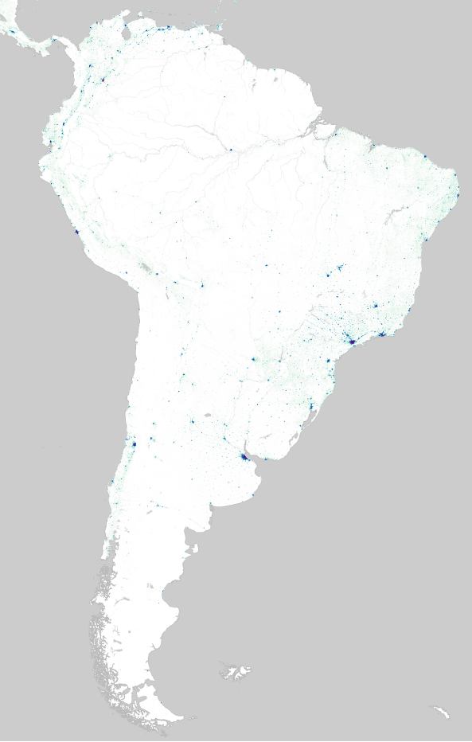
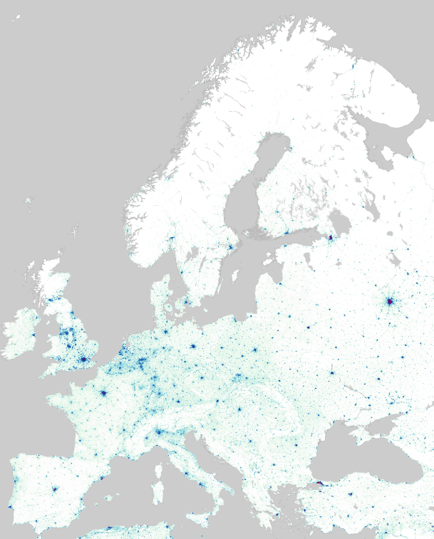
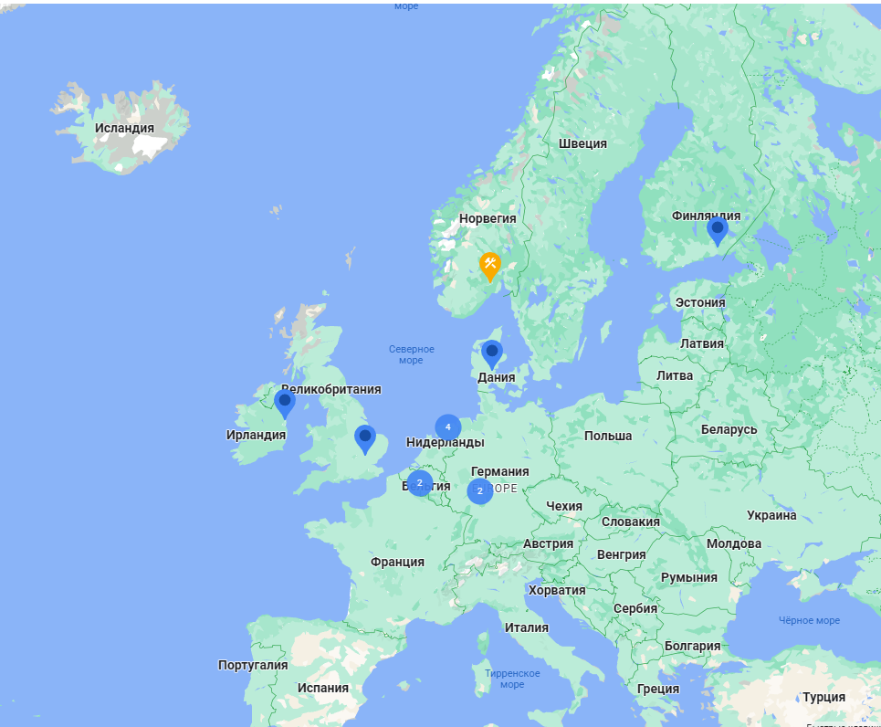
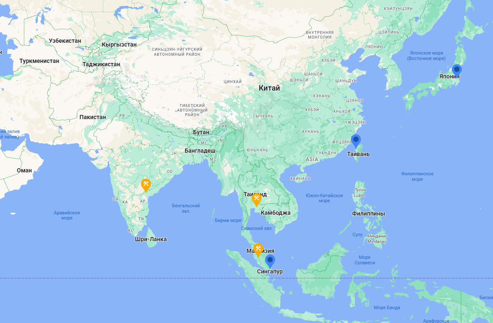
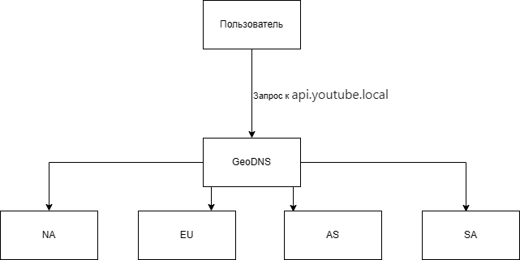
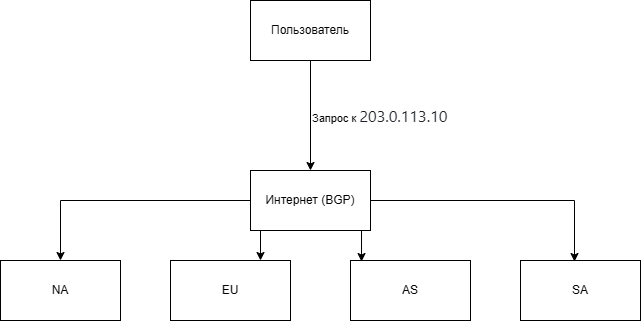
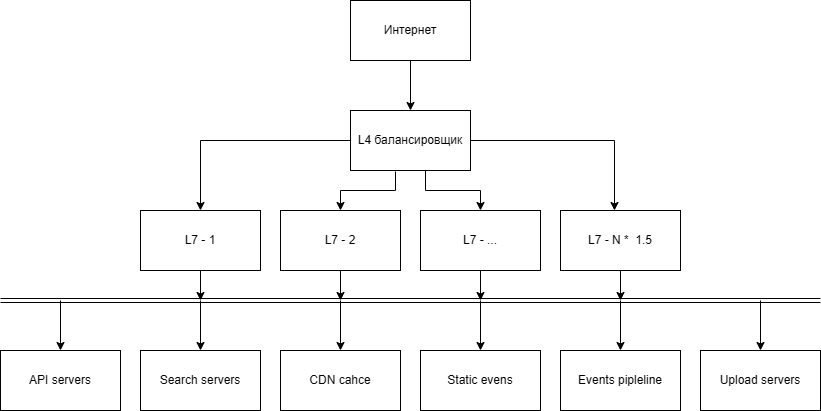
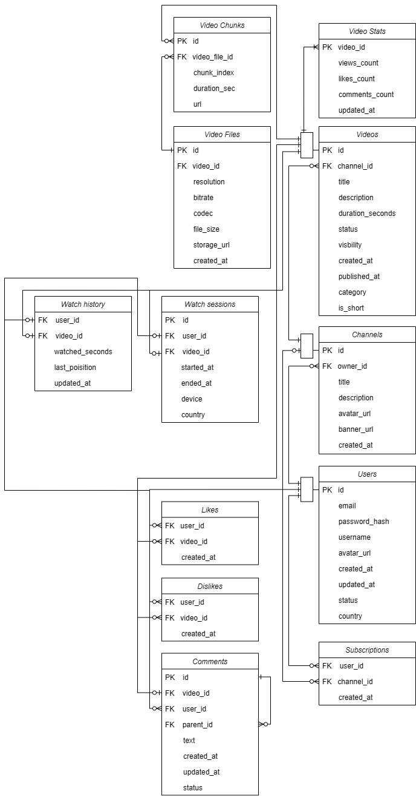
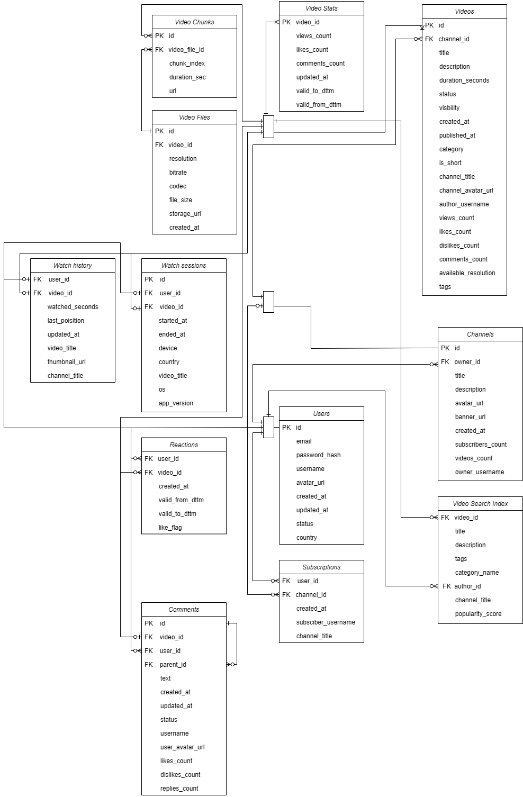
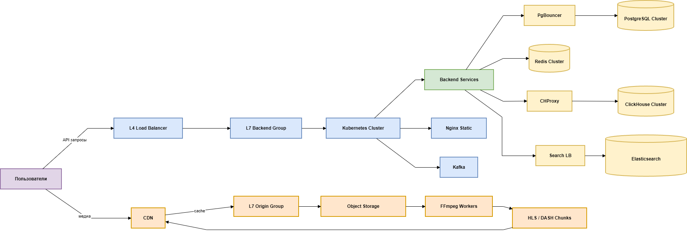

# Расчётно-пояснительная записка видеохостинга формата YouTube
## Описание и аналоги
### Описание
Проектируемый сервис — высоконагруженная платформа для хранения, обработки и потоковой передачи видеоконтента пользователям по всему миру.

Ключевые особенности системы (MVP):

* загрузка видео пользователями
* автоматическая обработка видео
* создание каналов
* подписки на каналы
* лайки, комментарии, просмотры
* сбор статистики

Когда пользователь загружает видео, оно отправляется на сервер по частям — чанками:
* видео разбивается на фрагменты фиксированного размера (например, 5–10 МБ)
* каждый фрагмент загружается отдельно
* сервер подтверждает получение каждого чанка
* после загрузки всех чанков видео собирается

Сервис должен обеспечивать:

* минимальную задержку при старте воспроизведения
* устойчивость к пиковым нагрузкам

### Аналоги

Крупнейшие решения на рынке видеохостинга:

* [TikTok](https://www.tiktok.com/) — короткие вертикальные видео с сильной рекомендательной системой
* [Vimeo](https://vimeo.com/) — платформа для профессионального контента
* [Rutube](https://rutube.ru/) — российский видеохостинг

## Аудитория
### Описание аудитории

Основная аудитория — пользователи от 12 до 60 лет.

Ключевые группы:

* зрители развлекательного контента
* обучающиеся (курсы, туториалы, лекции)
* авторы видео (блогеры, студии, компании)

### Местоположение аудитории

Платформа ориентирована на:

* глобальный рынок
* распределённую географию пользователей
* наличие дата-центров в разных регионах мира

### Размер аудитории
Для расчётной модели принимаем:

* MAU (месячная аудитория): 2.7 млрд пользователей [[1](https://www.aboutchromebooks.com/youtube-statistics-and-user-trends)]
* DAU (дневная активная аудитория): 122 млн пользователей [[1](https://www.aboutchromebooks.com/youtube-statistics-and-user-trends)]
* На платформу загружается около 900 часов видео каждую минуту [[5](https://thumbnailtest.com/stats/youtube/)]
* В среднем пользователь смотрит 9 видео за сессию [[5](https://thumbnailtest.com/stats/youtube/)]
* 5.76 млн видео загружаются ежедневно [[5](https://thumbnailtest.com/stats/youtube/)]
* Средняя длина видео на YouTube примерно 11,7 минут [[2](https://www.globalmediainsight.com/blog/youtube-users-statistics)]
* Пользователи в среднем смотрят видео около 19–30 минут в день [[3](https://affmaven.com/ru/youtube-statistics)]
* 5 млрд просмотров в сутки [[3](https://affmaven.com/ru/youtube-statistics)]

## Распределение нагрузки
### Геораспределение
Минимально:

* Северная Америка
* Европа
* Азия
* Южная Америка

# Расчет нагрузки

## Расчет нагрузки на просмотр видео

### Суммарное время просмтра в сутки (пик)

"With 500+ hours of video uploaded every minute and over 1 billion hours watched daily" [[1](https://www.aboutchromebooks.com/youtube-statistics-and-user-trends)], что указывает на то,
что в день просматривается около 1 млрд часов:

$$
Суммарный watch time = 1 000 000 000 часов/сутки
$$

### Среднее количество одновременных зрителей

```
1 000 000 000 / 24 ≈ 41 700 000 часов/час
```

### Коэффициент липучести

```
SF = DAU/MAU = 122 000 000 / 2 700 000 000 = 0.045
```

(очень приближенное значение из-за двух разных категорий видео (полноценные/shorts)

Значение Sticky Factor сильно занижено, потому что MAU включает пассивную аудиторию, а DAU не учитывает разделение обычных видео и shorts.

### Сетевой трафик

Судя по источнику [4] имеем битрейт и разрешение:

| Разрешение  | Средний битрейт (Мбит/с)| Примерный объем за час (ГБ/ч) |
|-------------|-------------------------|-------------------------------|
| 720p        | 1.5-6.0                 | 1.2-2.7 (2.0)                 | 
| 1080p       | 3.0-9.0                 | 2.5-4.1 (3.3)                 |
| 1440p       | 6.0-18.0                | 4.0-5.1 (4.5)                 |
| 4K          | 13.0-51.0               | 5.5-23.0 (14)                 |

При этом 85% просмтров в HD+ качестве [6]. Значит большая часть трафик лежит в диапазоне битрейта 3-9 Мбит.

Предположим, что в таком случае средний битрейт - 7 Мбит/с:

```
41 700 000 × 7 Мбит/с = 35 000 000 Мбит/с = 292 Тбит/с
```

## Нагрузка на загрузку видео

### Объем загрузки

```
900 × 60 = 54 000 часов в час
54 000 × 24 = 1 296 000 часов в сутки
```

### Хранение видео

Каждое видео хранится в нескольких форматах:

* 144p
* 360p
* 480p
* 720p
* 1080p
* 1440p
* 4K

Используя таблицу выше и учитывая, что 85% просмотров в HD+ качестве, возьмем реалистичное распределение:

* 720p - 10%
* 1080p - 60%
* 1440p - 20%
* 4K - 10%

Считаем взвшенное среднее:

```
0.1 × 2.0 = 0.2
0.6 × 3.3 = 1.98
0.2 × 4.5 = 0.9
0.1 × 14  = 1.4
0.2 + 1.98 + 0.9 + 1.4 = 4.48 ГБ/час
```

Тогда получаем:

```
1 296 000 × 5.88 = 7.27 ПБ в сутки
```

Для обеспечения отказоустойчивости видео хранится в нескольких копиях (3),
что позволяет избежать повторного транскодирования при сбоях.

Итоговый объем хранения составляет:

```
7.27 ПБ в сутки * 3 = 21.81 ПБ в сутки
```

## Нагрузка на API (RPS)

Все пользователи раз в 10 секунд скачивают чанк, отсюда и получаем RPS:

```
41 700 000 / 10 = 4 170 000 RPS
```

## Нагрузка на транскодирование

Если каждое видео (5.76 млн в сутки) кодируется в среднем в 5 форматов, то:

```
5 760 000 × 5 = 28 800 000 задач транскодирования в сутки (333 задач в секунду)
```

## Сводная таблица

| Продуктовая метрика        | Значение     |
|----------------------------|--------------|
| DAU                        | 122 млн      |
| Одновременные пользователи | 2.5 млн      |
| Трафик                     | 292 Тбит/с   |
| Новых видео в сутки        | 5.76 млн     |
| Новых данных в сутки       | 22 ПБ        |
| CDN нагрузка               | 4 млн RPS    |
| Задач транскодирования     | 29 млн/сутки |

# Глобальная балансировка нагрузки

## Функциональное разбиение нагрузки

### Действия на запросы

| Действие              | Запрос                    | Описание запроса             | Ограничения / особенности |
| --------------------- | ------------------------- | ---------------------------- | ------------------------- |
| Старт просмотра видео | Получение метаданных      | Чтение информации о видео    | Допустимо кэширование     |
|                       | Получение stream URL      | Генерация подписанной ссылки | Требует авторизации       |
|                       | Логирование старта        | Запись события просмотра     | -                         |
| Просмотр видео        | Heartbeat                 | Передача прогресса просмотра | Высокочастотный           |
| Главная страница      | Получение рекомендаций    | Получение случайных видео    | Низкая задержка           |
|                       | Информация о пользователе | Чтение профиля               | Требуется консистентность |
| Поиск                 | Поиск видео               | Запрос к search-кластеру     | Высокая CPU нагрузка      |
| Лайк/комментарий      | Запись события            | Модификация БД               | Асинхронная репликация    |

### Разбиение доменов

| Запрос              | Домен                |
|---------------------| -------------------- |
| API                 | api.youtube.local    |
| Поиск               | search.youtube.local |
| Видео-контент (CDN) | cdn.youtube.local    |
| Статические файлы   | static.youtube.local |
| События/логирование | events.youtube.local |
| Загрузка видео      | upload.youtube.local |

## Расположение серверов

Предлагаю сначла взглянуть на распределение аудитории [2] и посчитать все необходимые параметры:

| Регион        | Доля |
| ------------- | ---- |
| Северная Америка           | 30%  |
| Европа        | 27%  |
| Азия          | 33%  |
| Южная Америка | 10%  |

### Видеотрафик по серверам

| Регион           | Трафик (Тбит/с) |
|------------------|-----------------|
| Северная Америка | 87.6            |
| Европа           | 78.84           |
| Азия             | 96.36           |
| Южная Америка    | 29.2            |

### Анализ расположения и количества серверов

Нетрудно заметить, что количество RPS и трафика - огромные. Тогда пускай скажем, что пропускная способность каждого сервера - 0.2 Тбит/с. С учетом потери в 15%:

$$
bandwith = 0.2 * (1-0.85) = 0.17
$$

$$
TpS = \frac{292}{x} = 0.17,
$$

где x - количество серверов.

#### Северная Америка


Возьмем рассчитанный выше трафик по Северной Америке (10.5 Тбит/с) и рассчитаем необходимое количество серверов в данном регионе:

$$
x_{NA} = \frac{87.6}{0.17}=516
$$

Таким образом, для поддержания пропускной способности серверов в Северной Америке необходимо 516 серверов.

По расположению их все не получится перечислить, но можно взглянуть на карту датацентров Google и распределения населения.
Весьма логично будет объединять сервера в большие датацентры, как это делает Google (см. карту). Так будет и для других регионов.

Таким образом, получится, что большинство серверов должны быть расположены вдоль побережья в США и Мексике.

#### Южная Америка




$$
x_{SA} = \frac{29.2}{0.17}=172
$$

В Южной Америке необходимо иметь 172 серверов. Большинство должны быть расположены на северно-западном и центрально-восточном побережьях.

#### Европа




$$
x_{EU} = \frac{78.84}{0.17}=462
$$

Для Европы нужно 462 сервера. 

#### Азия




x_{AS}=\frac{96.36}{0.17}=567

Для Азии нужно 567 серверов. Большинство из них должны быть в Индии. Китайское население не приняло Youtube и пользуются импортозамещением.

### Итог

| Регион           | Количество серверов |
|------------------|---------------------|
| Северная Америка | 516                  |
| Европа           | 462                  |
| Азия             | 567                  |
| Южная Америка    | 172                  |

## Распределение запросов по датацентрам

## Схема DNS-балансировки (GeoDNS)



## Схема Anycast-балансировки (CDN)



## Модель балансировки

### DNS-балансировка (GeoDNS)

Так как просмотр видео не требователен к задержке (ping), то мы можем спокойно жертвовать несколькими мс задержки ради сохранения материальной выгоды.
Из-за высокой задержки может теряться трафик, но в наше время это не принципиально, так как современные провайдеры предоставляют трафик пользователям с большим запасом для просмтра видео.

### Fallback-механизмы

С Америкой и Западной, Центральной и Восточной частями Европы все довольно просто - если сервер перегружен, то мы отправляем пользователя в ближайший по линиям GeoDNS маршрутов сервер (скорее всего в том же ДЦ).

С Британскими и Скандинавскими островами, а так же с островной Азией все посложнее:

* Для Скандинавских и Британских островов в приоритете нужно нагружать именно их сервера, так они являются отдельными островами. Бельгийский и Германский сервера работают по стандартному GeoDNS и минимально общаются с Дублином и Хаминой. Финский сервер также может обеспечивать Восточную Европу.
* Для Азии аналогичная ситуация (из-за Японии и Сингапура).

### Anycast для CDN

При использовании Anycast несколько датацентров анонсируют один и тот же IP-адрес через BGP. Интернет автоматически направляет пользователя к ближайшему по сетевой метрике датацентру.

CDN хранит:

* сегменты видео (чанки)
* превью и постеры
* статические файлы интерфейса
* популярные видео

Видео хранится в виде небольших сегментов (10 секунд), что позволяет CDN эффективно кэшировать контент и быстро переключать качество.

# Локальная балансировка нагрузки

## Схема балансировки нагрузки



## Пояснения к схеме

L4 балансировка выполняется средствами облачного провайдера или аппаратными балансировщиками.

Причины использования L4:

* высокая пропускная способность
* минимальная задержка
* завершение TCP-соединения
* защита от перегрузки

L4 балансировщик распределяет соединения между L7 балансировщиками.

На втором уровне используется L7 балансировка (Nginx / Envoy).

Она выполняет:

* завршение SSL-соединения
* маршрутизацию запросов
* ограничение частоты запросов
* авторизацию
* кеширование небольших объектов

Для обеспечения резервирования будем использовать схему N * 1.5.

## Расчет количества балансировщиков

| Характеристика                       | Значение   |
|--------------------------------------|------------|
| CDN + API RPS                        | 4 170 000  |
| Нагрузка                             | 292 Тбит/c |
| Пропускная способность сервера       | 0.2 Тбит/с |
| RPS Nginx [7]                        | 600 000    |
| Падение пропускной способности Nginx | 15%        |
| Количество серверов                  | 1713       |

$$
  Итоговое\ количество\ серверов = max(\frac{Пиковая\ нагрузка}{Ожидаемая\ пропускная\ способность\ сервера}; \frac{Пиковый\ RPC}{Nginx\ RPC\ HTTPS})
$$

У нас используется 206 дата-центров, тогда трафик будет на один будет равен:

$$
Traffic_{DC} = \frac{292}{1713} = 0.17 Тбит/с
$$

Пропускная способность сервера с учетом потерь:

$$
Пропускная способность сервера = 0.85 * 0.2 = 0.17 Тбит/с
$$

Тогда расчет по пропускной способности:

$$
Servers_{Пропускная способность сервера} = \frac{0.17}{0.17} = 1
$$

По RPS:

$$
Servers_{RPS} = \frac{\frac{4 170 000}{1713}}{600000} = 0.004
$$

Тогда получаем 1713 серверов. По учету отказоустойчивости - 2570.

Итоговая сводная таблица:

| Характеристика                                                         |    Значение |
|:-----------------------------------------------------------------------|------------:|
| Ожидаемая пропускная способность сервера                               | 0.17 Тбит/с |
| Количество серверов необходимое для обеспечения пропускной способности |        1713 |
| Количество серверов, необходмое для обеспечения RPC                    |           7 |
| Итоговое количество серверов                                           |        1713 |
| Итоговое количество серверов с учётом резервирования N * 1.5           |        2570 |

Данные вычисления подтверждают, что выбранного количества серверов хватает для безотказной обработки трафика и RPS.

# Логическая схема БД

## Логическая схема

### Схема без денормализации



### Консистентность и описание таблиц

| Таблица         | Ожидаемая консистентность | Описание                                                                                                |
| --------------- | ------------------------- |---------------------------------------------------------------------------------------------------------|
| Users           | Strong                    | Таблица пользователей сервиса. Содержит учетные данные, информацию профиля и статус аккаунта            |
| Channels        | Strong                    | Каналы пользователей. Используются как сущность для публикации видео                                    |
| Videos          | Strong                    | Основная таблица видео. Содержит метаданные видео (название, описание, длительность, статус, видимость) |
| VideoFiles      | Strong                    | Файлы видео в различных разрешениях и кодеках. Содержит ссылки на физическое хранилище (CDN)            |
| VideoChunks     | Eventual                  | Разбиение видео на чанки для стриминга. Используется для доставки контента пользователю                 |
| VideoStats      | Eventual                  | Агрегированная статистика по видео (просмотры, лайки, комментарии). Обновляется асинхронно              |
| Likes           | Eventual                  | Лайки пользователей для видео. Допускается временная рассинхронизация счетчиков                         |
| Dislikes        | Eventual                  | Дизлайки пользователей. Используются для рекомендаций и обратной связи                                  |
| Comments        | Eventual                  | Комментарии пользователей к видео. Поддерживает древовидную структуру (parent_id)                       |
| Subscriptions   | Strong                    | Подписки пользователей на каналы. Используется для формирования ленты                                   |
| WatchHistory    | Eventual                  | История просмотров пользователя. Используется для рекомендаций и персонализации                         |
| WatchSessions   | Eventual                  | Сессии просмотра видео. Хранит информацию о времени просмотра и устройстве пользователя                 |


### Пояснение к таблице

Видео разделено на Videos (метаданные), VideoFiles (физические файлы), VideoChunks (стриминг).
Eventual используется для просмотров (VideoStats), лайков/дизлайков, истории просмотров, комментариев по причине высокой нагрузки на запись и допустимости небольшой задержки обнолвения.
Strong используется во всех остальных таблицах, так как это критично для UX.

## Размер данных

### Users

| Поле          | Размер   |
| ------------- | -------- |
| id            | 8 байт   |
| email         | 128 байт |
| password_hash | 64 байта |
| username      | 64 байта |
| avatar_url    | 256 байт |
| created_at    | 8 байт   |
| updated_at    | 8 байт   |
| status        | 1 байт   |
| country       | 32 байта |

### Channels

| Поле        | Размер   |
| ----------- | -------- |
| id          | 8 байт   |
| owner_id    | 8 байт   |
| title       | 128 байт |
| description | 512 байт |
| avatar_url  | 256 байт |
| banner_url  | 256 байт |
| created_at  | 8 байт   |

### Videos

| Поле             | Размер     |
| ---------------- | ---------- |
| id               | 8 байт     |
| channel_id       | 8 байт     |
| title            | 256 байт   |
| description      | 1024 байта |
| duration_seconds | 4 байта    |
| status           | 1 байт     |
| visibility       | 1 байт     |
| created_at       | 8 байт     |
| published_at     | 8 байт     |
| category         | 32 байта   |
| is_short         | 1 байт     |

### VideoFiles

| Поле        | Размер   |
| ----------- | -------- |
| id          | 8 байт   |
| video_id    | 8 байт   |
| resolution  | 16 байт  |
| bitrate     | 4 байта  |
| codec       | 16 байт  |
| file_size   | 8 байт   |
| storage_url | 256 байт |
| created_at  | 8 байт   |

### VideoChunks

| Поле          | Размер   |
| ------------- | -------- |
| id            | 8 байт   |
| video_file_id | 8 байт   |
| chunk_index   | 4 байта  |
| duration_sec  | 4 байта  |
| url           | 256 байт |

### VideoStats

| Поле           | Размер |
| -------------- | ------ |
| video_id       | 8 байт |
| views_count    | 8 байт |
| likes_count    | 8 байт |
| comments_count | 8 байт |
| updated_at     | 8 байт |

### Likes / Dislikes

| Поле       | Размер |
| ---------- | ------ |
| user_id    | 8 байт |
| video_id   | 8 байт |
| created_at | 8 байт |

### Comments

| Поле       | Размер   |
| ---------- | -------- |
| id         | 8 байт   |
| video_id   | 8 байт   |
| user_id    | 8 байт   |
| parent_id  | 8 байт   |
| text       | 512 байт |
| created_at | 8 байт   |
| updated_at | 8 байт   |
| status     | 1 байт   |

### Subscriptions

| Поле       | Размер |
| ---------- | ------ |
| user_id    | 8 байт |
| channel_id | 8 байт |
| created_at | 8 байт |

### WatchHistory

| Поле            | Размер  |
| --------------- | ------- |
| user_id         | 8 байт  |
| video_id        | 8 байт  |
| watched_seconds | 4 байта |
| last_position   | 4 байта |
| updated_at      | 8 байт  |

### WatchSessions

| Поле       | Размер   |
| ---------- | -------- |
| id         | 8 байт   |
| user_id    | 8 байт   |
| video_id   | 8 байт   |
| started_at | 8 байт   |
| ended_at   | 8 байт   |
| device     | 32 байта |
| country    | 32 байта |

### Занимаемое место

| Таблица       | Размер строки | Кол-во строк | Объем  |
| ------------- | ------------- | ------------ |--------|
| Users         | 0.6 КБ        | 2 млрд       | 1.2 ПБ |
| Channels      | 1.2 КБ        | 200 млн      | 240 ТБ |
| Videos        | 1.35 КБ       | 500 млн      | 675 ТБ |
| VideoFiles    | 324 байта     | 2 млрд       | 648 ТБ |
| VideoChunks   | 280 байт      | 100 млрд     | 28 ПБ  |
| VideoStats    | 40 байт       | 500 млн      | 20 ГБ  |
| Likes         | 24 байта      | 20 млрд      | 480 ГБ |
| Comments      | 561 байт      | 10 млрд      | 5.6 ПБ |
| Subscriptions | 24 байта      | 5 млрд       | 120 ГБ |
| WatchHistory  | 32 байта      | 100 млрд     | 3.2 ПБ |
| WatchSessions | 104 байта     | 20 млрд      | 2.1 ПБ |

## Особенности распределения нагрузки

| Таблица         | Ключ(и)                    | Характер распределения               |
| --------------- | -------------------------- |--------------------------------------|
| Users           | id                         | Равномерное                          |
| Channels        | id, owner_id               | Равномерное                          |
| Videos          | id, channel_id             | Перевес в сторону популярных каналов |
| VideoFiles      | video_id                   | Перевес в сторону популярных видео   |
| VideoChunks     | video_file_id, chunk_index | Сильный перекос на популярные видео  |
| VideoStats      | video_id                   | Сильный перекос                      |
| Likes           | video_id, user_id          | Перевес в сторону популярных видео   |
| Dislikes        | video_id, user_id          | Перевес в сторону популярных видео   |
| Comments        | video_id, parent_id        | Сильный перекос (вирусные видео)     |
| Subscriptions   | channel_id, user_id        | Перевес в сторону популярных каналов |
| WatchHistory    | user_id                    | Равномерное                          |
| WatchSessions   | user_id, video_id          | Равномерное с локальными всплесками  |

## Описание логических таблиц

| Таблица         | Назначение                     | Тип нагрузки               | Ключевые особенности                                                 |
| --------------- | ------------------------------ | -------------------------- |----------------------------------------------------------------------|
| Users           | Хранение пользователей сервиса | Read/Write                 | Критичная таблица, используется для аутентификации и профиля         |
| Channels        | Каналы пользователей           | Read-heavy                 | Используется для группировки контента и подписок                     |
| Videos          | Метаданные видео               | Read-heavy                 | Основная сущность контента, участвует во всех сценариях              |
| VideoFiles      | Физические версии видео        | Read-heavy                 | Содержит разные разрешения и кодеки                                  |
| VideoChunks     | Чанки видео для стриминга      | Read-heavy (очень высокий) | Используется CDN, высокая частота запросов                           |
| VideoStats      | Агрегированная статистика      | Read-heavy                 | Денормализованная таблица для быстрого чтения                        |
| Likes           | Лайки пользователей            | Write-heavy                | Высокая нагрузка записи                                              |
| Dislikes        | Дизлайки пользователей         | Write-heavy                | Аналогично Likes                                                     |
| Comments        | Комментарии к видео            | Mixed                      | Поддержка иерархии (parent_id), высокая нагрузка на популярные видео |
| Subscriptions   | Подписки на каналы             | Read/Write                 | Используется для формирования ленты                                  |
| WatchHistory    | История просмотров             | Write-heavy                | Используется для рекомендаций                                        |
| WatchSessions   | Сессии просмотра               | Write-heavy                | Используется для аналитики и метрик                                  |

## Нагрузка

| Таблица         | Кол-во записей | Объем данных | Чтение (RPS)      | Запись (RPS)         | Комментарий                       |
| --------------- | -------------- | ------ |-------------------| -------------------- |-----------------------------------|
| Users           |  2 млрд        | 1.2 ПБ | Средняя           | Низкая               | Аутентификация и профиль          |
| Channels        |  200 млн       | 240 ТБ | Средняя           | Низкая               | Относительно стабильная таблица   |
| Videos          | 500 млн        | 675 ТБ | Высокая           | Средняя              | Основная точка входа для контента |
| VideoFiles      | 2 млрд         | 648 ТБ | Высокая           | Средняя              | Используется при выборе качества  |
| VideoChunks     | 100 млрд       | 28 ПБ  | Очень высокая     | Низкая               | Основная нагрузка стриминга       |
| VideoStats      | 500 млн        | 20 ГБ  | Очень высокая     | Высокая (асинхронно) | Требуется кэш                     |
| Likes           | 20 млрд        | 480 ГБ | Средняя           | Высокая              | Высокая write-нагрузка            |
| Dislikes        | 10 млрд        | 240 ГБ | Низкая            | Средняя              | Используется реже                 |
| Comments        |  10 млрд       | 5.6 ПБ | Высокая           | Высокая              | Перекос на популярные видео       |
| Subscriptions   | 5 млрд         | 120 ГБ | Высокая           | Средняя              | Используется для ленты            |
| WatchHistory    | 100 млрд       | 3.2 ПБ | Средняя           | Очень высокая        | Поток событий просмотров          |
| WatchSessions   | 20 млрд        | 2.1 ПБ | Низкая            | Высокая              | Аналитика                         |

# Физическая схема БД

## Денормализованная схема БД



## Таблицы

| Таблица                    | Тип БД / хранилище | Шардирование                                          | Партиции                         | Индексы                                                                                                                                              | Резервирование                                          |
| -------------------------- |--------------------|-------------------------------------------------------|----------------------------------| ---------------------------------------------------------------------------------------------------------------------------------------------------- |---------------------------------------------------------|
| Users                      | PostgreSQL         | По hash(`id`) пользователя                            | По месяцу `created_at`           | PK(`id`), UNIQUE(`email`), UNIQUE(`username`), INDEX(`created_at`)                                                                                   | Мастер + 2–3 реплики                                    |
| Channels                   | PostgreSQL         | По hash(`id`) канала                                  | По месяцу `created_at`           | PK(`id`), INDEX(`owner_id`), INDEX(`created_at`)                                                                                                     | 2–3 реплики                                             |
| Videos                     | PostgreSQL         | По hash(`id`) видео                                   | По `published_at`                | PK(`id`), INDEX(`channel_id`, `published_at`), INDEX(`category_id`, `published_at`), INDEX(`published_at`), FULLTEXT(`title`, `description`, `tags`) | 2–3 реплики                                             |
| VideoFiles                 | PostgreSQL         | По hash(`video_id`)                                   | По `created_at`                  | PK(`id`), INDEX(`video_id`), INDEX(`resolution`), INDEX(`created_at`)                                                                                | 2–3 реплики                                             |
| VideoChunks                | Redis + CDN        | По `video_file_id` + shard_index                      | По `created_at`                  | KEY(`video_file_id:chunk_index`), INDEX(`video_file_id`)                                                                                             | Репликация в CDN + объектное хранилище, минимум 3 копии |
| VideoStats                 | Redis              | По `video_id` + shard_index                           | Без партиций                     | KEY(`video:{video_id}`)                                                                                                                              | Репликация в Redis-кластер, snapshot + AOF              |
| Likes / Dislikes           | PostgreSQL         | По составному ключу (`video_id`, month(`created_at`)) | По месяцу `created_at`           | PK(`user_id`, `video_id`), INDEX(`video_id`, `created_at`), INDEX(`user_id`)                                                                         | 2–3 реплики                                             |
| Comments                   | PostgreSQL         | По составному ключу (`video_id`, month(`created_at`)) | По месяцу `created_at`           | PK(`id`), INDEX(`video_id`, `created_at`), INDEX(`parent_id`), INDEX(`user_id`)                                                                      | 2–3 реплики                                             |
| Subscriptions              | PostgreSQL         | По составному ключу (`subscriber_id`, `channel_id`)   | По `created_at`                  | PK(`subscriber_id`, `channel_id`), INDEX(`channel_id`), INDEX(`created_at`)                                                                          | 2–3 реплики                                             |
| WatchHistory               | ClickHouse         | По hash(`user_id`)                                    | По `updated_at`                  | ORDER BY (`user_id`, `updated_at`), INDEX(`video_id`)                                                                                                | 2-3 реплики, RF=3                                       |
| WatchSessions              | ClickHouse         | По `user_id`                                          | По дню `started_at` (день/месяц) | ORDER BY (`user_id`, `started_at`), INDEX(`video_id`), INDEX(`country`)                                                                              | RF=3                                                    |
| VideoSearchIndex           | Elasticsearch      | По hash(`video_id`)                                   | По времени публикации            | INDEX(`title`), INDEX(`description`), INDEX(`tags`), INDEX(`author_username`)                                                                        | Реплики + шарды                                         |

## Пояснения к таблицам

shard_index - это структура вида (0..N) для чанков. Например:

```
video:123:0
video:123:1
video:123:2
...
```

Тогда записи распредлятся по шардам равномерно.

## Балансировка запросов

| Данные        | Таблицы для балансировки                         | Комментарий                                                                                                                                                         |
| ------------- |--------------------------------------------------|---------------------------------------------------------------------------------------------------------------------------------------------------------------------|
| PostgreSQL    | Videos, Channels, Comments, Subscriptions, Likes | Чтение и запись разделяются между мастером и репликой. Наиболее нагружены: Videos, Comments и Likes. Для PostgreSQL используется connection pooling через PgBouncer |
| Redis         | VideoStats                                       | Используется Redis-кластер с несколькими шардами.                                                                                                                   |
| ClickHouse    | WatchHistory, WatchSessions                      | Основная нагрузка — массовая запись событий и аналитические запросы. Используются дистрибуция и реплики                                                             |
| Elasticsearch | VideoSearchIndex                                 | Используются мастер и шардированые реплики для полнотекстового поиска и рекомендаций                                                                                |
| Медиаданные   | VideoFiles, VideoChunks                          | Видео и чанки хранятся в объектном храналище и раздаются через CDN. Основная нагрузка снимается с бэкенда                                                           |


## Схема резервного копирования

| Данные              | Описание резервирования                                                                                                                                                                                                                                                                                                                                                                                                                                                                                                            |
| ------------------- |------------------------------------------------------------------------------------------------------------------------------------------------------------------------------------------------------------------------------------------------------------------------------------------------------------------------------------------------------------------------------------------------------------------------------------------------------------------------------------------------------------------------------------|
| PostgreSQL          | Ежедневное резервное копирование через pg_dump + архивирование WAL + репликация. Используется RAID 10                                                                                                                                                                                                                                                                                                                                                                                                                              |
| Redis               | Снимки RDB один раз в сутки + сохранение AOF                                                                                                                                                                                                                                                                                                                                                                                                                                                                                       |
| ClickHouse          | Коэффициент репликации 2–3, резервирование между зонами доступности, ежедневные снимки                                                                                                                                                                                                                                                                                                                                                                                                                                             |
| Elasticsearch       | Реплики шардов + снимки индексов в объектное хранилище                                                                                                                                                                                                                                                                                                                                                                                                                                                                             |
| Медиаданные         | Видео и чанки хранятся минимум в 3 копиях в объектном хранилище + кэш CDN. Используется георепликация между регионами                                                                                                                                                                                                                                                                                                                                                                                                              |
| Объектное хранилище | Хранилище организовано по модели bucket -> объект -> чанк. Видео разбивается на чанки фиксированного размера 8 МБ, каждый чанк хранится отдельно и имеет уникальный object_id. Метаданные объекта (бакет, путь, размер, версия, расположение реплик) хранятся в отдельной metadata-стркутуре на базе PostgreSQL. Сами данные лежат на нодах с RAID 10. Для каждого объекта хранится минимум 3 копии: в разных серверах, стойках и дата-центрах. Старые и редко используемые видео автоматически переносятся в "холодное" хранилище |

## Структура объектного хранилища

```
Bucket
 └── user-video-bucket
      └── /video_id/
           ├── original.mp4
           ├── 720p/
           │    ├── manifest
           │    ├── chunk_0001.ts
           │    ├── chunk_0002.ts
           │    └── ...
           ├── 1080p/
           │    └── ...
           ├── ...
```

# Алгоритмы

## Основные проблемы

| Проблема                    | Описание                                                              |
|-----------------------------|-----------------------------------------------------------------------|
| Долгий старт воспроизведения | Пользователь ожидает мгновенный запуск видео, даже если видео большое |
| Горячие видео               | Небольшое количество видео может генерировать большую часть трафика   |
| Адаптация качества          | Необходимо подбирать качество под скорость интернета пользователя     |
| Загрузка больших файлов     | Видео могут иметь размер в десятки гигабайт                           |
| Обработка новых видео       | После загрузки видео требуется транскодирование и генерация чанков    |
| Комментарии популярных видео | Вирусные видео могут получать миллионы комментариев                   |
| Поиск                       | Поиск должен учитывать название, описание, теги и название канала     |

## Алгоритм загрузки видео

1. Пользователь начинает загрузку видео
2. Видео разбивается клиентом на чанки
3. Чанки последовательно отправляются в объектное хранилище
4. После завершения загрузки создается запись в Videos
5. Исходный файл сохраняется в объектном хранилище
6. В очередь ставятся задачи на транскодирование
7. Для каждого качества создаются отдельные VideoFiles
8. Для каждого качества генерируются HLS/DASH и выбираются чанки
9. После завершения транскодирования видео становится доступным для просмотра

## Алгоритм воспроизведения видео

Для воспроизведения используется динамическая подстройка качества видеопотока через HLS/DASH:

1. Пользователь открывает страницу видео
2. Бэкенд получает данные из таблиц Videos, Channels, VideoStats
3. Бэкенд возвращает:
   * название
   * описание
   * статистику
   * список доступных качеств
   * URL manifest-файла 
4. Плеер запрашивает manifest
5. Manifest содержит список доступных качеств и чанков
6. Плеер выбирает стартовое качество
7. Плеер начинает скачивать чанки видео
8. Во время просмотра плеер измеряет скорость соединения
9. При ухудшении соединения качество автоматически понижается
10. При улучшении соединения качество автоматически повышается

## Алгоритм поиска

Для поиска используется отдельный индекс в Elasticsearch:

1. Пользователь вводит поисковый запрос
2. Запрос отправляется в поисковый сервис
   3. Поисковый сервис выполняет поиск:
   * по названию
   * по описанию
   * по тэгам
   * по названию канала
4. Результаты ранжируются по:
   * релевантности
   * количеству просмотров
   * количеству лайков
   * свежести видео
5. Поисковый сервис возвращает готовый список результатов

## Алгоритм формирования главной страницы

Главная страница должна быть сформирована заранее:

1. Для каждого пользователя заранее формируется feed
2. В feed попадают:
   * подписки
   * популярные видео
   * Shorts
   * продолжение незавершенного просмотра
3. Готовый feed хранится в Redis
4. При открытии главной страницы бэкенд читает уже готовый feed
5. При необходимости выполняется догрузка новых элементов

# Используемые технологии

| Компонент              | Технология    | Назначение                                            |
| ---------------------- |---------------|-------------------------------------------------------|
| Backend API            | Go            | Высокопроизводительный backend для обработки запросов |
| Gateway / балансировка | Nginx         | SSL termination, rate limiting                        |
| Асинхронные события    | Kafka         | Обработка просмотров, лайков, комментариев            |
| Основная OLTP БД       | PostgreSQL    | Пользователи, видео, комментарии, подписки            |
| Аналитическая БД       | ClickHouse    | История просмотров, WatchSessions, аналитика          |
| Кэш                    | Redis         | Feed, VideoStats, WatchSessions                       |
| Поиск                  | Elasticsearch | Полнотекстовый поиск по видео, каналам и тегам        |
| CDN                    | Cloudflare    | Доставка чанков и снижение нагрузки на origin         |
| Object Storage         | Кастомная     | Хранение видеофайлов, manifest и чанков               |
| Транскодирование       | FFmpeg        | Генерация нескольких качеств видео                    |
| Контейнеризация        | Docker        | Упаковка сервисов                                     |
| Оркестрация            | Kubernetes    | Автоматическое масштабирование и failover             |
| Мониторинг             | Prometheus    | Сбор метрик                                           |
| Визуализация метрик    | Grafana       | Дашборды и алерты                                     |
| Логирование            | ELK Stack     | Централизованный сбор логов                           |
| CI/CD                  | GitLab CI/CD  | Автоматическая сборка и деплой                        |

# Таблица обеспечения надежности

| Компонент               | Способ обеспечения надежности                                   |
|-------------------------|-----------------------------------------------------------------|
| API-сервисы             | Несколько экземпляров backend за Nginx и L4/L7 балансировщиками |
| PostgreSQL              | Мастер-реплика, ежедневные бэкапы, RAID 10                      |
| Redis                   | Redis-кластер, реплики                                          |
| ClickHouse              | RF=3                                                            |
| Elasticsearch           | Реплики, шардирование, снапшоты индексов                        |
| Object Storage          | Минимум 3 копии каждого объекта, георепликация между регионами  |
| CDN                     | Кэширование популярных видео                                    |
| Транскодирование        | Повторный запуск задач, очередь задач                           |
| Kafka                   | RF=3                                                            |
| Контейнерная платформа  | Автоматический перезапуск подов                                 |
| Мониторинг              | Алерты по CPU, RAM, RPS, задержке                               |
| Непредвиденнная поломка | Backup в другом датацентре                                      |
| Сеть                    | Несколько балансировщиков                                       |

# Схема проекта



# Расчет нагрузки

## Требования к ресурсам

| Сервис           | Нагрузка    | CPU        | RAM   | Диск   | Сеть       |
|------------------|-------------| ---------- | ----- | ------ | ---------- |
| Хранилище        | 292 Тбит/с  | 12000      | 16 ТБ | 150 ПБ | 20 Тбит/с  |
| Транскодирование | 333 задач/с | 8000 + GPU | 20 ТБ | 5 ПБ   | 100 Гбит/с |
| PostgreSQL       | 300k RPS    | 1600       | 3 ТБ  | 50 ТБ  | 40 Гбит/с  |
| Redis            | 1.5M RPS    | 800        | 6 ТБ  | 10 ТБ  | 50 Гбит/с  |
| ClickHouse       | 500k RPS    | 600        | 2 ТБ  | 200 ТБ | 60 Гбит/с  |
| Kafka            | 500k RPS    | 500        | 1 ТБ  | 100 ТБ | 60 Гбит/с  |
| Elasticsearch    | 100k RPS    | 500        | 2 ТБ  | 100 ТБ | 40 Гбит/с  |
| Backend          | 1M RPS      | 3000       | 1 ТБ  | -      | 50 Гбит/с  |
| L7 Balancer      | 292 Тбит/с  | 30000      | 2 ТБ  | -      | 292 Тбит/с |


## Сервера

| Сервис            | Тип сервера | Конфигурация                      | Количество серверов | Стоимость сервера (месяц) | Итоговая стоимость (месяц) |
|-------------------|-------------| --------------------------------- | ------------------- | ------------------------- | -------------------------- |
| Хранилище         | Физический  | 64 CPU / 256 GB RAM / 100 TB disk | 1500                | 8000                      | 12 000 000                 |
| Транскодирование  | Физический  | 32 CPU / 128 GB RAM / GPU         | 4000                | 3000                      | 12 000 000                 |
| PostgreSQL        | Физический  | 32 CPU / 128 GB RAM / 4 TB NVMe   | 80                  | 4000                      | 320 000                    |
| Redis             | Физический  | 16 CPU / 256 GB RAM / 2 TB NVMe   | 35                  | 5000                      | 175 000                    |
| ClickHouse        | Физический  | 32 CPU / 128 GB RAM / 20 TB disk  | 25                  | 6000                      | 150 000                    |
| Kafka             | Физический  | 16 CPU / 64 GB RAM / 10 TB disk   | 20                  | 4000                      | 80 000                     |
| Elasticsearch     | Физический  | 16 CPU / 64 GB RAM / 8 TB disk    | 20                  | 4000                      | 80 000                     |
| Backend           | ВМ          | 32 CPU / 16 GB RAM                | 500                 | 1000                      | 500 000                    |
| L7 Balancer       | ВМ          | 128 CPU / 64 GB RAM               | 400                 | 2000                      | 800 000                    |
| Kubernetes        | ВМ          | 8 CPU / 16 GB RAM                 | 50                  | 500                       | 25 000                     |

## Список источников
1. [Youtube Statistics And User Trends In 2025](https://www.aboutchromebooks.com/youtube-statistics-and-user-trends)
2. [YOUTUBE STATISTICS 2026 (DEMOGRAPHICS, USERS BY COUNTRY & MORE)](https://www.globalmediainsight.com/blog/youtube-users-statistics)
3. [Статистика YouTube за 2026 год: ключевые выводы и тенденции](https://affmaven.com/ru/youtube-statistics)
4. [How much data does YouTube actually use?](https://www.androidauthority.com/how-much-data-does-youtube-use-964560/)
5. [YouTube Statistics: Revenue & Growth (2026)](https://thumbnailtest.com/stats/youtube/)
6. [Youtube Video Statistics](https://zipdo.co/youtube-video-statistics/)
7. [Nginx benchmarks](https://openbenchmarking.org/test/pts/nginx)


